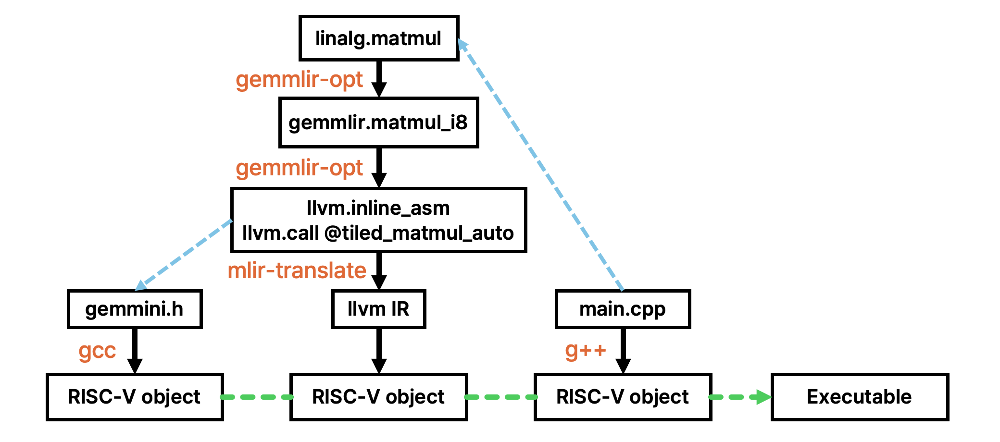

# gemmlir

## Abstract
gemmlir is an out-of-tree MLIR dialect that offloads `linalg.matmul`,
`linalg.matvec`, `linalg.batch_matmul` -- and, through im2col, convolution -- to the
[Gemmini](https://github.com/ucb-bar/gemmini) accelerator: `linalg.matmul` →
`gemmlir.matmul_i8` → `gemmini_flush` + call to `tiled_matmul_auto` (`gemmini.h`) →
RISC-V LLVM IR. Tiling is done by the Gemmini runtime. f32 tensor inputs can be
force-quantized to the int8 path first.



Pass pipelines: [docs/pipeline.md](docs/pipeline.md).

## Prerequisites

```
LLVM/MLIR >= 22 (tested: llvm-project 367e3889fabc), built with the RISCV target
CMake >= 3.20, Ninja, Python 3
gemmini-rocc-tests (submodule, 7c540b3; headers only)
riscv64-unknown-linux-gnu-gcc, a Gemmini-enabled Rocket SoC running Linux   (to run)
```

## Installation

```bash
git clone <this repo> gemmlir && cd gemmlir
make apt-install          # cmake, ninja, python3, compiler
make update-submodule     # gemmini.h and friends, plus this project's patch to them
make llvm                 # clone + build llvm-project at 367e3889fabc into ~/llvm-project (~1 h)
make                      # gemmlir-opt into build/
make test                 # lit tests
```

Each target is a few lines in the `Makefile`; override `LLVM_SRC`, `MLIR_DIR`, `LLVM_DIR`, `BUILD`,
`JOBS` on the command line to use an existing LLVM or another location -- or once
and for all in an untracked `config.mk`:

```bash
echo 'LLVM_SRC = /somewhere/llvm-project' > config.mk
```

`-DGEMMLIR_GEMMINI_PARAMS=<file>` (cmake) selects the `gemmini_params.h` generated for
your hardware instead of the submodule default.

The submodule is upstream `ucb-bar/gemmini-rocc-tests`, so what this project
changes in it -- memoizing the tiling search, choosing the tiling by DRAM traffic,
and `rdtime` for `read_cycles` -- lives in `third_party/gemmini-rocc-tests.patch`
rather than in a fork. `make update-submodule` applies it and is idempotent.

## Quantization
`--quantize` puts an f32 model on the int8 path. Weight scales are measured from
the constants -- and, since a constant's quantization does not depend on the
input, folded to an i8 constant at compile time rather than recomputed on every
inference. Activation scales come from `gemmlir.activation_scale` on each
operation, which `scripts/calibrate.py` writes by running the model. See
[docs/pipeline.md](docs/pipeline.md#quantization-scales) -- getting these right,
and rounding rather than truncating, moved a PyTorch MLP from a relative L2 error
of 0.49 to 0.012. The conversion also saturates rather than wrapping, so an
input past the calibrated range degrades instead of flipping sign.

## Usage

```bash
make example              # = compile.sh examples/matmul_i8.mlir -o build/matmul.o

export LLVM_BIN=~/llvm-project/build/bin
./scripts/compile.sh examples/matmul_i8.mlir -o build/matmul.o                # memref, i8 x i8 -> i32
./scripts/compile.sh examples/matmul_f32_tensor.mlir -o build/matmul.o --quantize   # tensor f32
./scripts/compile.sh examples/matmul_i8.mlir --dataflow=os                 # default is ws
./scripts/compile.sh examples/conv_i8.mlir -o build/conv.o                     # quantized conv block
./scripts/compile.sh model.mlir --from=tosa -o model.o                    # straight from a frontend
./scripts/compile.sh examples/matmul_i8.mlir --emit=llvm-ir               # or gemmlir | llvm-dialect

CFLAGS="-O2 -march=rv64gc -mabi=lp64d -static"
riscv64-unknown-linux-gnu-gcc $CFLAGS -Ithird_party/gemmini-rocc-tests -c runtime/gemmlir_rt.c -o gemmlir_rt.o
riscv64-unknown-linux-gnu-gcc $CFLAGS examples/main.c build/matmul.o gemmlir_rt.o -o matmul
# copy `matmul` to the board and run it; prints PASS

riscv64-unknown-linux-gnu-gcc $CFLAGS examples/conv_main.c build/conv.o gemmlir_rt.o -o conv
```

`examples/conv_i8.mlir` is a two-layer quantized block -- two convolutions with
fused bias, relu, scaling and max-pooling, joined by a saturating residual add.
Ten linalg operations become three calls into the runtime, and
`examples/conv_main.c` checks the result against gemmini.h's own CPU
implementation of the same three calls. Note that every buffer the accelerator
writes is a parameter there rather than a fresh allocation; see
[docs/pipeline.md](docs/pipeline.md#a-platform-note-reuse-the-buffers-you-hand-the-accelerator).

Besides `linalg.matmul`, the dialect exposes `gemmlir.matmul_i8_scale` (scaled,
saturating i8 output with an optional fused relu), `gemmlir.resadd_i8`
(`tiled_resadd_auto`), and `gemmlir.conv2d_i8` / `gemmlir.depthwise_conv2d_i8`
(`tiled_conv_auto` / `tiled_conv_dw_auto`, with bias, activation and max-pooling
fused). Each is reachable from a quantized PyTorch model, but only through the
shape that says what it does -- a `linalg.generic` spelling out the saturation
and the scales, never a plain `linalg.add` or `linalg.conv_2d_nhwc_hwcf` on i8,
which wrap where the accelerator saturates. See
[docs/pipeline.md](docs/pipeline.md#what-is-not-matched-from-linalg) for why.

`compile.sh` chains `gemmlir-opt`, `mlir-translate` and `llc`. The lowered function is plain C,
`void matmul_example(int8_t *A, int8_t *B, int32_t *C)` (row-major, fixed shapes);
`examples/main.c` calls it and checks against a CPU reference. `runtime/gemmlir_rt.c`
provides `tiled_matmul_auto`, static-asserts that `gemmini_params.h` matches the ABI
the compiler emits, and implements `memrefCopy` -- the one MLIR runtime symbol
generated code reaches for, which a padded convolution needs.
Note that `--plan-static-buffers` is in the pipeline: the buffers the
accelerator writes become static, because on this board their addresses must not
move between calls. That makes the compiled function **not re-entrant** -- see
[docs/pipeline.md](docs/pipeline.md#a-platform-note-reuse-the-buffers-you-hand-the-accelerator).

`runtime/gemmlir_rt_cpu.c` is the same surface with the matmuls forced onto the
host, for measuring what the accelerator buys; see
[docs/pipeline.md](docs/pipeline.md#where-the-time-actually-goes), which is also
where the timings live.

## Dataflow
`--dataflow=` (default `ws`) picks the Gemmini dataflow the runtime is asked for; it
becomes a `dataflow` attribute on the gemmlir op and then `tiled_matmul_auto`'s
`tiled_matmul_type`. Prefer `ws`: output-stationary accumulates in the PEs' 20-bit
registers rather than the 32-bit accumulator, so int8 saturates after about 32
accumulation steps and any K much past that is wrong on any bitstream --
see [docs/pipeline.md](docs/pipeline.md#dataflow).

## Models

`scripts/calibrate.py` takes a PyTorch model through torch-mlir and annotates it,
and `compile.sh --quantize` does the rest. Thirteen models are carried as the
regression set -- `resnet18`, `resnet50`, `googlenet`, `densenet121`,
`mobilenet_v2`, `mobilenet_v3_small`, `efficientnet_b0`, `regnet_y_400mf`,
`shufflenet_v2_x0_5`, `mnasnet0_5`, `squeezenet1_1`, a ViT and an LSTM -- plus a
decoder-only transformer and the four MLPerf Tiny benchmarks
(`examples/mlperf-tiny`). Every contraction in every one of them reaches the
accelerator; nothing is left in software.

**The regression set runs random weights on random noise at 64x64.** That is
deliberate: a wrong rewrite moves the relative L2 whatever the weights are, and
the small input keeps a thirteen-model sweep inside an hour. It also means
nothing in that harness can name a class.

## Demo

`demo/` is the other half: torchvision's **pretrained** weights at **224x224** on
real photographs, with the ImageNet class names compiled in, so the board prints
what it sees beside what PyTorch said.

```bash
cd demo && ./run.sh resnet18
```

Eighteen of twenty (model, photograph) pairs name the class PyTorch named;
`squeezenet1_1` 188 ms an image, `resnet18` 320, `resnet50` 710, `googlenet` 978.
See [demo/README.md](demo/README.md).

## Status

Verified on a U280 `Rocket64b1gem16ss8bsu16w256k128ps2f62` board running Linux at
**50 MHz** (the clock came down from 62.5 when the bitstream was rebuilt with the
normalization unit; `demo/ticks.h` reads it from the device tree rather than
assuming it), and on x86 for the build, `check-gemmlir`, and both `compile.sh`
paths to LLVM IR and to a riscv64 object.

**How a change is accepted.** The same compiled object is linked against
`runtime/gemmlir_rt.o` and against `runtime/gemmlir_rt_cpu.o` -- gemmini.h's own
CPU implementation of the same calls -- and the two outputs are compared **byte
for byte over forty runs, one process each**, on all thirteen models, together
with the same comparison against the build before the change. Forty runs because
one hardware fault here is intermittent: `resadd_i8` at 16x64 occasionally writes
a row from another computation, and only `mobilenet_v2` has that shape. A
relative L2 cannot see either that or a convolution that is wrong in one pixel.

Accumulation, the scaled i8 path, a fused relu, `resadd_i8`, convolution (with
bias and relu, with stride 2, with a fused 2x2 max-pool, and depthwise), matmul
bias (elementwise, broadcast, and into a scaled i8 result), the operands' mvin
scales, `linalg.batch_matmul` / `linalg.matvec` / `linalg.vecmat`, and the bias,
saturating-add, requantize, quantized-convolution and pooling fusions were each
checked against the runtime's own CPU implementation on the board, as is
`examples/conv_i8.mlir` end to end.

Transposed matmuls lower correctly -- the emitted flags and strides match
`matmul_cpu` -- but that bitstream's hardware transpose path returns wrong
results; see [docs/pipeline.md](docs/pipeline.md#transposes). `os` is wrong there
for the reason under **Dataflow** above, and a hand-written `tiled_matmul_auto`
call with identical arguments fails the same way, so that fault is in the
hardware, not the lowering. A `gemmlir.matmul_i8_scale` may likewise only write a
destination that is the whole width of its buffer: a narrow strided block
disagrees with `matmul_cpu` on every input.
