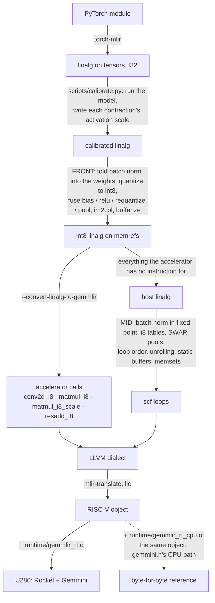

# Pipeline



**The pass order is `scripts/compile.sh`.** It is the only list, and the
reason for each placement that matters is a comment beside it there. A pass
list written out in prose was here and drifted until it described a pipeline a
third the size of the real one; so this document no longer keeps one.

To see every stage for a real block -- from the PyTorch module to RISC-V, with
the IR at each of the eleven steps and a note on what changed -- read
[reference/lowering](reference/lowering/README.md). It is generated from
`compile.sh`, so it cannot drift either, and its last stage is run on the board.

| stage | in `compile.sh` | what it does |
|---|---|---|
| FRONT | `FRONT=(...)` under `--quantize` | on tensors: fold, quantize, fuse; then bufferize and convert what the accelerator can do into `gemmlir` operations |
| MID | `MID=(...)` | on memrefs: everything the accelerator cannot do, as fast scalar loops |
| LOWER | `LOWER=(...)` | every dialect to LLVM, then `mlir-translate` and `llc` |

### The CPU reference

The reference is **the same compiled object** linked against
`runtime/gemmlir_rt_cpu.o` instead of `runtime/gemmlir_rt.o`: every accelerator
call runs gemmini.h's own CPU implementation of that call. Nothing is
recompiled, so a difference between the two outputs can only be the hardware.
`regression/gate.sh` compares them byte for byte, forty runs, on every model.

## Dataflow

`--convert-linalg-to-gemmlir=dataflow=os|ws|cpu` (also `compile.sh --dataflow=`)
records a `dataflow` attribute on the produced op, and `--convert-gemmlir-to-llvm`
passes it through as `tiled_matmul_auto`'s `tiled_matmul_type`. The attribute can
also be written by hand:

```mlir
gemmlir.matmul_i8(%A, %B, %C) : (memref<128x128xi8> x memref<128x256xi8>)
    -> memref<128x256xi32> {dataflow = #gemmlir.dataflow<os>}
```

`ws` is the default, and for int8 it is effectively the only correct choice.
Output-stationary accumulates inside the PEs, whose registers are
`spatialArrayOutputType = SInt(20.W)` in Gemmini's own `defaultConfig`, not the
32-bit accumulator. An int8 product reaches 2^14, so a 20-bit register saturates
after roughly 32 accumulation steps — any matmul with K greater than about 32 comes
back wrong, whatever the bitstream. Measured on a
`Rocket64b1gem16ss8bsu16w256k128ps2f62` U280 build: K=128 gives wrong values
throughout while WS is exact, and WS is also twice as fast (0.37 ms vs 0.73 ms for
128x128 x 128x256). `os` is kept because it is a real value of the runtime's
`tiled_matmul_type`, not because it is advisable.

`cpu` is rejected by `matmul_i8`: that op lowers with `full_C`, and `gemmini.h`'s
`matmul_cpu` writes `elem_t`, so it cannot produce the i32 accumulators the result
memref holds. `matmul_i8_scale` and `resadd_i8` do accept it, and then no
accelerator instruction is emitted at all, so the object runs on a plain RISC-V
core.

## Ops and the runtime calls they become

| op | runtime call |
|---|---|
| `gemmlir.matmul_i8` | `tiled_matmul_auto`, `full_C = true` — i32 accumulators out |
| `gemmlir.matmul_i8_scale` | `tiled_matmul_auto`, `full_C = false` — scaled and saturated to i8, `act` applied |
| `gemmlir.resadd_i8` | `tiled_resadd_auto` |
| `gemmlir.conv2d_i8` | `tiled_conv_auto` — bias, activation and max-pooling fused |
| `gemmlir.depthwise_conv2d_i8` | `tiled_conv_dw_auto` |

`tiled_norm_auto` (layernorm / softmax / i-GELU) is the one entry point still
unwired: it needs a bitstream built with `WithGemminiNorm`, and unlike the others
it has no CPU path in the runtime to check a lowering against.

### Convolution layouts

`input` and `output` are NHWC and `filter` is (KH, KW, C, F) — the same layouts as
`linalg.conv_2d_nhwc_hwcf`, which is what `conv_cpu` indexes. The depthwise kernel
is the exception: the runtime reads it as (C, KH, KW), *not* linalg's (KH, KW, C).
`bias` is one i32 per output channel and is optional.

Kernels, strides, paddings and dilations are square because the runtime takes a
single int for each. `wrot180` and the four transpose flags are pinned to false.
Pooling is fused by giving `output` the pooled shape; the verifier derives both
extents and rejects a mismatch.

Dims and strides are `i64`, pointers `ptr`, `D_scale_factor` `i32`, scales `f32`,
flags `i1`; `runtime/gemmlir_rt.c` static-asserts `gemmini_params.h` against these
types. A `gemmini_flush(0)` is emitted immediately before each call that reaches
the accelerator.

### Quantization scales

`--force-quantized-matmul` puts an f32 matmul on the int8 path. Its scales are
symmetric and per tensor, `max|x| / 127`:

* a **constant** operand -- the weights -- is measured at compile time, looking
  through pure copies, since a frontend usually transposes them with a
  `linalg.generic` that only yields its input;
* an **activation** cannot be measured here. Annotate the operation with
  `gemmlir.activation_scale = <f64>` from a calibration run; the
  `activation-scale` pass option is the fallback.

`scripts/calibrate.py` does the calibration for a PyTorch model: it hooks the
layers, records `max|input|` over representative inputs, exports the model
through torch-mlir and writes the attribute onto each `linalg.matmul`.

```python
from calibrate import calibrate
open("model.mlir", "w").write(calibrate(model, example_input, calib_inputs))
```

Matmuls are matched to layers by position, since torch-mlir emits them in
execution order, and the match is checked against the shapes. A count or shape
mismatch, or an operation that already carries attributes, raises rather than
annotates -- a scale on the wrong layer is worse than no scale.

The accumulator's scale is the product of the two.

This matters more than it looks. A PyTorch MLP (64 -> 48 -> relu -> 32) exported
through torch-mlir, force-quantized and run on the board, against PyTorch's own
f32 output:

| scales | relative L2 error |
|---|---|
| one fixed 0.02 everywhere (what this pass used to do) | 0.49 |
| weights measured, one activation scale for both layers | 0.20 |
| weights measured, per-operation activation scales | 0.036 |
| ...and rounding instead of truncating | **0.012** |

The two matmuls saw activations reaching 3.74 and 2.11, so no single scale
serves both: whichever is chosen either clips one layer or wastes most of the
int8 range in the other.

The last row is `--round-quantized-casts`. `--lower-quant-ops` turns a
`quant.qcast` into `fptosi(divf(x, scale))`, and `arith.fptosi` truncates toward
zero, while quantization is defined as round-to-nearest. The pass inserts the
rounding; `compile.sh --quantize` runs it. Simulating the same arithmetic in
PyTorch predicts 0.036 truncating and 0.012 rounding, and the board returns
exactly those, so nothing else in the pipeline is losing precision.

`--round-quantized-casts` also makes that conversion **saturate**, which
`--lower-quant-ops` does not. `arith.fptosi` is undefined for a value outside
the destination's range, and on RISC-V it wraps: an activation a little past
+127 comes back as a large negative number. That is not a slightly worse answer,
it is a broken one, and it happens the moment an input is bigger than whatever
the calibration run saw. Driving the CNN's input from 1x to 6x its calibrated
range and comparing against the *same model in f32*:

| input scale | wrapping | saturating |
|---|---|---|
| 1x | 0.0054 | 0.0054 |
| 2x | 0.4341 | **0.2491** |
| 3x | 0.8785 | **0.3530** |
| 4x | 0.5744 | **0.4489** |
| 5x | 0.6482 | **0.5289** |
| 6x | 0.7172 | **0.5896** |

Saturating is better everywhere and degrades monotonically; wrapping jumps
around, because each wrap flips a sign. In range the two are bit-identical, and
the board costs 1.2% for it (14.55 to 14.73 ms). The clamp is done in i32 and
then narrowed — `trunci(minsi(maxsi(fptosi(roundeven(x/s)), -128), 127))` —
which is the arithmetic the accelerator does, since `gemmini.h` scales the i32
accumulator and clips it to `elem_t`. Both runtimes agree to the digit on the
board, and the board agrees with x86.

Per-*channel* weight scales are the obvious next refinement and are not
implemented. They would be free on this path -- the dequantization runs in
scalar loops, not on the accelerator -- but on a freshly initialised `nn.Linear`
every output channel has nearly the same range (measured: 1.1x spread), so there
was nothing to demonstrate against.

## Convolution as a matmul

No frontend hands over a convolution in the layout the runtime wants. PyTorch
lowers to `linalg.conv_2d_nchw_fchw`, TOSA to `linalg.conv_2d_nhwc_fhwc`, and
`tiled_conv_auto` reads (KH, KW, C, F). `--conv-to-img2col` sidesteps that by
rewriting the convolution as an im2col pack plus a contraction, after which
there is no layout question left. It is also how the reference workloads run:
gemmini-rocc-tests stores ResNet's and MobileNet's inputs already packed, and 87
of their 110 accelerator calls are matmuls.

The rewrite itself is exact — a PyTorch CNN (conv 3x3, relu, max-pool, linear)
put through it and compiled to x86 reproduces PyTorch's f32 output to 0.000000
relative L2.

That is a detour, though, and once the model is in NHWC it is one that can be
dropped: `tiled_conv_auto` does the same addressing in hardware. Timing conv1's
shape on the board, by hand, both ways:

| | per call |
|---|---|
| `tiled_conv_auto` on the padded image | 0.055 ms |
| `tiled_matmul_auto` on the packed form | 0.064 ms |

So the accelerator does not mind either way -- and the direct call makes the
pack disappear entirely, 6912 elements for that one layer. See
[the direct path](#straight-to-tiled_conv_auto).

### NCHW to NHWC (`--conv-nchw-to-nhwc`)

`--conv-nchw-to-nhwc` rewrites `linalg.conv_2d_nchw_fchw`,
`linalg.depthwise_conv_2d_nchw_chw`, `linalg.pooling_nchw_max` and
`linalg.pooling_nchw_sum` into their NHWC forms. The convolution, the pooling
and their operands get explicit `linalg.transpose`s; `--canonicalize` composes
the ones that meet and drops the identities, and the pass pushes a transpose
past the elementwise operations between two layers -- from both sides, so the
relu ends up reading the previous convolution's NHWC result directly. Constant
filters are permuted at compile time, which also keeps them foldable as the i8
globals img2col's reshape produces. On the CNN what survives is two transposes:
one on the input and one on the way out to the classifier, where the flatten
still expects NCHW order.

It runs before `--conv-to-img2col`, and it is what took the CNN from 13.4 ms to
**5.4 ms** -- but only together with the way that pass packs NHWC; on its own it
was a 25% *loss*. The section after next is that story, because the reason is
worth more than the number.

The rewrite itself is exact to floating-point reassociation -- NHWC accumulates
a convolution over (kh, kw, c) where NCHW goes (c, kh, kw), and the two agree to
a relative L2 of 1.5e-7 on the CNN, with NHWC marginally the closer of the two
to PyTorch. With the bias left in f32 the quantized model is unchanged at
0.005351.

### The layout decides whether the tail of a layer can be offloaded

MLIR's own img2col already contracts NHWC the right way round:
`X(P x CKhKw) * W(CKhKw x F)`, channels in the columns. That one difference is
what lets the rest of a quantized layer reach the accelerator, because Gemmini's
`repeating_bias` is a 1xN row repeated *down* the rows -- per column. From NCHW
the contraction comes out `W(F x CKhKw) * X(CKhKw x P)`, the bias is per row,
and there is no per-row form of `D`: the whole dequantize / bias / relu /
requantize tail has to stay in software. (A full I x J i32 `D` would work and is
a compile-time constant, but at 4 bytes per output element it does not scale
past toy models.)

With the columns the right way round, three pieces in this pipeline finish the
job, and a two-convolution NHWC block compiles to `matmul_i8_scale` calls that
carry the bias, the requantization and the relu:

```
gemmlir.matmul_i8_scale(%cols, %weights, %out) bias(%d : memref<1x8xi32>)
  : (memref<36x36xi8> x memref<36x8xi8>) -> memref<36x8xi8>
  {act = #gemmlir.act<relu>, scale = 1.523030e-03 : f32}
```

* **`--quantize-bias-into-accumulator`** moves the bias from the dequantized
  domain into the integer one. A frontend writes `acc * s + b`; the accelerator
  adds `D` to the i32 accumulator *before* the mvout scaling. Since
  `acc*s + b == (acc + b/s)*s`, a constant bias becomes `round(b/s)`, evaluated
  at compile time -- the standard int8 bias quantization, whose error is half a
  step of `s`, the accumulator's own resolution. It fires only where the bias
  could actually reach `D` (a trailing-dimension broadcast or a full tile) and
  only where the result is requantized back to an integer: on the last layer of
  a network the bias stays in f32, which is strictly more accurate, and on an
  img2col'd NCHW convolution it would cost accuracy for nothing -- measured,
  0.0054 to 0.0067 relative L2 with not one extra operation offloaded.
* **`--pointwise-conv-to-matmul`** rewrites a 1x1 convolution that has no
  requantization to fold as a matmul. `tiled_conv_auto` writes `elem_t`: the
  accelerator's convolution *always* requantizes its accumulator to i8 on the
  way out, and `gemmlir.conv2d_i8` is the only shape there is. So a convolution
  whose result the model returns has nowhere to go -- the value leaves in f32 --
  and it stays a scalar loop, which is exactly how every detector and every
  model with an auxiliary head ends. A 1x1 convolution over NHWC is a matmul
  (the pixels are the rows, the channels are the contraction), and
  `tiled_matmul_auto` *does* have a form that writes the i32 accumulator, so as
  a matmul the layer offloads and the dequantization after it is the same scalar
  tail every model's last layer already has. Only where it would not fold as a
  convolution: a 1x1 followed by a requantization is left alone, because
  `conv2d_i8` takes the bias, the activation and a fused pooling with it and is
  the faster call on this board. Guarded on unit stride and unit dilation --
  a strided 1x1 subsamples, so the output pixels are not the input pixels and
  collapsing both to one row axis would be wrong.
* **`FoldPaddingIntoConv`** is guarded by the same rule the op's verifier
  carries: `tiled_conv_auto` exits on `kernel_dim <= padding`, against the
  *undilated* kernel, so a dilated convolution's shape-preserving padding is
  left materialized rather than folded into a call the runtime refuses. See
  "Dilated convolution, and the border that cannot be folded".
* **The requantize matcher** takes three more things, each of which the mvout
  pipeline does anyway: the i32 bias; the scaling split into a dequantize
  `mulf s1` and a requantize `divf s2`, collapsed to the single `s1/s2` the
  hardware multiplies by; and a relu in float anywhere in that chain, since
  positive scaling is monotonic and `round(max(x,0)) == max(round(x),0)`, so
  hoisting it to `lo = 0` is exact.
* **Collapsing an elementwise operation over a reshape** (below) now carries a
  second operand along when its own map survives the collapse, which a
  per-channel bias does: it reads the last dimension, and that dimension is a
  reassociation group of its own. Without that the dequantize stays 2-D and the
  bias 4-D, and nothing lines up.

Checked on the board against `gemmlir_rt_cpu.c`: Gemmini and the CPU
implementation of the same calls agree to every digit (relative L2 0.006927
against the same block in f32), and so does x86.

### Straight to `tiled_conv_auto`

With the model in NHWC, `--force-quantized-matmul` quantizing
`linalg.conv_2d_nhwc_hwcf` and the bias on the accumulator, the convolution
matcher that has been in `--convert-linalg-to-gemmlir` all along finally has
something to match, and the im2col detour can be skipped: leave
`--conv-to-img2col` out of the front end and both convolutions become
`gemmlir.conv2d_i8` calls carrying the bias, the requantization and the relu.
The CNN drops from 5.44 ms to **2.49 ms**, and against the same object with the
runtime forced onto the CPU (117.9 ms) that is **47x**.

Two things had to change for the second convolution to fold, and the first one
is a warning:

* **A convolution that does not fold is far worse than the detour.** With only
  the first one folding, the model went to 25.8 ms -- the second was left as a
  `linalg.conv_2d_nhwc_hwcf` scalar loop, 56 thousand multiply-accumulates with
  an address computation each. It is all or nothing per layer.
* **`--requantize-before-pooling`.** A quantized network as a frontend writes it
  pools in f32 and requantizes afterwards, so the convolution's tail --
  dequantize, bias, activation -- has no i8 result to fold into. `max` commutes
  with any non-decreasing function, so the requantization can go first; the pool
  then runs on i8 as well. Only a body built out of provably non-decreasing
  operations is moved: scaling by a **positive** constant, adding a constant,
  rounding, widening, clamping, and a truncation that a clamp to the
  destination's range has already made safe -- an unclamped `trunci` wraps, and
  wrapping is not monotonic. The pool's identity changes with it, from `-inf` to
  the integer type's own minimum. Both spellings of the pool are moved: the
  commutation argument says nothing about which order the axes are written in,
  and a model whose convolution became an im2col matmul arrives in NCHW.
* **`--drop-unread-padding`.** PyTorch's `ceil_mode` asks for an output one step
  wider than the input supports and torch-mlir pays for it with a `tensor.pad` of
  `stride - 1`; where the window divides evenly, not one padded element is read.
  The highest index a pool reaches on an axis is
  `(out - 1) * stride + (window - 1) * dilation`, and if that is inside the
  source on every axis -- with nothing on the low side, which would shift the
  indices -- the pad is dead. It costs a zero-fill, a copy, and the pool's chance
  to fold into the convolution above, because the copy stands between them.

The convolution's zero-filled i32 accumulator is dead once the call replaces it
-- `tiled_conv_auto` writes the requantized result to its own buffer and never
reads that one -- so `--convert-linalg-to-gemmlir` erases the fill, the same way
it does for a matmul. 2832 stores an inference on this model.

### What is left is the input

After that, the model's whole scalar cost is getting the input ready. Two moves
take it apart, both exact:

* The layout rewrite cancels the transposes it creates against each other, but
  the one in front of the network's input has nothing to cancel against -- and
  the operation that would absorb it, the input's quantization, does not exist
  until the quantization passes have run. So `--fuse-elementwise-around-matmul`
  runs the same absorb pattern again, and what was a transpose and then a
  conversion becomes one operation reading NCHW f32 and writing NHWC i8. 2386
  elements to 1414; 2.57 to 2.26 ms.
* A pad only moves data too, which is what
  `--hoist-elementwise-before-gather` is for. A convolution's padding
  bufferizes into a fill of the whole padded buffer plus a copy of the real
  input into the middle of it, and doing that before the quantization means both
  run on f32. Afterwards they run on i8 -- a quarter of the memory traffic --
  and the conversion covers the real input rather than the padded one, 972
  elements to 768. The read map is a permutation by then, so the padding moves
  with it: `[0, 0, 1, 1]` on NCHW becomes `[0, 1, 1, 0]` on NHWC. 2.26 to
  **2.15 ms**, which is **55x** against the same object on the CPU.

  It is sound because the quantization leaves zero where it is, and only bodies
  that provably do are moved: dividing by a scale, rounding, converting, and
  clamping to a range that contains zero. Adding a constant does not, and is
  left alone.
* The other end has a transpose too. A convolution block finishes NHWC and the
  flatten before the classifier expects the frontend's NCHW order, so the layout
  rewrite leaves one there with nothing to cancel against. It does not have to
  run: flattening the other order only permutes which weight row each activation
  meets, and the weights are constants -- reshaping them to the spatial extents,
  permuting and flattening back is folded at compile time. Only when they *are*
  constants, because at run time that would move K x N elements to save K.
  1210 elements to 1066; 1.13 to **1.09 ms**.

  This one needed MLIR's own `populateConstantFoldLinalgOperations`, which
  `--conv-nchw-to-nhwc` now runs: a frontend hands weights over behind a
  transposing `linalg.generic`, and the permutation has to reach an actual
  constant. (It fires here and not where it was tried before, in the quantized
  pipeline, because that folder needs every operand to share an element type and
  this is f32 throughout.)

### The padding does not need a buffer either

`tiled_conv_auto` takes a `padding` and applies it while it reads the image, so
the pad does not have to exist. `--convert-linalg-to-gemmlir` folds it away:
`tensor.pad` bufferizes into an allocation, a fill of the whole of it, and a
copy of the real input into the middle, and the pattern recognises exactly that
shape -- one zero fill of the buffer, one copy into a window of it, and nothing
else touching it before or after the call -- then points the convolution at the
copy's source and sets `padding`.

The runtime has a single `padding` scalar, so only a border that is equal on all
four sides of the two spatial axes and absent on batch and channel can be
folded; a window that is not centred, one on the channel axis, or a fill of
anything but zero is left where it is. Zero is what a symmetric quantization
makes of a padded zero, which is why the hardware's zero border is the same
convolution.

972 zero stores and a strided 768-element copy an inference, for an input of 768
elements: **2.15 ms to 1.12 ms**, and **104x** against the same object with the
runtime on the CPU. The compiled model is down to 1210 elements of scalar work
-- the input's quantization (768), a 144-element i8 pooling chain, and the last
layer's dequantization -- and after the weight permutation below, 1066 with no
`linalg.transpose` left in it at all.

### …and how the gather is written decides whether that is worth it

Putting the CNN through the layout pass does exactly what it promises. The first
convolution's whole tail becomes one call --
`matmul_i8_scale(256x27 x 27x8 -> 256x8) bias(1x8xi32) {act = relu, scale = 0.00294}`
-- the first linear layer folds the same way, and the compiled model touches
13610 elements instead of 14542. And on the board it was **25% slower**: 13.49
to 16.90 ms.

The accelerator was not the problem; its share *fell*, 0.42 ms to 0.24 ms
(measured against a runtime whose `tiled_matmul_auto` returns immediately). The
scalar code rose 3.6 ms, and all of it was the im2col pack. Timing the same
6912-element pack on the board on its own:

| how the pack is written | per call |
|---|---|
| NCHW, `(n, k, p)` with the position innermost | 3.79 ms |
| NHWC, `(n, p, k)` with the patch offset innermost | 9.21 ms |
| NHWC, the same map iterated position-innermost | 4.13 ms |
| NHWC, split into `(n, oh, ow, kh, kw, c)` | **1.77 ms** |

Index arithmetic, not layout and not locality. MLIR's rewrite packs into
`N x P x K` with the patch offset collapsed into `K` and the position into `P`,
and taking either apart costs a floordiv and a mod per level. Which loop they
land on decides how often they run: NCHW's innermost loop is the position, whose
divisors are 16 -- powers of two, so shifts -- while NHWC's is `K`, whose
divisors are the kernel's 9 and 3, four multiply-shift sequences on every one of
the 6912 elements.

`--conv-to-img2col` therefore writes the NHWC pack as nested loops,
`(n, oh, ow, kh, kw, c)`, where the indices *are* the offsets and there is no
arithmetic left to move; a `collapse_shape` afterwards is a view, so everything
downstream sees what MLIR's rewrite produced. Only a batch of one is handled
this way, and anything else falls through to MLIR's pattern.

That is 2.1x faster than the NCHW pack it replaces, and it is what makes the
layout change pay -- on the whole CNN, **13.44 ms to 5.39 ms**. The element
count barely moved (14542 to 13610); what changed is what each element of the
pack costs.

The accuracy moves too, 0.005351 to 0.006703, and that is entirely
`--quantize-bias-into-accumulator` (without it the NHWC model is 0.005351 as
well). Half a step of the accumulator's scale is 0.0015 of an output LSB here,
enough to tip a few of 2048 roundings; there is no better integer bias at that
scale. Dropping the pass keeps the f32 bias and leaves the tail in software.

With a batch of 1 the contraction comes out as a `linalg.generic` rather than a
named `linalg.matmul`, and everything downstream matches named operations, so
`--raise-contraction-to-matmul` collapses the unit axes away and leaves a
`linalg.matmul`. Note that such an axis is not classified as a *batch*
dimension: img2col's appears in the right-hand side and the result but not the
left, so linalg calls it a second `n`. The pass picks the dimension of each kind
that actually has extent and requires every other one to be 1.

`--linalg-fold-unit-extent-dims` would do the same job and covers more ground,
but **miscompiles this IR**: the same CNN goes from 0.000000 to 1.24 relative L2,
all outputs zero, in f32 with no accelerator involved. Bisected pass by pass;
`--conv-to-img2col` alone is exact and adding the fold breaks it regardless of
where `--canonicalize` goes. Do not use it here.

A convolution with **padding** works too, but brings a dependency: PyTorch's
padding becomes a `tensor.pad`, which bufferizes into a copy that is not a
memcpy, so MLIR emits a call to `memrefCopy` from its C runner utils. That is a
host library, so `runtime/gemmlir_rt.c` provides the same walk in C and a RISC-V
object links.

End to end, a PyTorch CNN through `--conv-to-img2col`,
`--raise-contraction-to-matmul` and `--quantize` offloads **both** its
convolution and its linear layer and runs on the board at 0.012 relative L2
against PyTorch -- which is what simulating the same int8 arithmetic predicts. A
second network with same-padding, a stride-2 convolution and two linear layers
offloads all four of its matmuls and reads 0.0054.

## Coming from TOSA

`compile.sh --from=tosa` runs `tosa-to-linalg-named`, `tosa-to-linalg` and a
bufferization before everything below, so a frontend's output can be fed in
directly. What survives the trip, measured by running the in-tree lowering and
looking at what comes out:

| TOSA op | lowers to | offloaded |
|---|---|---|
| `tosa.matmul` | `linalg.batch_matmul` | **yes** — checked end to end on the board |
| `tosa.max_pool2d` | `linalg.pooling_nhwc_max` | only as a fold onto a convolution that was itself offloaded |
| `tosa.conv2d` | `linalg.conv_2d_nhwc_fhwc` | **no**, see below |
| `tosa.rescale` | `tosa.apply_scale`, an integer multiply-shift | **no**, see below |

Three things stand between a TOSA convolution and the accelerator, and none of
them is an oversight in the matcher:

1. **Filter layout.** TOSA convolutions arrive as `linalg.conv_2d_nhwc_fhwc`,
   filter (F, KH, KW, C). The runtime reads (KH, KW, C, F), and neither of its
   two transpose flags (`trans_weight_1203`, `trans_weight_0132`) is that
   permutation. Offloading would mean materialising a transposed copy of the
   weights.
2. **Bias.** TOSA does not add the bias after the convolution; it broadcasts it
   into the convolution's init tensor. That maps cleanly onto the runtime's `D`
   operand, but it is a different pattern from the one matched today.
3. **Requantization.** `tosa.rescale` is an integer multiply-shift rounding half
   *up*; the accelerator scales by a float and rounds half to *even*. Folding one
   into the other is not exact. Measured over 108k accumulator values for five
   realistic scales, they disagree on 0% to 0.004% of values and never by more
   than one LSB — but "never by more than one LSB" is a choice to make, not a
   fact to assume, and `tiled_conv_auto` only ever writes `elem_t`, so there is
   no exact path to fall back on.

## What comes from linalg

| source | becomes |
|---|---|
| `linalg.matmul` | `gemmlir.matmul_i8` (i32 result only) |
| `linalg.matvec` | the same, with N = 1 — the vectors are reshaped to single-column matrices |
| `linalg.vecmat` | the same, with M = 1 — single-row matrices |
| `linalg.batch_matmul` | an `scf.for` over rank-reduced `memref.subview`s, one 2-D call per batch element |
| a `linalg.generic` spelling out a saturating i8 add | `gemmlir.resadd_i8` |
| an i32 matmul followed by a requantization | `gemmlir.matmul_i8_scale` |
| an i32 conv followed by an optional per-channel bias and a requantization | `gemmlir.conv2d_i8` |
| ...and a `linalg.pooling_nhwc_max` after that | the same op, pooling fused |

The matmul forms accumulate into their output operand and all refuse an i8
result, for the reason below. Shapes need not be multiples of the array size: the
accelerator pads, and the padding is not written back (checked on hardware with
a 37x53 matvec).

Batching and slicing work because operands are addressed properly rather than by
shape:

* the pointer handed to the runtime is `alignedPtr + offset`, so a subview's
  offset (dynamic, in the batch loop) is not dropped;
* each row stride comes from the memref's **layout**, so a slice of a wider
  buffer keeps that buffer's stride. A layout that is not row-major with
  unit-stride columns is rejected — the runtime addresses a matrix as
  `base + row*stride + col` and cannot express anything else.

Note the pass order this needs: `--expand-strided-metadata` turns a subview's
offset into `affine.apply`, so `--lower-affine` has to run before
`--convert-scf-to-cf`.

### Operand scales

Both matmul ops take `lhs_scale` / `rhs_scale`, the runtime's mvin scales. They
are applied as each operand is loaded, and `MVIN_SCALE` is
`round_nearest_even(x * scale)` **saturated back to i8** — so they requantize an
input rather than scaling the arithmetic. They default to 1.0, and
`--convert-linalg-to-gemmlir` leaves them there: `linalg.matmul` is exact integer
arithmetic and must not pick up a requantization.

Unlike `act`, these do take effect on the `full_C` path — measured, with the
unscaled product as the negative control. `D_scale_factor` is left at 1 because
the shipped `gemmini_params.h` defines `MVIN_SCALE_ACC` as the identity, so a
bias mvin scale would be ignored.

### Transposes

MLIR 22 writes a transposed matmul as an `indexing_maps` override on
`linalg.matmul` — `(m,n,k)->(k,m)` for A, `(m,n,k)->(n,k)` for B — and the pass
turns those into the runtime's `transpose_A` / `transpose_B`. Maps it does not
recognise (a broadcast, a permuted result) fail the match rather than being
dropped. Each stride handed to the runtime is the trailing dimension of the
memref **as stored**, so a transposed A of shape (K, M) contributes `stride_A =
M`; `matmul_cpu` reads `A[i][k]` at `A + i + k*stride_A` in that case.

`os` cannot transpose at all and `ws` can transpose one operand but not both;
both are rejected with a diagnostic, because the runtime would otherwise print
and `exit(1)` on the board.

> **This bitstream's transpose path is broken.** On the
> `Rocket64b1gem16ss8bsu16w256k128ps2f62` U280 build, WS with `transpose_A`
> returns wrong values and with `transpose_B` writes nothing at all, while the
> same call in the runtime's CPU mode reproduces the untransposed product
> exactly. The lowering is right — it agrees with `matmul_cpu` on both the flags
> and the strides — so this is the hardware, as with `os`. Check a transposed
> matmul on your own bitstream before relying on it.

### Accumulation and bias

`linalg.matmul` means `C += A*B`, so `matmul_i8` carries `accumulate` (default
true) and the lowering passes C to the runtime as the bias operand `D` with
`stride_D = stride_C` — verified on hardware that D may alias C. When the pass can
see a `linalg.fill` of zero immediately before the matmul it sets `accumulate =
false` and passes `D = NULL`, which skips reading C back into the accumulator.

Both matmul ops also take an optional `bias`, which occupies that same `D`:

```mlir
gemmlir.matmul_i8(%A, %B, %C) bias(%D : memref<1x48xi32>)
    : (memref<32x64xi8> x memref<64x48xi8>) -> memref<32x48xi32> {accumulate = false}
```

There is only one `D` pointer, so `bias` together with `accumulate` is rejected —
add the bias into the output yourself if you need both. The bias shape says how
the runtime reads it: (M, N) is one value per element, (1, N) sets
`repeating_bias` and broadcasts the row down the matrix. It stays i32 even on
`matmul_i8_scale`, where the result is i8 — the runtime reads `D` as `acc_t`
(`low_D` is false), which is exactly the bias a quantized matmul carries.

### What is not matched from linalg

One fusion **is** sound and is applied: a `+= bias` immediately after a matmul
that is not already accumulating folds into the runtime's D operand, a 1-D
broadcast becoming the 1xN `repeating_bias` form. Nothing saturates on that path
— `arith.addi` wraps in i32 and so does the 32-bit accumulator whose raw value
`full_C` reads back, measured by driving `D + A*B` past `INT32_MAX` (862 of 862
cases wrapped, none saturated). The same measurement is what makes `accumulate`
exact.

`linalg.matmul` with an i8 result is refused rather than sent to
`matmul_i8_scale`: linalg accumulates in the output element type, so i8 wraps,
while the accelerator's scaled path requantizes and *saturates*, and there is no
scale to apply. The same reasoning keeps `linalg.add` on i8 away from `resadd_i8`
and `linalg.conv_2d_nhwc_hwcf` away from `conv2d_i8`.

What *is* matched is a `linalg.generic` that says saturation out
loud — `trunci(clamp(addi(extsi a, extsi b), lo, 127))`, with `lo` either -128 or,
for a fused relu, 0 — which is what a quantized model lowers a residual add to
and exactly what the runtime computes with unit scales. A clamp to any other
range, or no clamp at all, is left alone.

A frontend does not write that one: its two branches have different scales, so
what actually arrives is
`trunci(clamp(fptosi(roundeven(relu?(a*sa + b*sb) / so))))` over two i8 tensors.
That is matched too. The runtime applies `A_scale` and `B_scale` on the way in
and `C_scale` on the way out, so the division by `so` is folded into the two
input scales and `C_scale` stays 1 -- which is not cosmetic: `MVIN_SCALE` rounds
**and clips to i8**, so a scale above one saturates an operand before the sum,
while each ratio `s/so` is at most 1 for a sum whose range the output covers.
The operation is elementwise and the buffers are contiguous, so any split of the
shape into a matrix is sound; the trailing dimensions are grouped until their
product is a multiple of the array's side, so the tiling has no remainder.

`matmul_i8_scale` is reached the same way: an i32 matmul writing a local
temporary, followed by
`trunci(clamp(fptosi(roundeven(mulf(sitofp acc, s))), lo, 127))`, becomes one
scaled matmul with that `s` — and `lo = 0` folds the relu in as well. The
`roundeven` is not decoration: the accelerator's mvout scaling rounds half to
even, measured on hardware against every exact .5, so a requantize that
truncates means something else and stays in software. For one 32x64 x 64x48 the
two roundings differed in 790 of 1536 elements.

The temporary has to be a local `memref.alloc` that nothing reads afterwards —
folding it away would otherwise drop a result someone still wants. Freeing it
afterwards is fine.

Convolution works the same way, except that there the whole chain is *required*:
`tiled_conv_auto` always writes `elem_t`, so a `linalg.conv_2d_nhwc_hwcf`
accumulating into i32 has nothing to lower to on its own and is left alone. A
per-channel bias (`(n,h,w,f)->(f)`) between the conv and the requantization is
picked up as the op's `bias`. Two things the runtime cannot express make the
match fail rather than approximate: strides or dilations that differ between the
two axes, and a non-square kernel. Padding is not part of linalg's convolution —
it is a separate pad on the input — so the offloaded call uses `padding = 0`, and
a pre-padded input still gives the right answer.

A `linalg.pooling_nhwc_max` reading the convolution's result folds in as well, so
conv, bias, requantize, relu and pooling become a single call. The runtime pools
the requantized i8 values with a plain max over the window, which is what linalg
computes; its out-of-bounds branch treats the padding as zero rather than -inf,
so only `pool_padding = 0` is emitted, and linalg has no pooling padding either.
A non-square window, unequal strides, or any dilation leaves the pool where it
is.

Those gemmlir ops are also reachable by writing them directly; a relu
(`linalg.generic` computing `arith.maxsi(x, 0)` in place) sitting on either one
folds into its `act` attribute, which is sound because relu and saturation to
[-128, 127] commute.

## Where the time actually goes

`runtime/gemmlir_rt_cpu.c` is the same runtime surface with every matmul forced
onto the host, so linking it instead of `gemmlir_rt.c` measures what the
accelerator buys for *identical* compiled code. For the second CNN above (two
convolutions through im2col, two linear layers, all four matmuls offloaded) on
the U280 at 62.5 MHz:

| | per inference |
|---|---|
| `gemmlir_rt.c` (Gemmini) | 0.84 ms |
| `gemmlir_rt_cpu.c` (same object, CPU matmuls and convolutions) | 105.9 ms |
| the same model unquantized, on the CPU | 55.1 ms |

Offloading is 126x against the same quantized code. The gap kept widening as more
of each layer moved into the mvout pipeline -- the bias, the requantization and
the activation are all work the CPU runtime has to do in software instead. The interesting number is
what it says about the rest, though: those matmuls are small enough to be
dominated by `tiled_matmul_auto`'s fixed cost of about 13 us a call, so **well
under a millisecond of it is the accelerator**. Almost all of the rest is the
scalar code around it — im2col packing, the f32 <-> i8 conversion loops between
layers, bias, relu and pooling.

That is why `--fuse-elementwise-around-matmul` is in the pipeline. Those
conversion loops each walk the whole activation, and the quantization path
leaves a long chain of them; fusing took the same model from 35.3 ms to 22.1 ms
with the output unchanged. The pass exists rather than just using
`--linalg-fuse-elementwise-ops` because the stock pass also fuses a
quantization *into* the matmul that consumes it, which hides the matmul from
`--convert-linalg-to-gemmlir`: four offloaded matmuls became one and the model
took **232 ms**. Refusing any fusion whose consumer is a contraction is the
whole difference.

Where the time goes, measured by linking a runtime whose `tiled_matmul_auto`
returns immediately. At 22 ms, and again at the 5.4 ms it is now:

| | at 22 ms | at 0.84 ms |
|---|---|---|
| the accelerator | **0.4 ms** | 0.11 ms for the two convolutions, timed by hand |
| im2col packing | ~6.8 ms | gone -- `tiled_conv_auto` does the addressing |
| everything else | ~15 ms | ~0.95 ms, nearly all of it quantizing the input |

(The 6.8 ms comes from the f32 model costing 47.9 ms with direct convolutions
and 54.7 ms through im2col.) Every pass below came out of that table, and none
of them changes the output.

Three of them are about the elementwise chain.
`--fuse-elementwise-around-matmul` collapses the chain of elementwise passes
(35.3 to 22.1 ms) and `--hoist-elementwise-before-gather` moves the quantization
to the other side of the im2col packing (22.1 to 18.9 ms): the conversion then
runs over the unexpanded activation, nine times fewer elements for a 3x3 kernel,
and the packing copies i8 rather than f32. Third, `--force-quantized-matmul`
folds the **weight quantization** out of the "everything else" row into compile
time (18.9 to 15.4 ms); the section after next is how. None of the three changes
the output.

Then the layer's whole tail -- bias, requantization, activation -- moved into
the mvout pipeline, and after that the convolutions stopped going through im2col
at all. Both needed the NHWC layout; the first also needed the pack rewritten.
All three are above.

### Collapse an elementwise operation back over a reshape

The other half of the same problem. A frontend reshapes constantly between the
2-D form a contraction wants and the 4-D form an activation has, so the
dequantize-and-bias lands on 8x256 and the relu-and-requantize that follows it
on 1x8x16x16, with a view in between. Same iteration space, adjacent, and they
would fuse into one loop over one buffer -- but no stock pattern folds an
`expand_shape` with its *consumer* by collapsing that consumer.

Collapsing is the right direction (expanding the producer is what loses the
matmul match, above). An elementwise operation on `expand_shape(x)` is that
operation on `x`, reshaped afterwards, when its read map is the identity -- with
the caveat that a frontend writes a constant `0` rather than the dimension
wherever an axis has extent 1, which the match has to allow, and a map that
genuinely permutes must not. 2832 elements, 17406 to 14574, and an 8 KB f32
temporary; 14.16 to 13.44 ms, output bit-identical.

The first convolution's whole tail is now one loop that reads i32 accumulators
and writes i8 -- `sitofp, mulf, addf, maximumf, divf, roundeven, fptosi, clamp,
trunci`. That is one f32 bias add away from the shape `matmul_i8_scale` folds
into, which would put it in the accelerator's mvout pipeline and cost nothing.
The bias is the obstacle and the reason is the im2col orientation:
`--conv-to-img2col` contracts `W(F x CKhKw) * X(CKhKw x P)`, so the bias is
per-*row* of the result, while Gemmini's `repeating_bias` is a 1xN row repeated
down the rows -- per-*column*. Contracting the other way round,
`X'(P x CKhKw) * W'(CKhKw x F)`, puts channels in the columns and the bias
becomes a repeating row; it also makes the result NHWC, which is what
`tiled_conv_auto` wants. That is one change, and it is the same change the
direct convolution path needs.

### Sink a reshape into the broadcast behind it

A bias reaches the layer materialised: torch-mlir broadcasts 8 floats over the
whole 1x8x16x16 activation and collapses that to 8x256 to feed the consumer.
The consumer iterates 8x256 and the operand has 8x256 elements, so fusion would
absorb the broadcast and read the 8 floats directly -- except the reshape sits
between them, and neither of MLIR's reshape-fusion directions moves it.
`populateFoldReshapeOpsByExpansionPatterns` widens the *consumer* back to 4-D,
which costs the matmul match (four offloaded matmuls became two, 20238 elements
became 29706); `populateFoldReshapeOpsByCollapsingPatterns` only handles an
`expand_shape` with its producer and does nothing here.

So the reshape is sunk the other way, into the broadcast:
`collapse_shape(broadcast(x))` is a broadcast into the collapsed shape. That is
sound when every reassociation group either is not read at all or holds exactly
one read dimension with every other dimension in it of extent 1 -- then the
collapsed index *is* that dimension's index. A group merging two dimensions the
broadcast reads, or one that pairs the read dimension with a real one, would
need floordiv/mod to undo and is left alone. Afterwards the broadcast and its
consumer are adjacent and ordinary fusion removes the materialisation: 2832
elements, 20238 to 17406, 14.73 to 14.11 ms, output bit-identical.

### The zero fill in front of a matmul is dead

`linalg.matmul` means `C += A*B`, so the lowering hands C to the runtime as the
bias operand D. When C was just zero-filled it passes `NULL` instead and skips
reading the tile back -- but the fill itself was still there, storing a zero to
every output element on every inference. It is dead: with `D = NULL` and
`full_C`, `tiled_matmul_auto` *writes* all I x J elements rather than adding to
them, so nothing ever reads those zeros.

`--convert-linalg-to-gemmlir` now erases the fill it used as the proof, at all
four entry points (matmul, matvec, vecmat, batch_matmul -- the batch loop writes
every slice, so a fill outside it is dead too). The search is the same one that
decides `accumulate`, and it already refuses when anything touches the buffer in
between, which is exactly the case where the zeros are observable. 2874 elements
on the two-layer CNN, 23112 to 20238; 14.85 to 14.46 ms on the board, output
bit-identical.

### Do not fuse into a gather

Fusion runs the producer's body once per *consumer* iteration, so it is only a
win when the consumer does not iterate more than the producer produces. An
im2col gather breaks that: it reads a 3x3 neighbourhood, so its iteration space
is nine times the tensor it reads, and fusing a relu into it ran the relu on
3528 elements instead of 2048. Worse, it welds the relu to the gather, and
`--hoist-elementwise-before-gather` -- which only moves an operation across a
gather that is a *pure copy* -- can then no longer move the conversion to the
cheap side. That is why the second convolution kept quantizing 3528 f32 elements
after the packing while the first quantized 972 before it.

`--fuse-elementwise-around-matmul` therefore refuses any fusion whose consumer's
static iteration space is larger than the fused operand, the same shape of guard
as the one that keeps quantization out of a contraction. On its own that is a
small loss (the relu becomes a separate 2048-element loop, 24592 elements to
25160), so the pipeline runs the fusion **again** after the hoist: the relu and
the conversion are then adjacent and same-shaped, collapse into one loop that
emits i8 directly, and the gather becomes a pure i8 copy -- a quarter of the
memory traffic of the f32 one it replaces. 24592 to 23112 elements, 15.42 to
14.85 ms on the board, output bit-identical.

### Quantizing the weights at compile time

A weight is a constant and its scale is measured from that constant, so nothing
about its quantization depends on the input -- yet the obvious lowering
re-derives it on every inference. It arrives through a `linalg.generic`
transpose, `--force-quantized-matmul` puts a conversion on top, and what is left
is one generic with a constant input, a permutation map and an i8 result. MLIR's
`populateConstantFoldLinalgOperations` refuses that: it requires every operand to
share an element type, and this one is f32 in, i8 out. (The *convolution*
weights do fold through it, because im2col reshapes them without changing type.)

So the pass evaluates it itself. `constantThroughCopies` walks back to the
`arith.constant` through generics that only yield their input, composing the
permutation as it goes, and `quantizedConstant` emits the i8 `arith.constant`
directly. Two details make it a substitution rather than an approximation: the
permutation composes off the *output* map, since that is the side a frontend
permutes to express a transpose (`out[maps[1](i)] = in[maps[0](i)]`, so the
inverse of `maps[1]` belongs in the chain -- reading only the input map is why
the first attempt folded nothing); and the arithmetic stays in `float` with
`nearbyint`, which is exactly what `--lower-quant-ops` and
`--round-quantized-casts` emit. On the two-layer CNN that removed the
`144x32` and `32x10` quantization loops -- 4928 elements of the 29520 the
compiled model still touched -- and the board went from 18.82 to 15.39 ms with
the ten output floats **bit-identical**, checked both against the x86 reference
runtime and against `gemmlir_rt_cpu.c` on the board.

### Pooling in the convolution call

`tiled_conv_auto` pools in the mvout pipeline, so a max-pool on the
convolution's result folds into the same call --
`--convert-linalg-to-gemmlir=fuse-pooling=true`. On the CNN that is the last
144-element chain gone, 1210 elements to 922, and 1.12 ms to 0.91 ms.

It took two goes. The first time it was **wrong on the hardware** -- a different
answer every call, 0.2742, 0.2519, 0.1208, … -- while the same object linked
against `gemmlir_rt_cpu.c` gave exactly the unfolded 0.0067, so the rewrite was
never the problem. Tracing the pointers the runtime is handed said what was:
without the fold the convolution's output buffer sat at `0x8c600` on every call,
and with it the allocator started alternating the next one between two bins,
`0x8c980`, `0x8ca40`, `0x8c980`, `0x8ca40`. That is the
[platform note below](#a-platform-note-reuse-the-buffers-you-hand-the-accelerator),
and it has nothing to do with pooling: two hand-written `tiled_conv_auto` calls
in a row, no compiler involved, are exact with reused buffers (0/144 differ,
four rounds) and wrong with freshly allocated ones (138, 15, 8, 8), *whether or
not the second one pools*. Hardware pooling on its own is exact -- 0 of 144
against `CPU`.

So the compiled model was never correct so much as lucky, and folding the pool
spent the luck. **`--plan-static-buffers`** is the answer, and it is now
in the pipeline: every allocation an accelerator operation reads or writes
becomes an uninitialized `memref.global`, so the address is fixed for the life
of the program rather than at the allocator's discretion -- which is what the
platform note has been asking for all along, done by the compiler instead of by
hand. That makes the compiled function **not re-entrant**; for an inference
entry point on this kind of target that is the normal trade, and leaving the
pass out gets the allocations back.

With it, pooling folds and every call is exact, the first included.

### The accelerator's writes do not invalidate the data cache

Measured on the board with no compiler involved, over the same convolution six
rounds running:

| before reading the result | wrong elements |
|---|---|
| the CPU filled the output buffer, then called | 43–69 of 784 |
| the same, with the cache evicted between the call and the read | **0 of 784** |
| the CPU never touched the buffer | **0 of 784** |

So a cache line the CPU wrote survives the accelerator overwriting the memory
underneath it, and the CPU reads its own data back. A *read* before the call is
harmless; only a write is not. There is no instruction to fix it properly with
-- the board is `rv64imafdc_zicntr_zicsr_zifencei_zihpm_zaamo_zalrsc_zca_zcd`,
no Zicbom, and `cbo.clean`, `cbo.flush` and `cbo.inval` all trap.

That makes erasing the dead zero fills a **correctness** rule rather than an
optimization, so `--convert-linalg-to-gemmlir` now says so: a host write to a
buffer an accelerator operation overwrites *without reading* is an error, with
the write pointed at. Such a write is dead anyway. An accumulating matmul is
left alone -- it reads its output as the bias, so the write there is the
accumulator's starting value, and the fix for that one is the caller's.

This is not the whole of the platform's behaviour: it does not explain the
address-alternation above, where nothing writes the buffer at all. It is the
part that is pinned down.

### The first write to a page the host has never written does not stick

With `--plan-static-buffers` the buffers are `memref.global`s, so they
live in `.bss` and start life as the kernel's shared zero page; `mlockall`
populating them for reading does not change that. The accelerator's first write
to such a page is lost. Measured on a three-convolution CNN: the first inference
came back at a relative L2 of 0.127 and every one after it at 0.0039.

`runtime/gemmlir_rt.c` writes each output buffer once, the first time it sees
that pointer. The first inference then reads 0.0039 like the rest, and it costs
nothing measurable -- 8.75 ms against 8.70. **Once**, not every call: writing the
output buffer immediately before every call is the *other* problem above, where
the host reads its own cache line back.

## Testing on a second model

Everything above was found on one CNN, so there is a second one, deliberately
different: a 5x5 convolution with padding 2, a max-pool in the middle rather
than at the end, padding on a middle layer, a strided third convolution, and a
wider classifier. Two things it caught:

* **Pass order.** A pooled layer's requantization has the *next* layer's padding
  between it and the pool, which the first CNN never had because its pool was
  last. `--hoist-elementwise-before-gather` moves the quantization ahead of a
  pad already, so it now runs before `--requantize-before-pooling` -- with a
  fusion round in between, so that the transposes either side compose to the
  identity and the requantization ends up reading the pool directly.
* **Two patterns wanting the same transpose.** With a relu between the last
  convolution and the flatten, pushing the transpose into the relu wins the race
  and the layer is stranded in software. Moving it into the classifier's weights
  removes it instead, so the push gives way when the transpose is that flatten
  and the weights are constant.

What the second model compiles to: the 5x5 convolution becomes one call carrying
`padding = 2` *and* `pool_size = 2, pool_stride = 2`, the middle convolution
another with `padding = 1`, the third a third, and the two linear layers a
`matmul_i8_scale` and a `matmul_i8`.

Its third convolution took two more patterns, and both came straight out of the
first failure: it did not fold, so it ran as a scalar
`linalg.conv_2d_nhwc_hwcf` loop and took **8.75 ms** where the rest of the model
took a fraction of that.

* **The permutation was not an operation any more.** With the relu between the
  convolution and the flatten, absorbing the transpose into the relu gets there
  first, and the relu is then what produces the frontend's layout.
  `MovePermutedElementwiseIntoWeights` rewrites it to produce the
  *convolution's* layout instead -- every map composed with the inverse
  permutation, which makes the convolution's own read the identity -- and
  permutes the classifier's weight rows to match. The read map spells the batch
  dimension as a constant `0`, which is how a frontend writes an axis of extent
  1, so the match has to allow that.
* **The flatten was between the layer's tail and its quantization.**
  `MoveElementwiseBeforeCollapse` moves the quantization back across the
  reshape, where it fuses with the dequantize into the shape the convolution
  matcher folds.

With those, all three convolutions fold and the model runs in **0.95 ms**
against 247.2 ms for the same object with the runtime on the CPU -- 260x.
Both models now come down to the same two things: quantizing the input (768
elements) and dequantizing the result.

## Depthwise convolution, and a third model

`gemmlir.depthwise_conv2d_i8` and its lowering to `tiled_conv_dw_auto` have been
in the dialect since the beginning, board-checked against the runtime's own CPU
implementation -- and unreachable from a frontend, because nothing produced
them. torch-mlir emits `linalg.depthwise_conv_2d_nchw_chw` for a
`groups == channels` convolution, which is what the depthwise half of a
MobileNet-style separable block is, so three small additions connect it:

* `--conv-nchw-to-nhwc` rewrites it to `linalg.depthwise_conv_2d_nhwc_hwc`,
  with the filter going (C, KH, KW) to (KH, KW, C) the way linalg counts it;
* `--force-quantized-matmul` quantizes it, which took nothing beyond naming the
  operation -- the rewrite never depended on which one it was;
* `--convert-linalg-to-gemmlir` folds the i8 convolution, its per-channel bias
  and its requantization into one call, and permutes the filter back to
  (C, KH, KW), which is how the runtime counts it. That one is a new constant
  global rather than a loop.

`FoldPaddingIntoConv` covers the depthwise call as well -- on this model that
was 2592 of the 3370 elements left, and 3.43 ms to 1.12 ms.

A third model to check it: an ordinary stem, a separable block, a max-pool and
a classifier. It compiles to `conv2d_i8`, `depthwise_conv2d_i8`, `conv2d_i8`
(the pointwise 1x1) and `matmul_i8`, and runs in **1.12 ms** against 117.7 ms
for the same object with the runtime on the CPU. Gemmini and that CPU
implementation agree exactly, 0.0086 either way.

All three models now come down to the same two things -- 778, 774 and 778
elements of scalar work, which is quantizing the input and dequantizing the
result.

## A fourth model: a residual block, and where it stops

A ResNet-style block -- stem convolution, two 3x3 convolutions, `x + y`, relu,
pool, classifier -- is the first model that does **not** come down to the input
quantization, and it is worth writing down exactly why, because the reason is
one missing rewrite rather than anything broad.

One thing did come out of it. `--fuse-elementwise-around-matmul` was fusing a
producer that had **two** consumers. Fusion copies the producer into the
consumer, so that recomputes it once per consumer; a residual block is exactly
that shape, since the block's input feeds both the first convolution and the
shortcut. Worse than the recomputation, the copy left two convolutions inside a
single four-operand `linalg.generic`, and `matchRequantize` reads one or two
inputs -- so two of the three convolutions stopped folding. MLIR's stock control
function refuses a multi-use producer already; this pass replaces that function
to keep a quantization out of a contraction, and the condition had to be carried
over with it. On the board: **69.18 ms to 66.99 ms**, relative L2 0.0077 against
the runtime's own CPU implementation either way, and the other three models
bit-identical (778 / 774 / 778 elements, 0.81 / 0.95 / 1.12 ms).

What is left is a branch point. At `x + y` the shortcut wants `x` in f32, so
the dequantization at the end of the stem stays f32 and a separate
`quant.qcast` feeds the convolution. The stem's tail therefore never ends in a
requantization, `--convert-linalg-to-gemmlir` has no i8 result to fold into, and
the stem stays a scalar `linalg.conv` loop: 1 of 3 convolutions folded, 15606
elements of scalar work, **66.99 ms**.

## Sharing a quantization at a branch

`--share-branch-quantization` quantizes the branch **once** and hands the other
consumers the dequantization of that one value -- which is what a quantized
residual network does anyway, and is the precondition for reaching `resadd_i8`.
The producing convolution is then left with a single consumer whose chain ends
in a requantization, so it folds. On the residual block: 2 offloaded calls to 3,
15606 scalar elements to 10538, and **66.99 ms to 43.17 ms**, against 221.4 ms
for the same object with the runtime on the CPU. The two agree exactly (relative
L2 0.0070 on every call, Gemmini and CPU alike -- and slightly *better* than the
0.0077 before, because the shortcut now carries the same quantized activation
the convolution sees rather than a separately rounded one). The other three
models compile to byte-identical IR.

Three things had to be true at once, and each of them failed on its own first.

**The dequantization cannot be a `quant.dcast`.** The quant dialect folds
`dcast(qcast(x))` straight back to `x` -- it takes a quantization to be exact --
so the rewrite is undone as fast as it is made and the greedy driver never
terminates. (That is also what looped two earlier attempts at this, with no
diagnostic: `applyPatternsGreedily` just never returns.) It is written out as
`sitofp` and a multiply instead, which is what `--lower-quant-ops` emits for a
dcast anyway. Matching that shape is then also what *terminates* the pass: a
branch root that is already a shared dequantization is left alone.

**The quantization has to land in the convolution's layout, not the branch's.**
`matchRequantize` requires the requantizing `linalg.generic` to write its result
with an identity map, and a frontend's convolution tail is in NCHW while the
convolution is in NHWC. Left at the branch value, the quantization fuses into
the tail perfectly well and the tail still does not fold. So the transposes
between the branch and the convolution are hoisted in **front** of the
quantization, where the existing absorb-and-fuse machinery pulls them into the
tail; the pads that were in the chain are rebuilt on i8 behind it, with their
amounts permuted along (NCHW's `low[0, 0, 1, 1]` is NHWC's `low[0, 1, 1, 0]`),
and `FoldPaddingIntoConv` then takes them into the call. Everything below the
branch comes out NHWC.

**Fusion must not widen an i8 activation back to f32.** An i8 activation is
where a layer ends: it is what the accelerator writes and what the next layer
reads. Fusing it into the dequantization that follows puts the widening
*inside* the producer, so the tail ends in a multiply instead of a `trunci` and
the convolution does not fold -- a whole scalar convolution traded for one pass
over an activation. `--fuse-elementwise-around-matmul` refuses that direction
only; fusing f32 work *into* a quantization is the whole point of the pass.

The pass fires only at a real branch -- more than one use -- and for one of two
reasons.

**The value comes off a quantized contraction.** That is the case above: the
prize is that the contraction's tail ends in a requantization and the layer
offloads at all. It is worth a scale one branch did not ask for. ShuffleNet's
unit is a branch whose two sides were calibrated apart, and making it agree
before sharing took the probe from 2.37 to **54.43 ms**.

**Some consumer is quantizing the value anyway.** Then doing it once at the
branch costs that consumer nothing and turns every other consumer's read of an
f32 tensor into a read of an i8 one. EfficientNet's sixteen squeeze-excitation
gates are that shape and the first reason misses them -- the depthwise
convolution below them already writes i8, so the branch is a *SiLU's* output
rather than a contraction's.

The second reason needs a guard the first does not, and it took three wrong ones
to find it. What makes sharing free here is not what the other consumers do with
the value; it is that **the branches already agree on the scale**. An LSTM's
input is sixteen timesteps sliced out of one tensor, each calibrated on its own,
with scales from 0.0128 to 0.0248: hoisting one of them over all sixteen makes
the widest timestep saturate at the narrowest one's range, and that is the whole
of 0.0066 to 0.0284 relative L2. A squeeze-excitation gate has one quantized
branch and nothing to disagree with. (The three that failed, each measured: a
4096-element size floor, which reverts ShuffleNet's 10 ms and costs RegNet 76 of
its 128; and "the other consumers are quantized within a few steps" on any path
and then on all paths, both of which left the LSTM at 0.0284.) The other
consumers get one much smaller say: none of them may be the *answer*, because a
function result handed the dequantization of an i8 where it had an f32 is a
rounding nothing downstream absorbs.

On the U280, byte-identical to the CPU reference over forty runs each:
`efficientnet_b0` 550.8 to **400.5 ms** (relative L2 0.0200 to 0.0196),
`regnet_y_400mf` 273.3 to **150.7** (0.0233 to 0.0230), `shufflenet_v2_x0_5`
65.4 to **63.1**. The LSTM and every probe compile to byte-identical IR.

How the site was found, after three guesses had failed: build the IR just before
the pass, run the pass with each candidate condition, and **diff the two
outputs**. The LSTM differed at one site out of 160, and one print of the root
there named it. Guessing cost four iterations; looking cost one.

### Splitting the residual out of the tail

One convolution of the three was left, and it was exactly the one whose tail
*is* the residual add:

```mlir
linalg.generic ins(%shortcut, %acc, %bias : memref<1x16x16x8xi8>,
                                            memref<1x16x16x8xi32>,
                                            memref<8xi32>)
               outs(%out : memref<1x16x16x8xi8>)
```

`matchRequantize` reads a requantization of exactly one accumulator, so it
cannot fold that, and there is no single Gemmini call that adds a residual
inside a convolution. `--split-residual-add` separates the two: the
convolution's own requantization to i8, which folds into the call, and the
scaled add of two i8 tensors, which is what `gemmlir.resadd_i8` is.

The intermediate is quantized at the **block output's** scale. That makes the
add's own arithmetic exact -- the second scale comes out as 1 -- and leaves one
approximation: the convolution's result is rounded and clipped to i8 where the
fused form kept it in i32. That is a real numerical change and the reason this
is a pass of its own rather than part of the conversion. Measured, it is the
whole difference between a relative L2 of 0.0070 and 0.0097 against the f32
model, for:

| | offloaded calls | scalar elements | per inference |
|---|---|---|---|
| branch shared, tail fused | 2 | 15606 | 66.99 ms |
| ...plus the branch in the convolution's layout | 3 | 10538 | 43.17 ms |
| ...plus `--split-residual-add` | 4 | 3850 | 3.73 ms |
| ...plus the scaled add matched to `resadd_i8` | 5 | 1802 | **1.78 ms** |

against 306.1 ms for the same object with the runtime on the CPU, which it
agrees with exactly. `resadd_i8` had been in the dialect and board-checked from
the beginning and was unreachable from a frontend; this is what reaches it.

The three other models are unaffected -- `--split-residual-add` only fires where
a shortcut meets an accumulator, and they have none: 778 / 774 / 778 elements,
0.87 / 0.95 / 1.13 ms, relative L2 0.0067 / 0.0039 / 0.0086.

### The first inference was wrong, and what it was

Splitting the tail made the **host** read a buffer the accelerator writes. That
had not happened before -- every accelerator output was read by another
accelerator call -- and it turned the first inference of every run into a wrong
answer (relative L2 0.0295 against 0.0097 for every one after it, and against
0.0097 for the same object on the CPU runtime).

The cause is the `memset` that fixes the *other* first-inference problem. An
accelerator write to a page the host has never written does not stick, so
`runtime/gemmlir_rt.c` writes each output buffer once at first sight -- and that
leaves the buffer dirty in the host's data cache, which Gemmini's writes do not
invalidate. The host then reads its own zeros back. It is the same
non-invalidation that makes a `memset` before *every* call worse than useless;
it was simply invisible while the accelerator was the only reader.

The fix is to push those lines out again after the `memset`, by walking a
scratch region larger than the cache. **The scratch region has to be
populated**: an untouched `.bss` array is all one shared zero page, so reading
megabytes of it touches a single line and evicts nothing -- a first attempt did
exactly that and changed the answer not at all, which looked like a refutation
of the whole theory. With a `malloc`'d, written 2 MB region the first inference
is 0.0097, the same as every other one, at no measurable cost (1.78 ms against
1.79) because it runs once per buffer rather than once per call.

## Average pooling, both kinds

Every ResNet and MobileNet ends with a global average pool, not a flatten of the
whole feature map, and torch-mlir lowers `adaptive_avg_pool2d(x, 1)` to a
`linalg.pooling_nchw_sum` over the whole image followed by a divide by the pixel
count. Left alone that is the worst case this pipeline has: the sum is in f32,
so the convolution feeding it has no i8 result to end in and stays a scalar
loop, and the sum itself is another pass over the whole activation.

Gemmini has a `tiled_global_average_auto`, and it is the wrong tool. It writes
the mean at the **input's** scale, and a mean over 256 pixels has a range
roughly that much smaller than its input's -- most of the output's int8 range
would go unused, and the layer after it is a classifier that reads exactly that.

Summing a whole image per channel is a **contraction**. With the image read as
`(H*W, C)` -- which in NHWC it already is, the collapse moves nothing -- the sum
is `ones(1, H*W) x image`. `--average-pool-to-contraction` writes that, and
everything else already exists: `--force-quantized-matmul` folds the constant to
i8 once at compile time, the sum accumulates in i32, and the divide by the pixel
count disappears into the requantization scale of the accelerator call, at the
output's own calibrated scale. The pass runs before calibration, since what it
produces is an operation the calibrator annotates -- `scripts/calibrate.py`
records the pooling layer's input range as a `(H*W, C)` contraction, and refuses
a window that is not the whole image, which stays a pooling operation.

An average pool with a **window** rather than the whole image -- `AvgPool2d(2, 2)`,
what the older CNNs are built from -- is a contraction too, a different one: a
depthwise convolution whose filter is all ones. That is exactly what
`linalg.depthwise_conv_2d_nhwc_hwc` computes and what `tiled_conv_dw_auto` runs,
the stride comes across unchanged, and the divide by the window's size folds
into the filter. The whole-image case stays a matmul: a 16x16 filter is not a
window the accelerator takes, and the matmul keeps the result at the scale the
calibration measured for it.

On a CNN with an average pool after each of its two convolutions:

| | offloaded calls | scalar elements | per inference | relative L2 |
|---|---|---|---|---|
| sum pools left in f32 | 1 | 12150 | 35.45 ms | 0.0045 |
| `--average-pool-to-contraction` | 5 | 778 | **1.04 ms** | 0.0064 |

against 97.5 ms for the same object with the runtime on the CPU, which it agrees
with exactly. 34x, and the accuracy moves for the same reason as before: the
sum is now over the quantized activation.

There was one thing in the way, and it is worth recording because it is the kind
of bug that leaves everything looking right. `--fold-batch-norm` takes the
divide by the window's size into the all-ones filter -- which is what it is for
-- and the additive part that comes out of that is **zero for every channel**.
Written as the per-channel broadcast the batch-norm case needs, that zero is
invisible to `--force-quantized-matmul`, which then treats the accumulator's
starting value as unknown, dequantizes it and adds it back: a stray `+ 0.0` in
the middle of the requantization. `matchRequantize` walks multiplies and
divides, not adds, so the depthwise convolution silently stopped folding. The
same value for every channel is a `linalg.fill`, and writing it as one fixes it.

On the residual block with a real head (stem, two convolutions, the shortcut,
global average pool, classifier):

| | offloaded calls | scalar elements | per inference | relative L2 |
|---|---|---|---|---|
| sum pool left in f32 | 3 | 9538 | 44.01 ms | 0.0030 |
| `--average-pool-to-contraction` | 5 | 778 | **1.04 ms** | 0.0044 |

against 308.2 ms for the same object with the runtime on the CPU, which it
agrees with exactly, on the first inference and every one after. 42x, and the
model comes down to the same two things as the others -- quantizing the input
and dequantizing the result. The accuracy moves because the mean is now taken
over the quantized activation rather than in f32, which is the same trade
`--split-residual-add` makes and the price of the layer being on the
accelerator at all.

Batch is one: with more than one image in the buffer the collapse would sum
across them. The guard is explicit and the operation stays a pool.

## Batch norm

Every real CNN has a batch norm after every convolution, and in evaluation mode
it is a per-output-channel affine: `out = in * a + b` with
`a = gamma / sqrt(var + eps)` and `b = beta - mean * a`. torch-mlir emits it as
one `linalg.generic` over four constant vectors.

Nothing downstream can take it. `tiled_conv_auto` scales its accumulator by a
single number and adds one value per column; `matchRequantize` reads exactly
that, and a per-channel *multiply* is neither. So the requantization never
matches, and every convolution in the network stays a scalar loop -- on the
residual block that is 117.5 ms against 1.04 ms.

All of it is constant, so it goes into the weights: scaling output channel `f`
of the filter by `a[f]` scales that channel's whole result, and the additive
part joins whatever the convolution was already accumulating onto (a zero fill,
or the bias a frontend broadcast into the destination). What is left is an
ordinary convolution, and the rest of the pipeline has never heard of batch
norm.

`--fold-batch-norm` does not pattern-match the batch-norm formula. Each value in
the body is classified as constant or as `a * in + b` and propagated forward --
a product of two values that both depend on the activation, a division by one, a
square root of one, or an operation outside the small vocabulary it evaluates
all make it refuse. That covers a batch norm however a frontend spells it, and
a plain per-channel scale as well. A scale of exactly one is refused too: a bias
after a contraction is already the accelerator call's `D` operand, and rewriting
the weights for it would churn the IR to no purpose. With that guard the five
models without a batch norm compile byte-identically.

Two things about where it sits in the pipeline were not obvious.

**The operation it removes may be carrying a relayout.** `--conv-nchw-to-nhwc`
absorbs a convolution's back-transpose into whatever elementwise operation
follows it, which is the batch norm -- so by the time this runs, the batch norm
reads NHWC and writes NCHW. Deleting it outright drops the transpose and
produces IR that does not verify. It has to be given back, as a
`linalg.transpose` that the absorb patterns downstream find another host for.
Deriving that permutation has to allow for the constant `0` a frontend writes
where an axis has extent 1.

**A pattern must not give up after it has already rewritten.** The first version
worked out the permutation *after* re-pointing the convolution at its new
weights, and on a map with that constant `0` in it returned failure with the IR
already changed. The greedy driver then rewrote the same operation for ever and
`applyPatternsGreedily` returned failure with **no diagnostic at all** -- the
same silent exit 1 that [the branch sharing](#sharing-a-quantization-at-a-branch)
hit for a different reason.

There was also a cleanup to do first. Absorbing a transpose into an elementwise
operation leaves the transpose that used to feed its *destination* behind: still
a use of the convolution's result, so the result no longer looks single-use, and
still a real transpose of the whole activation at run time. A destination whose
value the body never reads is only supplying a shape, so `--conv-nchw-to-nhwc`
now points it at a fresh `tensor.empty` and the transpose dies.

On the residual block written the way a real network writes it -- batch norm
after all three convolutions, a global average pool for a head:

| | offloaded calls | scalar elements | per inference | relative L2 |
|---|---|---|---|---|
| batch norm left in place | 1 | 25366 | 117.54 ms | 0.0031 |
| `--fold-batch-norm` | 6 | 778 | **1.04 ms** | 0.0030 |

against 308.3 ms for the same object with the runtime on the CPU, which it
agrees with exactly. 110x, and the accuracy is fractionally *better*: the folded
form rounds twice on the data path where the original rounded three times.

## A batch of images

`tiled_conv_auto` takes a batch size and `tiled_matmul_auto` a row count, so
almost nothing about the mapping changes when more than one image is in the
buffer: a two-convolution CNN at batch 4 already compiled to the same two
`conv2d_i8` calls and one `matmul_i8`, with the max-pool still fused into the
second convolution, and it is right on the board -- relative L2 0.0108, the same
on Gemmini and on the runtime's own CPU implementation (3.44 ms against 728.2).

One thing did need writing. A global average pool over a batch is **not** one
contraction: collapsing the images into the rows would sum across them. It is a
`linalg.batch_matmul` of `ones(N, 1, H*W)` against `image(N, H*W, C)`, which
`--convert-linalg-to-gemmlir` already lowers to one call per image. Three small
additions connect it:

* `--average-pool-to-contraction` keeps the batch dimension and writes the batch form
  when there is more than one image, the plain `matmul` when there is one;
* `--force-quantized-matmul` quantizes `linalg.batch_matmul` -- the rewrite is
  templated over the operation and needed nothing beyond naming it;
* `scripts/calibrate.py` matches it too, contracting `(K, N)` out of the
  `(batch, K, N)` operand.

The requantization after it does not fold, because the scaled path is a matmul
and this is a loop of them, so a `(N, 1, 1, C)` scalar tail is left -- 32
elements for a batch of 4.

On the residual block with batch norm and a global average pool head:

| | per batch | per image | relative L2 |
|---|---|---|---|
| batch 1 | 1.04 ms | 1.04 ms | 0.0030 |
| batch 4 | 3.62 ms | **0.905 ms** | 0.0032 |

against 1202.1 ms for the batch of four with the runtime on the CPU, which it
agrees with exactly. The per-image gain is the fixed cost of a call -- about
13 us each -- spread over four images; the accelerator's own work is unchanged.
The six batch-1 models compile byte-identically.

## Transposed convolution

`nn.ConvTranspose2d` is how a decoder upsamples, and torch-mlir writes it as an
ordinary convolution over an input with `stride - 1` zeros inserted between its
samples: a zero-filled buffer and a strided `tensor.insert_slice` into it, plus
a kernel with its two spatial axes reflected and its channels swapped. Compiled
literally that is a 17x17 buffer for an 8x8 input, three quarters of it zeros,
converted and convolved in full.

Gemmini has the mechanism: `tiled_conv_auto` takes an `input_dilation` and reads
the input as if the zeros were there, skipping the positions that are not
multiples of it. gemmlir passed a literal 1. It is now an attribute on
`gemmlir.conv2d_i8`, and three rewrites put the model into the shape that uses
it.

* **The kernel has to become a constant.** torch-mlir writes the reflection as a
  `linalg.generic` with no operands that gathers from the weight constant with
  `linalg.index` and a `tensor.extract`.
  `populateConstantFoldLinalgOperations` does not reach that -- it folds an
  elementwise operation over constant *operands*, and this one has none. Left
  alone it is recomputed every inference, and worse, the filter is not a
  constant when `--force-quantized-matmul` runs, so it has no range for it and
  quantizes it at the **activation's** scale. `--conv-nchw-to-nhwc` now folds a
  gather from a constant, carrying each value in the body as a constant or as an
  affine form in the loop indices.
* **The quantization has to move above the stuffing**, the same move
  `--hoist-elementwise-before-gather` already makes across a `tensor.pad` and for
  the same reason: the operation takes zero to zero, so the zeros it would have
  produced are the zeros the fill already put there. Four times fewer elements
  converted, and the stuffing then moves i8.
* **The stuffing folds into the call.** `FoldPaddingIntoConv` already matched a
  zero fill, a window and a copy; a window with a *stride* on the two spatial
  axes is not padding but the stuffing, and the two compose -- the border it was
  inserted at is the padding, the stride is the input dilation. The runtime's
  accelerator path takes an input dilation of 2 and only with a unit stride, and
  the depthwise call has no such parameter, so both are refused.

On a decoder -- a strided convolution down, a transposed convolution back up, a
convolution after it, and a global average pool head:

| | offloaded calls | scalar elements | per inference |
|---|---|---|---|
| stuffed buffer materialised | 3 | 19442 | 32.15 ms |
| folded into `input_dilation` | 5 | 778 | **0.98 ms** |

against 159.6 ms for the same object with the runtime on the CPU. Relative L2
0.0003 in all three, so this changes nothing numerically -- which is the point,
and is what the board run is for: the hardware's `input_dilation` path had never
been exercised, and it agrees with `conv_cpu` exactly.

## A whole network: ResNet-20

Everything above was built against small models written to exercise one thing at
a time. ResNet-20 for CIFAR is a published architecture that uses all of it at
once: 21 convolutions, a batch norm after every one, 9 residual adds -- three of
them across a stage transition, where the shortcut is a 1x1 projection -- a
global average pool and a classifier.

It compiled, and two things were missing.

**Both sides of a residual add can be accumulators.** With an identity shortcut
the block's tail reads one i8 tensor and one accumulator, which
`--split-residual-add` already took apart. At a stage transition the shortcut is
a convolution too, so the tail reads *four* operands -- two accumulators and two
biases -- and neither convolution folded. That is 4 of the 21. The pass now
matches the add generically: each side is an operand widened and scaled, each
accumulator gets its own requantization, and what is left is the scaled add of
two i8 tensors that `resadd_i8` is.

**A branch's second consumer requantizes at the scale it was just dequantized
at.** `--share-branch-quantization` quantizes a branching activation once and
hands the other consumers the dequantization of it. At a stage transition both
consumers are convolutions reading the *same* tensor, so the calibration
measured the same range for both -- and the second one quantizes again at that
same scale. What was left was `clip(round(q * s / s))`, a full pass over the
activation that computes `q`: 24576 of the 27658 elements still being converted.
`--fuse-elementwise-around-matmul` now recognises a requantization whose scales
cancel over a value that is already i8 and replaces it with that value. It is
exact -- `q` is a small integer, `(q*s)/s` is within 1.5e-5 of it for
`|q| <= 127`, and `roundeven` recovers it -- and it is the fold the quant
dialect does for `qcast(dcast(x))`, which [the branch
sharing](#sharing-a-quantization-at-a-branch) has to write out as arithmetic to
avoid.

That second one had a trap worth recording: the ratio has to be accumulated as a
fraction rather than divided as the chain is walked. Walking from the bottom, a
scale of `c` over `c` is found as a divide then a multiply and comes out as
`(1/c)*c`, which for most `c` is not 1. With that wrong, one of the two round
trips folded (its constant happened to divide out exactly) and the other did
not, which looked like the pattern simply not matching.

| | offloaded calls | scalar elements | per inference |
|---|---|---|---|
| as it first compiled | 26 | 105866 | -- |
| both sides of the add split | 32 | 27658 | -- |
| the cancelling requantizations gone | 32 | **3082** | **10.11 ms** |

3082 is 3072 + 10: quantizing the input and dequantizing the result, the same
floor every other model reaches. Against **29432 ms** for the same object with
the runtime on the CPU -- 2911x -- and a relative L2 of 0.0088 against the f32
model, identical on Gemmini and on that CPU implementation.

## ReLU6, and the constant that was not one

MobileNetV2 and V3 are built from inverted residual blocks -- 1x1 expand, 3x3
depthwise, 1x1 project -- with **ReLU6** on the first two. Gemmini's activations
are none and relu; there is no bounded one, and the normalization activations
need a bitstream feature this board does not have.

It does not need one. A bounded activation is an upper clamp in f32 before the
quantization, and the quantization saturates on the way out of the accumulator
anyway. An activation calibrated at `max|x| <= 6` has `6/scale >= 127`, so the
mvout's clip to `elem_t` fires first and the clamp never does: it can be dropped
outright. `matchRequantize` now walks an upper bound and accepts it **only when
it is inert** -- the bound, carried through the scalings between it and the
conversion, has to land at or past 127. A bound that actually bites is a
different function and is left in software, which costs the fold; that is the
honest answer and the tests cover both.

A `hardtanh` clamps on both sides, and the lower half goes the same way: the
accumulator saturates at -128 anyway, so a bound that lands there or past it
never fires either. (With a relu in the chain the narrowing clamps at 0 instead,
and a negative bound can never bite at all.) On the same block model written
with `nn.Hardtanh(-6, 6)` instead of `ReLU6`: 105.51 ms and 4 offloaded calls to
**1.75 ms and 7**, 778 scalar elements, against 245.5 ms for the same object on
the CPU runtime -- relative L2 0.0044 in all three, since an inert clamp is
inert.

The other half was not about the accelerator at all. torch-mlir lowers a bounded
activation by putting each bound in a **0-D tensor** and broadcasting it, so what
reaches the requantization is not `max(x, 0)` against a constant but against a
block argument fed by an operand. Nothing that reads a body can see through that:
even the relu matcher, which has worked since the beginning, looks for a zero and
finds an argument. `--fuse-elementwise-around-matmul` now inlines an operand that
carries one value everywhere -- a fill of a constant, a splat, or a 0-input
generic that yields one -- into the body and drops it.

On a MobileNetV2 inverted residual block with a stem and a classifier:

| | offloaded calls | scalar elements | per inference |
|---|---|---|---|
| bounds left in the body | 4 | 67414 | 96.64 ms |
| bounds inlined and folded | 7 | 778 | **1.90 ms** |

against 246.9 ms for the same object with the runtime on the CPU. Relative L2
0.0033 in all three -- dropping an inert clamp changes nothing, which is what
makes it worth doing.

## MobileNetV2, and the cost of allocating

MobileNetV2 -- the paper's block table, with the strides a CIFAR-sized input
needs -- compiled on the first try: 35 `conv2d_i8`, 17 `depthwise_conv2d_i8`,
10 `resadd_i8` and two matmuls, 64 accelerator calls, no scalar convolution, and
the same 3082 elements of scalar work as everything else. Nothing needed
writing for it, which is the point of running it.

What it did show is a cost none of the smaller models were big enough to make
visible. With the accelerator calls nulled out, an inference still took
**55.67 ms of its 124.11** -- and there were only 3082 scalar elements to
compute. The time was not arithmetic at all: bufferization allocates every
intermediate, and MobileNetV2's come to 4.45 MB across 137 buffers. Each call
allocated and freed them, and with `mlockall(MCL_FUTURE)` the kernel populates a
mapping at `mmap` time, so every inference paid for 4.45 MB of fresh pages.
4.45 MB / 55.67 ms is 80 MB/s, which is what a 62.5 MHz core zeroing and locking
pages looks like.

`--promote-accelerator-buffers` already gave the accelerator's own buffers a
fixed address, for a different reason -- the hardware returns wrong data when
the buffer it writes moves between calls. Extending that to **every** temporary
answers both: the buffers become views into one uninitialized `memref.global`,
the function allocates nothing, and the addresses are fixed by construction. The
pass is now `--plan-static-buffers`, and it runs before `--convert-linalg-to-loops`
rather than after `--convert-scf-to-cf`, where the allocations are still on the
function's own line.

| | per inference | of which not the accelerator |
|---|---|---|
| allocating per call | 124.11 ms | 55.67 ms |
| one static arena | **66.52 ms** | -- |

against 16959 ms for the same object with the runtime on the CPU, relative L2
0.0091 on both. Every other model gained too, between 1% and 11%: ResNet-20
10.11 to 9.43 ms, the decoder 0.98 to 0.87, the two-layer CNN 0.87 to 0.78.

### What is left on the table, and why

Buffers whose lives do not overlap could share the space, which would make the
arena the **peak** rather than the sum -- 0.36 MB against 4.45 MB on
MobileNetV2, a twelfth. It is implemented in about forty lines, it is easy to
check, and it is **not shipped**, because on this board it is not safe.

With sharing, the MobileNetV2 block model went from exact on every inference to
right on the first and wrong on the second and after, and wrong by different
amounts from run to run. Three measurements say where it is not:

* the **same object against the runtime's own CPU implementation** is exact on
  every call, so the planning is right: no buffer is overwritten while it is
  still wanted, and the data flow the compiler produced is correct;
* with the first-touch `memset` disabled, **every** call is wrong, including the
  first -- so what makes the first call right is only that the arena starts
  zeroed;
* padding each slot so no two buffers share a granule, first by 256 bytes and
  then by a whole page, moved the symptom around without removing it, which
  rules out a write past a buffer's end.

A fourth measurement says what it **is**. Pushing the host's data cache out
before every accelerator call -- the same eviction walk the first-touch `memset`
already does once per buffer -- makes the shared arena **exact on every
inference**. So the mechanism is host cache visibility: giving one address two
roles leaves the host holding lines for it that the accelerator's reads and
writes do not see through, on a board that already loses an accelerator write to
a page the host has never written.

That is not a fix: the eviction costs 169.68 ms against 1.77 ms for the model it
was measured on, because it walks a region larger than the cache on every call.
Nor is it enough to exclude the buffers the *host* touches from sharing and let
only the accelerator's own share -- that was tried, and the model is still wrong
from the second inference. So the stale lines are for addresses the host only
ever wrote through that one `memset`, which is followed by an eviction. Not
shipped. A targeted flush of one buffer's lines is the fix this wants, and this
board cannot do it: `cbo.clean`, `cbo.flush` and `cbo.inval` all trap as illegal
instructions, so there is no cache-block operation to issue, and evicting by
conflict would need the cache geometry, which is not documented here. Sizing the
eviction walk down does not rescue it either -- it has to be larger than the
cache, and at 59 MB/s that is milliseconds per call against a 1.77 ms model.

## Concatenation

`torch.cat` on the channel axis is what an Inception block, a DenseNet layer and
a detection neck are joined with, and torch-mlir emits it cleanly as
`tensor.concat`. Two things were in the way, and the second was much the larger.

**The join sits before the requantization.** A frontend concatenates in f32, so
neither branch's tail ends in a requantization and neither convolution folds. A
concatenation only moves elements, so an elementwise operation distributes over
it: `--hoist-elementwise-before-gather` now quantizes the *pieces* instead of the
join. The pieces all take the consumer's single scale, which is what the
calibration measured for the joined activation and what a quantized network does
with a concatenation anyway.

**The copies are not small.** `tensor.concat` bufferizes into an allocation per
branch plus a strided copy into the join, and a strided `memref.copy` goes
through the runtime's element-at-a-time descriptor walk. On the model below, two
2048-element i8 copies cost **4.61 ms of a 4.96 ms inference** -- the accelerator
itself was 0.30 ms of it.

`tiled_conv_stride_auto` takes the distance between two output pixels, which for
an ordinary buffer is the channel count and for one branch's slice of a join is
the joined width. gemmlir called `tiled_conv_auto`, which is that function with
the strides filled in from the shapes; it now calls the strided form always and
reads both strides off the memrefs, so a convolution can be pointed straight at
a `memref.subview` of the join. `FoldConcatIntoConv` does the pointing -- a
convolution whose result is only copied into a whole-channel slice of a wider
buffer writes that slice itself, and the copy goes. (Bufferization allocates the
join only where the first copy needs it, after both branches have run, so the
allocation is taken up to where they are; an allocation of a static shape has no
operands, so it can move.)

The runtime's first touch has to follow the slice rather than the span: writing
`rows * cols * out_stride` bytes would run over the neighbouring branch, which
may already hold its result.

On a two-branch block with a stem, a head and a classifier:

| | offloaded calls | per inference | of which not the accelerator |
|---|---|---|---|
| join in f32, copied | 4 | 19754 elements, -- | -- |
| pieces quantized | 6 | 4.96 ms | 4.61 ms |
| written into the join | 6 | **0.95 ms** | 0.65 ms |

against 531.9 ms for the same object with the runtime on the CPU, relative L2
0.0044 on both and unchanged by either rewrite. The twelve other models compile
byte-identically and are unchanged on the board.

### The other half: splitting

A join usually has a split on the other side of it. ShuffleNet's unit passes
half the channels through untouched and sends the other half through a 1x1, a
depthwise 3x3 and another 1x1, and torch-mlir writes that as
`tensor.extract_slice`. Three things followed, and each one is the mirror of
something already here.

* **The split is a branch.** The convolution above it has two consumers, so its
  tail stays f32 and it does not fold -- exactly what
  `--share-branch-quantization` is for. Its walk up to the branch now goes
  through an `extract_slice` as well as a transpose and a pad, and rebuilds the
  slice on i8 with its offsets permuted the same way. 18134 scalar elements to
  11018, and the stem folds.
* **A slice of an elementwise result is that operation over the slice.** What
  the sharing leaves for the pass-through half is a dequantization and a
  relayout over the *whole* tensor, then a slice, then a requantization of the
  half. Taking the slice first does the work on the half that is wanted, and
  what is left fuses into one pass from i8 to i8: 11018 to **2826**, which is
  the input quantization plus that one 2048-element rescale.
* **An elementwise operation can write the join too.** `FoldConcatIntoConv`
  only knew about convolutions, and the piece joined in here is whatever
  requantized the pass-through half. The same fold for an operation that writes
  every element of its destination took the last strided copy out: 4.52 ms to
  **2.48 ms**, of which 1.65 ms is still not the accelerator.

against 219.6 ms for the same object with the runtime on the CPU, relative L2
0.0057 on both throughout.

## Channel shuffle

ShuffleNet's unit ends by interleaving the channels of the two halves it joined,
so the next layer mixes what the groups kept apart. A frontend writes it as
`expand_shape` splitting the channel axis into (groups, rest), a transpose of
those two, and `collapse_shape` putting them back: a fixed permutation of one
axis, and on the accelerator a whole pass over the activation to move data that
is only going to be multiplied by a constant.

A convolution reading a permuted input computes the same thing as the same
convolution reading the original with its filter's input channels permuted the
other way, and the filter is a constant. `--fold-channel-shuffle` does the
shuffle once, at compile time, in the weights. It runs before
`--conv-nchw-to-nhwc`, on the shape torch-mlir emits, and looks through the
padding a convolution reads its border through -- padding the spatial axes
commutes with permuting the channels, and it is the pad's operand that gets
rewired.

**The filter takes the inverse permutation, and that is not the same list.** The
shuffle reads input channel `i*m + j` into output channel `j*g + i`; the filter
has to be reordered the other way. The permutation is an involution only when
the two group sizes are equal, so with two groups of three -- or any real
network -- getting it the wrong way round is a wrong answer rather than a
rearranged one. It cost a relative L2 of 0.12 where 0.0036 was available, and it
is what the board run caught. The lit test pins the arithmetic down with numbers
small enough to check by hand.

On a block with two branches, a join, the shuffle and a convolution after it:

| | offloaded calls | scalar elements | per inference | relative L2 |
|---|---|---|---|---|
| shuffle left in place | 4 | 25898 | 55.32 ms | 0.0420 |
| folded into the weights | 6 | 2826 | **2.31 ms** | 0.0036 |

against 593.3 ms for the same object with the runtime on the CPU, which the
board agrees with exactly in both configurations.

The accuracy moves further than the change in structure accounts for: with the
shuffle left in place the two branches stay f32 and are quantized once at the
join, which is *fewer* roundings, not more. Three checks say it is not a
miscompile. The calibrated scales are identical in the two builds. The scalar
convolution the unfolded one is left with extends both operands to i32 before
multiplying, so it is not an 8-bit overflow. And the error is spread evenly over
all ten outputs -- each off by 0.002 to 0.011 where the folded build is off by
0.0003 to 0.0007 -- rather than concentrated in one or two, which is what a
wrong index or a dropped term looks like. So it reads as quantization noise
whose source was not isolated, in a configuration that is not shipped.

### A frontend syntax shim

None of this parsed at first. `tensor.expand_shape` grew a mandatory
`output_shape` list and torch-mlir still prints the form without it, so its
output for a channel shuffle does not survive a round trip through
`gemmlir-opt` -- before any pass sees it. Every result shape it emits for a
shuffle is static, so `scripts/calibrate.py` fills the list in textually. That
does **not** rescue [grouped convolution](#what-the-frontend-not-the-accelerator-blocks),
whose reshapes are dynamic and would need real SSA values.

## What the frontend, not the accelerator, blocks

Grouped convolution -- `nn.Conv2d(groups=g)` with `1 < g < channels`, which
ResNeXt and ShuffleNet are built from -- would map onto `g` ordinary calls, and
in NCHW each group's slice is contiguous, so the split is straightforward. It
cannot be reached from here: torch-mlir lowers it to a 5-D
`linalg.conv_2d_ngchw_gfchw` through a `tensor.cast` that makes the shapes
dynamic, and prints the resulting `tensor.expand_shape` in a syntax this MLIR no
longer parses -- it wants an `output_shape` for a dynamic result. The IR does
not survive a round trip through `gemmlir-opt` at all, before any of this
project's passes see it. `groups == channels` is unaffected: torch-mlir has a
dedicated lowering for it that stays 4-D and static, which is how depthwise
convolution works here.

## A platform note: reuse the buffers you hand the accelerator

Allocating the accelerator's output buffer freshly on each call makes **every
other call wrong** on the U280 board, even with `mlockall(MCL_CURRENT|MCL_FUTURE)`
and a `gemmini_flush(0)` before every call. It is not a compiler problem: the
same three runtime calls written by hand reproduce it exactly when their output
buffers come from `malloc`/`free` each round, and are exact (12 of 12 runs) when
the buffers are stable. Buffer *alignment* is not the variable — a 64-byte
aligned buffer fails as readily as any other; what matters is whether the address
changes between calls.

So a pipeline that bufferizes each layer into a fresh `memref.alloc` will
misbehave here. Allocate the buffers once and reuse them —
`examples/conv_i8.mlir` does, and runs the same fused block twelve times over
with no drift.

## Returning a memref

`--legalize-bare-ptr-returns` must run before `--convert-func-to-llvm`. Under the
bare-pointer convention a function returning a memref hands back a single pointer,
and MLIR returns the *allocated* one; if the allocation carried an `alignment` the
data starts up to `alignment - 1` bytes later and a C caller silently reads the
wrong memory.

The allocation is not always the returned value itself: a layer whose result is
reshaped on the way out returns a view, which carries the same two pointers, and
by the time this pass runs `--expand-strided-metadata` has turned that reshape
into a `memref.reinterpret_cast`. The pass follows those (only at a static zero
offset -- an offset is not something dropping an alignment could fix, so a
`memref.subview` stops the walk). Missing it is not a small error: the whole
result reads from the wrong address, which is how the NHWC convolution block
came back at a relative L2 of 0.94 against its own f32 reference, with IR that
read as correct at every level above LLVM.

The pass drops the attribute from allocations that are returned
directly, leaving internal buffers aligned. Only the `--quantize` pipeline returns
a memref today.

## Two outputs: a detection head

Everything above returns one tensor. A detector returns two -- class scores and
box regressions off a shared trunk -- and so does any segmentation model with an
auxiliary head. That much already worked: the bare-pointer convention gives
`define { ptr, ptr } @forward(ptr)`, and `--legalize-bare-ptr-returns` iterates
over every return operand, so a C caller reads the struct and gets both
pointers. Nothing needed changing there.

What did not work was the two heads themselves. A two-output model

```python
x = torch.relu(self.sn(self.stem(x)))       # 3x3, 3 -> 16
x = torch.relu(self.tn(self.trunk(x)))      # 3x3, 16 -> 16
return self.cls(x), self.box(x)             # 1x1, 16 -> 8 and 16 -> 4
```

compiled to two `gemmlir.conv2d_i8` and **two scalar loops**: the stem and the
trunk folded, the heads did not. The blocker is not the branch at the trunk's
output -- `--share-branch-quantization` handles that -- it is the shape of the
accelerator's convolution. `tiled_conv_auto` writes `elem_t`; the convolution
always requantizes to i8 on the way out and there is no form that does not. A
head's result *is* the function's f32 return, so there is no requantization to
fold into, and `matchRequantize` correctly refuses it.

`tiled_matmul_auto` does have a form that writes the i32 accumulator. A 1x1
convolution over NHWC is a matmul -- every output pixel reads exactly its own
input pixel, so the pixels are the rows and the channels are the contraction --
and as a matmul the layer offloads, leaving the dequantization as the same
scalar tail every model's last layer already has. That is
`--pointwise-conv-to-matmul`, and it deliberately fires *only* where the
convolution would not fold: with a requantization after it, `conv2d_i8` carries
the bias, the activation and a fused pooling in the same call and is the faster
of the two.

On the board, at 62.5 MHz:

| | offloaded calls | scalar elements | per inference |
|---|---|---|---|
| heads as scalar convolutions | 2 | 13056 | 15.92 ms |
| ...plus `--pointwise-conv-to-matmul` | 4 | 6912 | **3.07 ms** |

Relative L2 against the PyTorch model is 0.0153 on the class scores and 0.0113
on the boxes, **identical** for all three builds -- both Gemmini builds and the
same object linked against the runtime's CPU implementation, which takes 485.98
ms. The rewrite is exact: a 1x1 convolution and the matmul it becomes are the
same sum in the same order, so this is not an accuracy tradeoff the way
`--split-residual-add` is.

The 6912 elements that remain are the input quantization (768) and the two
heads' dequantize-and-relayout tails (2048 + 2048, 1024 + 1024). Both are the
model's edges, which no model offloads.

Of the twenty-three other models, twenty-two compile byte-identically. The one
that changes is the shuffle-unfolded block, which has a 1x1 convolution in the
same position: 53.34 ms to 47.91 ms, relative L2 0.0420 before and after and on
the CPU reference, with the same two `conv2d_i8` calls it had -- the pass took a
scalar loop, not a convolution.

## Dilated convolution, and the border that cannot be folded

Atrous convolution -- the same filter read at several dilation rates, so the
receptive field grows without a stride and without more weights -- is the core
of DeepLab and of every segmentation backbone that keeps its resolution. The
mechanism was already in place: `gemmlir.conv2d_i8` carries a `dilation`, the
matcher reads `linalg`'s `dilations`, and the lowering passes it to
`tiled_conv_stride_auto` as `kernel_dilation`. It had never been exercised from
a frontend.

It works, and it is exact. Three probes, each a hand-written `gemmlir.conv2d_i8`
compared against the runtime's own CPU path on the same object, four calls each:

| | rate 1 | rate 2 | rate 4 |
|---|---|---|---|
| plain, contiguous output | exact | exact | exact |
| writing one channel slice of a wider buffer | exact | exact | exact |
| ...plus bias, relu and a requantize scale | exact | exact | exact |

"Exact" is bit-identical, hash and sum, on every call -- and for the first two
also against a plain-C reference written in the driver, so the agreement is not
two implementations sharing a mistake.

### What does not fold

`tiled_conv_auto` refuses a padding that reaches the kernel:

```c
if (kernel_dim <= padding) {
  printf("kernel_dim must be larger than padding\n"); exit(1); }
```

It compares against the **undilated** `kernel_dim`. A 3-tap filter at rate 4 is
9 taps wide and its shape-preserving padding is 4, so the call is refused even
though the border is well inside the dilated filter. Rate 2 needs a padding of
2, which is still inside a 3-tap kernel, and folds like any other.

That is now a verifier error on the op -- the constraint belongs where it cannot
be built around -- and `FoldPaddingIntoConv` checks it before folding. When the
padding is past the limit the border simply stays where the pattern found it: an
explicit zero buffer with the image copied into the middle and a convolution
with no padding of its own, which computes the same thing. The ASPP block below
compiles with all four convolutions and the projection offloaded, the rate-4
branch reading a materialized 32x32 border.

### Why the block is not shipped anyway

It is not stable on the board. Eight inferences of the same input give two
different answers, 176 of 9216 output elements apart, in a pattern that varies
between runs and between builds.

Not the convolution: the probes above cover every configuration the block uses.
The cause is the materialized border itself -- 16 KB the **host** writes
immediately before the accelerator reads it. Evicting the data cache after every
accelerator call makes all eight inferences identical but **wrong** (0.0188
relative L2); evicting before the call as well makes them identical and exactly
right -- 0.0152, the runtime's own CPU implementation to the digit. So the host
is holding its own writes and the accelerator is reading past them, which is the
same non-invalidation as `host-write-check.mlir` in the other direction. This is
the first buffer of any size a compiled function hands the accelerator that the
host wrote in the same inference; every other accelerator input is a constant or
a previous call's output.

The fix is not available here. The board is rv64imafdc, no Zicbom, so a line can
only be pushed out by displacing it, and evicting on both sides of every call
costs 33.20 ms to 328.48 ms on this block. A targeted displacement -- reading
just enough of a scratch region to cover one buffer's sets, rather than a 2 MB
walk -- is the obvious next thing to try, and it is what would make a host-written
accelerator input safe in general.

So dilation ships as a verified primitive and as a padding rule. The atrous
*block* was blocked on the board's data cache, not on the compiler -- and the
next section is that cache, which turned out to be a much larger problem than
one block.

## The answer was for the previous input

Every board number in this document was taken by calling `forward` several
times on **one** input and reading the last answer. That hid a bug that makes
the compiled function wrong for any input after the first.

The accelerator reads through the L2. The host's stores sit in its 16 KB L1,
which is write-back, and Gemmini does not probe it -- the same non-invalidation
as `host-write-check.mlir`, running the other way. So the accelerator reads what
was in memory *before* the host wrote, which for a function called in a loop is
the previous inference's data. Replay one input and that is the right answer
computed from the wrong bytes; change the input and the answer lags.

Feeding three inputs A, B, C and then A, B, C again, and hashing each result
against the same object linked against the runtime's CPU implementation:

| | before | after |
|---|---|---|
| inverted residual (r6) | B, C and the repeated A all wrong | all six match the CPU runtime |
| residual block (res) | B, C and the repeated A all wrong | all six match the CPU runtime |
| channel shuffle (shu) | the repeated A no longer matches itself | all six match the CPU runtime |
| concat block (cat) | already correct | unchanged |
| decoder (up) | already correct | unchanged |
| ResNet-20 (r20) | already correct | unchanged |

Three of six. Whether it bites depends on how much the host wrote and what else
ran in between, which is why it stayed invisible: the models that happen to
displace their own stores were fine, and no driver ever changed its input.

### The fix, and what it costs

`runtime/gemmlir_rt.c` walks 16 KB of a populated scratch region on **both**
sides of every accelerator call -- before, so the accelerator sees the host's
stores; after, so the host sees the accelerator's. 16 KB is this L1's capacity
and the measured threshold is exactly at its associativity; the numbers and the
reasoning are in the comment above `gemmlir_evict`. The previous walk was 2 MB,
sized for an L2 that never needed walking, and only ran once per buffer.

| model | accelerator calls | before | after |
|---|---|---|---|
| decoder (up) | 3 | 0.87 ms | 1.37 ms |
| concat block (cat) | 6 | 0.95 ms | 1.56 ms |
| residual block (res) | 5 | 1.78 ms | 2.17 ms |
| inverted residual (r6) | 5 | 1.77 ms | 2.37 ms |
| channel shuffle (shu) | 6 | 2.31 ms | 2.97 ms |
| detection head (two) | 4 | 3.07 ms | 3.44 ms |
| ResNet-20 (r20) | 23 | 9.44 ms | 11.27 ms |
| atrous block (atr) | 5 | 33.20 ms | 34.28 ms |
| MobileNetV2 (mbv2) | 37 | 66.48 ms | 70.79 ms |

About 0.12 ms per call, and no change to any accuracy. It is the price of the
function being a function.

`examples/main.c` now runs four rounds over three inputs, with the first
repeated at the end, which is the shape a driver has to have to catch this. It
also zeroes the accumulator between rounds: `linalg.matmul` on memrefs means
`C += A*B` and the lowering honours that, so a driver that reuses C without
clearing it measures a running sum -- the single-round version got away with it
because C is a zero-initialised static.

### The atrous block, resolved

The previous section left the ASPP block recorded as blocked on this hazard. It
is not blocked any more: with the flush it is stable over eight inferences and
lands on 0.0152 relative L2, the runtime's own CPU implementation to the digit,
at 34.28 ms against 485.98 ms for that CPU build. Dilation ships end to end.

## Flushing where it matters, and the fence that was missing

The previous section put a 16 KB cache walk on both sides of every accelerator
call. That is about 0.12 ms a call and ResNet-20 makes 23 of them, so it cost
1.8 ms of 11.3 -- paid, for the most part, on nothing. Between two convolutions
of a fused network the host touches no buffer at all: there are no dirty lines
to push out and no stale ones to drop.

`--place-cache-flushes` works out which flushes are load-bearing and marks the
rest `gemmlir.no_flush_before` / `gemmlir.no_flush_after`. The lowering emits a
call to `gemmlir_flush` only where the attribute is absent, so a pipeline that
never runs the pass -- or an operation the pass could not analyse -- keeps every
flush. It decides by checking rather than by pattern-matching: it starts from
every flush present, tries removing them one at a time, and keeps a removal only
if simulating the function still shows no accelerator reading a host-dirty
buffer and no host reading one the accelerator has overwritten.

The simulation runs the block until the cache state repeats, because the
function is called in a loop and the host's lines outlive one call. That is not
a detail -- it is the whole reason one flush is usually enough. The flush before
the *first* call does double duty: it drops the lines the host just wrote into
that call's input, and the lines it left behind reading the *last* call's output
on the previous inference.

| model | accelerator calls | flushes |
|---|---|---|
| ResNet-20 | 32 | 1 of 64 |
| MobileNetV2 | 64 | 1 of 128 |
| inverted residual, concat, decoder, detection head | 4-7 | 1 |
| residual block, channel shuffle, atrous block | 5-6 | 2 |

The ones that survive are the models where the host builds something in the
middle -- a materialized border, a relayout -- which is exactly where a flush is
the point.

### One flush was not enough, and why

With the pass on, the inverted residual went wrong on every input again.
Sweeping the walk from 16 KB to 512 KB did not fix it; keeping *all* the before
flushes fixed it, and so did keeping all the after flushes. Neither direction
mattered, only that something ran **between** consecutive calls -- which is not
what an insufficiently emptied cache looks like. It is what a missing fence
looks like.

gemmini.h fences at the end of `tiled_matmul` and `tiled_resadd` and **not at
the end of any convolution**. A convolution's writes are not guaranteed to have
landed when it returns. Nothing caught it for a long time because something slow
always happened to follow: with a flush on both sides of every call the walk was
the delay, and before that every driver replayed one input, so reading the
previous call's data gave the same answer anyway.

`runtime/gemmlir_rt.c` now fences after every convolution -- Rocket holds `fence`
until the RoCC accelerator reports itself idle, and it costs nothing measurable
next to the call it follows. The depthwise entry point had no wrapper at all, so
it had neither the fence nor the first touch every other accelerator output
gets; it has one now.

### What it costs

All nine models give the same three answers on three inputs as the same object
linked against the runtime's CPU implementation, twice through, and every
accuracy is unchanged.

| model | flush everywhere | flush where it matters |
|---|---|---|
| decoder (up) | 1.37 ms | 1.05 ms |
| concat block (cat) | 1.56 ms | 1.17 ms |
| residual block (res) | 2.17 ms | 1.94 ms |
| inverted residual (r6) | 2.37 ms | 2.04 ms |
| channel shuffle (shu) | 2.97 ms | 2.72 ms |
| detection head (two) | 3.44 ms | 3.23 ms |
| ResNet-20 (r20) | 11.27 ms | 10.40 ms |
| atrous block (atr) | 34.28 ms | 33.91 ms |
| MobileNetV2 (mbv2) | 70.79 ms | 68.04 ms |

Most of the tax is back. It is not all the way back to the numbers before any of
this -- 9.44 ms for ResNet-20, 66.48 for MobileNetV2 -- and it should not be:
those were measured on a build that gave the wrong answer for any input but the
one the driver kept replaying.

## Grouped convolution

`nn.Conv2d(..., groups=G)` is the "cardinality" of ResNeXt and the middle of
every RegNet block, and it had never reached the accelerator. Three things were
in the way; two are gone.

### It did not parse

torch-mlir casts the operands to `tensor<?x?x?x?xf32>`, reshapes them into the
5-D form `linalg.conv_2d_ngchw_gfchw` wants, and casts the result back -- so the
shapes are dynamic in the text and static in the model. On top of that
`tensor.expand_shape` now needs an `output_shape`, which is exactly the
dimensions the `?` hides, so the output does not parse at all.

`normalize()` in `scripts/calibrate.py` recovers them. A cast whose source is
static says what the dynamic type really is; a reshape of a static source
resolves its own result, because a collapsed dimension is the product of the
ones it came from and an expanded group multiplies back to the dimension it came
from. Each resolved type is substituted for its `?` spelling throughout. A wrong
substitution would fail the verifier rather than pass quietly.

### Gemmini has no groups, and does not need any

Group `g` reads input channels `[g*C/G, (g+1)*C/G)` and writes output channels
`[g*F/G, (g+1)*F/G)`. Nothing crosses between groups, so the operation is G
convolutions that never see each other's data, and that is what
`--split-grouped-conv` writes.

Two things about *how* it writes them are the whole difference between it
working and not:

* **The slices are taken in NHWC.** Splitting first and relayouting afterwards
  gives every group its own pair of transposes -- 64 of them for a ResNeXt block
  at G=32. Collapsing to NCHW, transposing once, and slicing after gives one
  transpose in and one out whatever G is. The filter is transposed whole and
  sliced after for the same reason: one transpose of a constant folds at compile
  time where G of them, each behind a slice, do not. Measured on a G=4 block,
  16 transposes against 2.
* **The groups are joined with `tensor.concat`**, not written one at a time into
  a shared destination. They are the same thing, but the concatenation is the
  one the rest of the pipeline knows.

The slicing convention is exact: sliced and concatenated the way this pass does
it, against `F.conv2d(..., groups=G)`, the difference is 0.

Two front-end passes had to learn the shapes that come with it.
`--share-branch-quantization` now walks through a reshape, because the pass
collapses the 5-D form before it relayouts; and its "does this come off a
quantized contraction" walk now goes through the same layout-only operations its
root walk does, because a `tensor.pad` is neither a linalg operation nor
elementwise and stopping there refused every padded convolution's branch. That
second one is what moves the border to i8 and folds the block's first 1x1
convolution into a `conv2d_i8` writing the padded buffer directly. Neither
changes any other model: all twenty-five compile to the same number of
accelerator calls, and ResNet-20, the inverted residual, the residual block and
the channel shuffle give the same six answers on three inputs as the same object
on the CPU runtime.

### What is not done

A ResNeXt bottleneck compiles, runs, and agrees with the runtime's own CPU
implementation exactly -- 186.75 ms against 320.16 ms for the CPU build, the
same six hashes on three inputs. Two of six contractions offload, because the
group tails end in the concatenation and the concatenation is followed by the
transpose back to NCHW, so the next layer's requantization never reaches back
into the branches. The `cat` block does not have this problem because there the
concatenation feeds a convolution in the same layout. What is missing is pushing
a requantization back through a transpose and an elementwise into a
concatenation's branches.

And the block's accuracy is still wrong, though a good deal less wrong than it
was. Two real defects came out of chasing it.

**A fill that erased what the convolution had just written.** Pointing a
producer at one slice of a wider buffer moves its write earlier, to where the
producer is; anything between that also touches the buffer then acts on the
slice at the wrong time. Bufferizing a padded convolution puts the zero fill of
the border *after* the convolution that fills the middle, and redirecting
without noticing let the fill erase the result. It is a silent wrong answer, not
a crash, and it had no way of showing before: the padded buffer only became an
accelerator output at all when `--share-branch-quantization` learned to see
through a `tensor.pad`, two paragraphs above. A fill of the *whole* buffer is
the one case that can be kept, by running it before the producer instead; every
other writer refuses the fold.

**A filter quantized at the activation's scale.** `constantAbsMax` looks for the
constant behind a contraction's weights and did not walk through
`tensor.extract_slice`, which is exactly how `--split-grouped-conv` hands each
group its share of the filter. Finding nothing, the caller fell back to the
activation's scale -- for a 3x3 filter next to an activation that is about three
of the 256 levels. One grouped convolution went from **0.1295 to 0.0096**
relative L2 the moment it read the slice's own maximum. The activation scale, by
contrast, has to be *shared* across the groups and now is: they slice one
quantized tensor, so there is one scale to have, and giving each group its own
asks for something the IR cannot express.

**A window narrower than the buffer around it.** The runtime walks an NHWC
buffer as `((n * rows + r) * cols + c) * stride`, with `stride` the one number
it takes between two pixels: a row is that stride times the number of columns,
and there is nowhere to say otherwise. A 16x16 window inside an 18x18 buffer has
a wider row than that -- so the accelerator writes the wrong rows, and nothing
says so. `pixelStride` in the lowering read `strides[2]` and never checked that
`strides[1]` agreed with it.

That window is exactly what bufferizing a padded convolution makes once the
padding is on i8: the convolution writes straight into the middle of the padded
buffer. Both the op's verifier and the matcher now require the rows to follow
the stride -- a *channel* window still passes, which is what a concatenation
makes, since there the pixel stride widens and the rows widen with it.

| | before | after |
|---|---|---|
| 1x1 convolution feeding a grouped one | 0.7742 | 0.0129 |
| grouped convolution feeding a 1x1 | 0.0126 | 0.0126 |
| the whole ResNeXt bottleneck | 0.1180 | **0.0027** |

0.0027 is the `groups=1` block's 0.0026 and the PyTorch simulation's 0.0023.
Gemmini and the runtime's CPU implementation agree exactly, at 234.89 ms against
272.88 ms. Grouped convolution is correct end to end.

### One shipped model was wrong

`--split-grouped-conv` did not create this; it only made it easy to hit. Of the
twenty-nine models, one other compiled a convolution into that window: a global
average pooling block on a padded input. It had been offloading a convolution
that wrote the wrong rows, and the answer landed at **0.0106 relative L2 where
0.0030 was available** -- inside the range the other models live in, so it never
looked wrong. The miscompiled version was also *faster*, 42.39 ms against 88.25,
because writing 16 rows where 18 were meant is less work.

Everything else is unchanged: the same number of accelerator calls in all
twenty-nine, and the concat block, the channel shuffle, the inverted residual,
the residual block, the decoder, the detection head, the two pooling blocks, the
batch-norm block, the atrous block and ResNet-20 all give the accuracies and
times they gave before.

### The padding did not have to be there

The window the previous section refuses is one bufferization chooses to make.
At the tensor level there is nothing wrong: a `linalg.generic` requantization
feeding a plain `tensor.pad` feeding a convolution. `tensor.pad` normally
bufferizes into an allocation, a zero fill and a copy of the real input into the
middle -- and `FoldPaddingIntoConv` turns exactly that into the runtime's own
`padding`, so the fill, the copy and the padded buffer all go. But when the
producer's result has no other consumer, bufferization sees it can write
straight into the middle and skips the copy, and then neither end can be
offloaded: the producer because its destination is not addressable, the
consumer because the shape the padding folds out of is not there.

`--materialize-pad-sources` asks for the producer to have a buffer of its own,
with `bufferization.alloc_tensor`, and only where that is the choice
bufferization would otherwise make -- a source with another consumer keeps its
own buffer anyway, and asking there would just add a copy, nine of them on
ResNet-20, whose every block hands its result to the shortcut as well.

The copy that comes back does not survive either: the padding fold takes the
whole border apart, and what is left is a copy between two allocations where
the source is written once and read nowhere else, which `ElideRedundantBufferCopy`
removes by letting the writer write the target. The two do not fight, because
that elision refuses while the target is still a window -- a window is not an
allocation.

On the global average pooling block, which is the model the stride rule caught:

| | offloaded calls | relative L2 | per inference |
|---|---|---|---|
| before the stride rule (wrong) | 3 | 0.0106 | 42.39 ms |
| with the stride rule alone | 2 | 0.0030 | 88.25 ms |
| ...and the padding folded | 3 | **0.0030** | **44.36 ms** |

against 204.49 ms for the same object on the CPU runtime, which it agrees with
exactly, on three inputs twice through. The speed of the wrong version is back
without the wrongness. Of the twenty-nine models this is the only one that
changes -- every other compiles to the same accelerator calls and the same
copies, and the concat block, the channel shuffle, the inverted residual, the
residual block, the decoder, the detection head, the atrous block, the ResNeXt
bottleneck and ResNet-20 all give the accuracies and times they gave before.

### What is still not done

Two of six contractions offload in the ResNeXt bottleneck. The group tails end
in the concatenation and the concatenation is followed by the transpose back to
NCHW, so the next layer's requantization never reaches back into the branches.
What is missing is pushing a requantization back through a transpose and an
elementwise into a concatenation's branches -- the `cat` block does not need it
because there the concatenation feeds a convolution in the same layout.

## The normalization unit

The U280 board was reprogrammed on 2026-09-12 with a Gemmini built
`norms = true` -- two INT8 16x16 accelerators at 50 MHz, 20 shared scale units,
a `Normalizer` module and 637 `igelu` references in the generated Verilog. That
is the one thing that had been blocked on the bitstream rather than on the
compiler.

Three things had to be true before any of it could be used, and only one of them
was:

* **The parameter header has to say so.** `GemminiConfigs.scala` writes
  `HAS_NORMALIZATIONS` and `NORM_STAT_IDS 2` into `gemmini_params.h` for such a
  config, and without them `sp_tiled_norm`'s body is `#ifdef`'d away -- the call
  returns having written nothing at all. Neither header on the host carried
  them: the one shipped in `third_party` is byte-identical to the board's own
  and describes the geometry correctly (verified against the Verilog: four
  scratchpad banks of 4096 rows, two accumulator banks of 512), but it predates
  the norm-enabled build. `-DGEMMLIR_NORMALIZATIONS=ON` adds exactly those two
  defines.
* **The board's clock changed**, 62.5 MHz to 50 MHz, so `rdtime` ticks are 2.0
  us where they were 1.6. Every earlier timing in this document was taken at
  62.5 and is not comparable. The drivers read `timebase-frequency` now instead
  of assuming it; at 50 MHz the inverted residual is 2.62 ms, the concat block
  1.47, ResNet-20 12.94 and the atrous block 42.49.
* **The softmax reference in `gemmini.h` is wrong** and had to be fixed before
  it could be compared against: an element far below its row's maximum gives a
  shift of 32 or more, which is undefined for int32 and on RISC-V wraps modulo
  32, leaving the exponent unshifted. The fix (saturate the shift, and yield
  zero past 31) comes from `03_gemmini/vivado-risc-v/patches/`.

### What is wired

`gemmlir.norm_i8` takes the i32 accumulator a matmul left behind and writes the
i8 the next layer reads, normalizing along each row. It lowers to
`tiled_norm_auto`.

| | accelerator against the runtime's own CPU formulation |
|---|---|
| `layernorm` | bit-identical |
| `softmax` | bit-identical |

Both on a 32x64 accumulator of random values, three calls each, hash and sum and
every element. The two binaries are the same object linked against
`gemmlir_rt.o` and `gemmlir_rt_cpu.o`; the accelerator one carries 66 custom-3
instructions and the reference three, which are the fences the lowering emits
either way.

The runtime has no CPU path for this one -- `tiled_norm` issues the instructions
whatever type it is handed -- so `gemmlir_rt_cpu.c` now carries the reference
itself, transcribed from `matmul_cpu`'s LAYERNORM and SOFTMAX branches.

### What is not, and why

**iGELU is not reachable through `tiled_norm_auto`.** `sp_tiled_norm` branches on
LAYERNORM and SOFTMAX and has no third case: an iGELU mvins the accumulator and
never mvouts, so the output buffer is left exactly as it was. Measured, every
element zero where the runtime's own `scale_and_sat` gives real values. It is
refused by the verifier rather than emitted.

It works on the **matmul's** own scale pipeline, though, where `tiled_matmul`
does configure its constants. All three of `relu`, `igelu` and `softmax` on
`matmul_i8_scale` are bit-identical to `matmul_cpu`:

| | |
|---|---|
| `relu` | bit-identical |
| `igelu` | bit-identical |
| `softmax` | bit-identical **at scale 1.0** |

That last qualification is a real one. Softmax already divides each row by its
own sum and multiplies by 127; the operation's `scale` multiplies on top, and
the runtime's CPU reference substitutes `127 / sum_exp` for whatever scale it
was handed and ignores it. At 0.01 the accelerator returned exactly one
hundredth of the reference, element for element. So the verifier refuses a
softmax at any other scale and says to requantize afterwards -- a silently
different answer is the one thing this pipeline cannot afford.

And a convolution cannot have either: its accumulator holds a window of pixels,
not a row, and `tiled_conv_auto` has nowhere to say what to reduce over. The
verifier refuses a reduction on `conv2d_i8` and `depthwise_conv2d_i8` too.

The softmax's own constants come from a BERT scale the runtime hard-codes at
0.05 ("TODO let bert-scale be set by the programmer"), so the approximation does
not follow the data's scale. That is a property of the call, not something the
caller chose, and it is why this is the I-BERT approximation and not softmax.

### The temperature is the whole thing

`igelu` and `softmax` are the I-BERT *integer* approximations, and their
constants -- `qln2`, `qb`, `qc` -- are derived from a scale that says what one
unit of the accumulator is worth. The operation passed 1.0, which is to say it
took the raw integers as if they were the real values. For a quantized matmul
they are not: they are in units of `lhs_scale * rhs_scale`.

`matmul_i8_scale` takes a `bert_scale` now. Against float softmax of the exact
i32 product, scaled back to real values and quantized the way the hardware says
it does:

| | relative L2 | worst element |
|---|---|---|
| told the accumulator's worth | 0.1405 | **0.5 of 127** |
| not told (`bert_scale` 1.0) | 7.5120 | 123.8 of 127 |

Half a step at i8 resolution, which is to say the approximation is exact as far
as the output can tell. The relative L2 is the larger number because a softmax
row is mostly near-zero entries, where half a step is a large fraction of very
little. The accelerator and the CPU reference agree exactly in both rows, which
is what makes the second row a measurement of the temperature rather than of
the hardware.

So the I-BERT softmax is not an approximation worth worrying about; being told
what the integers mean is. Nothing derives `bert_scale` automatically yet -- the
quantization front end knows `lhs_scale * rhs_scale` and would have to put it
there.

### Not yet reached from a frontend

Nothing in `--quantize` produces a `norm_i8` yet: a `torch.softmax` arrives as an
f32 chain of max, subtract, exp, sum and divide, and recognising it is a pattern
of its own. The operation, its lowering and the numbers are in place first,
which is the order everything else in this document was built in.

## Attention, and the operand nobody measured

One head of scaled dot-product attention -- three projections, `Q @ K.T`, a
softmax, `probs @ V` -- reaches the accelerator with every one of its five
contractions offloaded, without a line of new lowering. torch-mlir gives them as
`linalg.batch_matmul`, which was already wired, and it materializes `K.T` as a
`linalg.generic` rather than folding it into the matmul's indexing maps -- so
the transpose flags this board computes wrongly never come into it.

Two things were missing, and both were in the calibration rather than the
accelerator.

### The `@` operator is not a layer

`activation_ranges` hooked modules, and a transformer's two busiest contractions
are not modules: `Q @ K.T` and `probs @ V` are the operator on tensors. They
reach the IR as contractions all the same, so the count did not line up and
`annotate` refused. A `TorchFunctionMode` records them now, bracketed by the
module hooks so a `Linear` reaching `matmul` on its way down is not counted
twice.

### And its right operand is an activation

A convolution or a linear layer multiplies an activation by a *weight*, and the
weight's range is in the constant, there to be read. `Q @ K.T` and `probs @ V`
multiply an activation by an activation, and when
`--force-quantized-matmul` could not find a constant it used the left operand's
scale for the right one.

That is not close. Attention probabilities live in [0, 0.13] and the values they
weigh reach 2.8, so quantizing `V` at the probabilities' scale flattens it:

| | relative L2 |
|---|---|
| the left operand's scale for both | 0.8352 |
| each operand measured | **0.0115** |

The calibration records both ranges now and writes the second as
`gemmlir.rhs_activation_scale`; the pass reads it when there is no constant to
read instead. The constant still wins where there is one -- it is exact where a
calibration is a sample -- so nothing else changes: all thirty models compile to
the same accelerator calls they did, and the inverted residual, the concat
block, the detection head and ResNet-20 give the same accuracies.

At 50 MHz the head is 8.60 ms against 31.95 for the same object on the CPU
runtime, which it agrees with exactly.

### A batch of one is not a batch

Every one of those five contractions is a `linalg.batch_matmul`, and
`--convert-linalg-to-gemmlir` gives a batched matmul a loop over the batch with
a `memref.subview` per slice. Everything that fuses into a matmul -- the
requantization, the bias, the activation -- looks at what follows the matmul in
its own block, and what follows this one is the end of the loop body. So all
five kept their quantization and dequantization as separate scalar passes:
7400 of the head's 8480 scalar elements, against 1056 for the softmax itself.

`--unbatch-single-matmul` collapses a batch of one to a plain `linalg.matmul`,
and takes the same leading dimension off the elementwise work around it --
otherwise the reshapes sit between a dequantization and the next quantization
and keep the two from ever meeting. Only where the shapes are a sequence and its
features: a convolution's NHWC tensors have a leading batch of one too, and
taking it off leaves the 4-D form every convolution matcher looks for, which
stopped twelve models compiling and cost six more half their accelerator calls
before the rule was narrowed to rank 3.

Two of the five fuse now -- the projections whose tails are a plain
requantization -- and the accelerator still agrees exactly with the CPU runtime,
with the relative L2 unchanged at 0.0115 throughout.

There was one more thing in the way, and it was the batch again. A weight
reaches a batched matmul *broadcast* into the batch: torch-mlir writes a
`linalg.generic` copying the 2-D constant into a 1 x M x N one. Collapsing that
back leaves a reshape in front of the constant, and the folder that turns a
constant weight into an i8 one at compile time walks through permuting copies,
not reshapes -- so all three weights were being quantized again on every
inference, 3072 elements of the 6944. Reading through the broadcast rather than
collapsing it leaves the constant where the folder can still see it.

And one value quantized at one scale should be one loop, however many
contractions read it. The three projections all read the same input at the same
scale and each quantized it again -- another 1024 elements. Plain `--cse` merges
those, and also merges the accumulators' zero fills, which then have more than
one user and stop proving that the accumulator starts at zero: the
requantizations stop folding and the total goes *up*, 3872 to 4384. So the
sharing is done where the casts are made instead.

Both of those turned on one detail. A greedy driver rewrites the contractions in
the order it finds them, and a reshape or a cast placed at the contraction does
not dominate the others -- so the lookup never found anything. Putting each at
its *value's* definition is what makes it shared, and it is why the operands now
come out in the order the values were defined rather than the order the matmul
reads them.

| | scalar elements | per inference |
|---|---|---|
| batched | 8480 | 8.60 ms |
| ...unbatched | 6944 | 6.84 ms |
| ...weights left foldable | 3872 | 3.96 ms |
| ...input quantized once | **2848** | **2.92 ms** |

against 60.04 ms for the same object on the CPU runtime, which it agrees with
exactly at 0.0115 relative L2 throughout -- none of this is a numerical change.

It did not the first time. Collapsing the batch off a weight puts a
`tensor.collapse_shape` in front of it, and `constantAbsMax` did not walk
through one -- so the weight fell back to the activation's scale, the
accumulator came out at `s_x squared`, and the head went to 0.0643. A reshape
does not touch the values, so it walks through one now. It is the third time
that same shape of bug has come up: the weight is a constant, and the only
question is whether the pass can see that it is.

### What is left on it

The softmax is still five f32 operations -- max, subtract, exp, sum, divide --
between two accelerator calls, and `1/sqrt(d)` is a sixth. All of it could be
one `act = softmax` on the `Q @ K.T` matmul, with `bert_scale` carrying both the
accumulator's worth and the `1/sqrt(d)`: the temperature is a division, and a
division is what that is. That is the next thing, and the measurement that says
it is worth doing is already in the section above -- told the right temperature,
the integer softmax is within half a step of the real one.

## The divide is most of the quantization loop (2026-09-13)

Every quantization in the pipeline divides by its scale, and the scale is a
compile-time constant. `--reciprocal-for-division` (in `MID`, after
`--order-loops-for-locality` and before `--convert-linalg-to-loops`) rewrites
`x / c` as `x * (1/c)`.

It has to run **after** `--convert-linalg-to-gemmlir`: the requantization
matchers read the `divf` to recover the scale, and would stop seeing it.

The inner loop of `gmid`'s quantize is thirteen instructions, one of which is
`fdiv.s` by a loop-invariant value. Timed alone on the board, 2048 elements:

| | ms | cycles/element |
|---|---|---|
| `x / s` | 3.05 | 74.5 |
| `x * (1/s)` | 2.14 | 52.3 |

So the divide alone is **22 of the loop's 74 cycles**.

Across the 33 models it removes 51 of 53 `fdiv` sites -- the two it leaves are
`attn`'s softmax, whose denominator is a running sum, not a constant. Comparing
the two pipelines' LLVM dialect output, the opcode sequence is identical modulo
`fdiv` -> `fmul` in all 33.

**It is not bit-exact with the division, and that is the point.** `1/c` is
rounded once, so the product can differ from the quotient by an ulp, and where
that lands on a tie the rounding after it can move by one step. Measured: on all
28 models with a driver the relative L2 against torch is **unchanged to four
decimals**, and the byte-for-byte Gemmini-vs-CPU sweep is 32/32 exact with no
replay drift -- both arms are the same compiled object, so the accelerator and
the host still agree regardless. What it changes is the quantizer's own
definition, and a scale is a measured statistic: its f32 reciprocal is as
defensible a multiplier as dividing by it.

Both arms measured in one board run, 26 timed models:

| | old | new |
|---|---|---|
| total | 259.6 ms | **226.5 ms** |

12.7% off the whole set with no model meaningfully slower -- the three that read
+0.04 to +0.12 (`apb`, `cnn3`, `up`) are all under 2 ms, inside this board's
run-to-run drift. Biggest: `gmid` 20.8 -> 16.6, `gmin` 22.9 -> 18.8, `gdown`
12.2 -> 8.0, `atr` 21.8 -> 18.7, `gr1` 9.5 -> 7.3.

The reciprocal is rejected when it is not a finite normal number -- one over a
scale near `FLT_MAX` is denormal, and multiplying by that would flush ordinary
values away rather than round them.

### Clamping in float is exact, and slower (2026-09-13, reverted)

The quantization loop's saturation to `[-128, 127]` runs *after* the conversion,
and RV64 without Zbb has no `min`/`max`, so it is six instructions and two
branches:

```
fcvt.w.s a0,fa4,rne
li a4,-128 ; blt a4,a0,.. ; li a0,-128
li a4,127  ; blt a0,a4,.. ; li a0,127
```

Clamping the float going in instead is two instructions from the base F
extension, `fmin.s` and `fmax.s`, with both bounds hoisted out of the loop. It
has to go **under** the rounding -- `fptosi(roundeven(clamp(x)))` -- or
`math.roundeven` stops folding into `fcvt.w.s rne`; that is sound because the
bounds are whole numbers and the rounding is monotone and fixes whole numbers,
so `round(clamp(x)) == clamp(round(x))`.

It is exact: checked over **all 2^32 float32 bit patterns**, zero disagree with
convert-then-clamp, NaNs included (min-before-max sends a NaN to `hi`, which is
where the integer clamp sent `fcvt.w.s`'s `INT32_MAX`). It also removes an
undefined behaviour -- `fptosi` is poison out of range, and the old form relied
on the conversion happening first. Accelerator-level IR byte-identical in all 33
models, the board sweep 32/32 exact, every relative L2 unchanged.

**And it is slower.** Same 2048-element loop, three runs each:

| | instructions in the body | cycles/element |
|---|---|---|
| clamp after, integer | 12 | **21.0** |
| clamp before, float | 10 | 24.1 |

Two fewer instructions, three more cycles. This core is in-order and
single-issue, so what an element costs is its **dependency chain**, not its
instruction count: `fmin.s` and `fmax.s` sit between the multiply and the
conversion and lengthen it, while the two integer branches they replaced hung
off the chain and were predicted not-taken. Across the model set it was
225.8 -> 231.1 ms, 22 of 26 models slower, `atr` by 1.24 ms.

Reverted. Worth revisiting only on a core with Zbb (where the integer clamp is
two instructions and no branches) or an out-of-order one.

## The dequantize tail is two FPU trips where it could be one (2026-09-13)

Every convolution that cannot fold leaves a tail of `sitofp`, `mulf` by the
scale, `addf` the bias, then the activation. The add waits for the multiply, so
on this in-order core they are two latencies. `fmadd.s` is one.

`--fuse-multiply-add` rewrites `a * b + c` as `math.fma`, in `MID` beside
`--reciprocal-for-division` and for the same reason: `--convert-linalg-to-gemmlir`
reads the `mulf`/`addf` pair to recognise a dequantization it can fold into the
accelerator, so this has to run after it. It fires only when the multiply has a
single reader -- one with another reader has to stay where it is, and folding a
copy of it into the add would cost an instruction rather than save one.

Measured on a 2048-element tail loop, and the two things that could be done to
it, separately and together:

| | cycles/element |
|---|---|
| as it is: `fmul`, `fadd`, relu as a branch | 30.4 |
| relu as `fmax.s` | 27.5 |
| **`fmadd.s`** | **26.3** |
| both | 23.6 |

43 fma sites across the 33 models, the accelerator-level IR byte-identical in
every one, and the rest of the opcode sequence unchanged. Board sweep 32/32
exact, every relative L2 unchanged. On the ten models over 5 ms, 197.0 -> 193.5;
on the eight that actually have a tail, **85.7 -> 81.9 ms**, 4.4%: `gmin`
-0.73, `gup` -0.70, `gmid` -0.64, `gr1` -0.42, `grp` -0.37, `gdown` -0.34,
`shub` -0.32, `shu` -0.23.

**It is not bit-exact, and it is more accurate**: the fused form rounds once, on
the sum, where the unfused one throws away the low half of the product first.
Same kind and size of change as multiplying by a scale's reciprocal rather than
dividing.

The relu is the other half of that table and still open -- `arith.select` on an
`arith.cmpf ugt` is what torch-mlir emits, and it returns the NaN that
`fmax.s` would turn into zero. Sound only where the value is provably not a NaN,
which it is here: an `i32` accumulator through `sitofp` is finite, a finite
scale cannot make a NaN of it, and the bias is a constant global.

### Two ways of running LLVM's own optimizer, both closed

The pipeline is `mlir-translate --mlir-to-llvmir | llc -O2`, and **`llc -O2` is
not `-O2`**: it optimizes machine code and never runs the IR pipeline, so LICM,
GVN and unrolling do not happen at all. The bias load in the tail loop above is
loop-invariant, reads a `private constant` global, and is reissued every
iteration for exactly that reason.

Adding `opt -O2` before `llc` makes every model **slower**, 10% to 32%: `gmid`
16.7 -> 20.1, `atr` 18.7 -> 24.7, `r20` 11.1 -> 13.9, `shub` 9.1 -> 11.4. The
cause is one canonicalization. InstCombine recognises `smin(smax(fptosi(x)))` as
`llvm.fptosi.sat`, RISC-V expands that into six instructions with its own NaN
handling, and the `math.roundeven` that used to fold into `fcvt.w.s rne` is left
behind as a separate six-instruction expansion. The quantize loop goes from
three FP operations an element to eleven: **20.9 -> 47.0 cycles**.

Running only `opt -passes='loop-simplify,loop-mssa(licm)'` avoids that entirely
-- the fusion survives, no `fptosi.sat` is formed, and the invariant bias load
*is* hoisted. It is worth **0.2%** (181.6 -> 181.2 ms over twelve models), which
is nothing: the load hits L1 and its latency was already covered.

### …and the relu is the other half (2026-09-13)

`--select-to-minmax` rewrites `x > c ? x : c` as `arith.maxnumf`, one `fmax.s`,
in place of a compare, a data-dependent branch, an `fmv.s` and a jump -- four
instructions and three steps on the chain between the bias add and the store.
It runs in `MID` after `--fuse-multiply-add`, and after
`--convert-linalg-to-gemmlir` for the usual reason: that pass reads the compare
to recognise an activation it can fold into the accelerator.

**The NaN rule, which is what makes it sound.** `maxnumf` hands back whichever
operand is not a NaN. The select hands back whichever side its comparison fell
to, and a NaN makes an ordered comparison false and an unordered one true. So
the two agree exactly when *the operand the select would yield on a NaN* is not
one: the false value for an ordered predicate, the true value for an unordered
one. An ordered relu therefore needs nothing proved at all.

torch-mlir emits the unordered form, so the value itself has to be proved, and
in a dequantize tail it can be: an `i32` accumulator through `sitofp` is finite,
a finite scale cannot make a NaN of it, `math.fma` rounds once so its product
cannot reach an infinity to meet another, and the bias is a `memref.global`
marked `constant` whose elements the pass reads. Where the proof does not go
through -- an opaque argument, a bias holding a NaN -- the select stays.

**And a zero rule.** `fmax.s(+0, -0)` is `+0` where the select keeps the `-0` it
compared against, so a maximum against a negative zero and a minimum against a
positive one are left alone. A relu's bound is `+0`, so it folds.

13 of the 16 surviving compares across the 33 models fold, in six of them;
accelerator-level IR byte-identical everywhere, the rest of the opcode sequence
unchanged, board sweep 32/32, every relative L2 unchanged. Only the models whose
IR changed moved, and all of them down: `gmid` 15.89 -> 15.22, `gup` 14.90 ->
14.50, `shub` 8.82 -> 8.50, `atr` 18.76 -> 18.68 -- **58.4 -> 56.9 ms, 2.5%**.
The seven models whose IR is identical read within ±0.09 ms, which is the
measurement's own noise.

With `--fuse-multiply-add` this closes the table in the section above: the
dequantize tail is 30.4 cycles an element down to 23.6.

## The copy is the biggest thing left, and the odometer was most of it (2026-09-13)

Splitting the heavy models by stubbing one runtime entry point at a time --
`memrefCopy`, `tiled_matmul_auto`, `gemmlir_memset` -- says where the time
actually is now:

| | total | copies | accelerator |
|---|---|---|---|
| `gmid` | 15.2 | **4.2** | 0.58 |
| `gmin` | 18.1 | **4.3** | 0.37 |
| `gup` | 14.5 | **5.4** | 0.36 |
| `atr` | 18.7 | **3.9** | 0.25 |

The copies are the im2col packs. For a 3x3 kernel the source of a pack is
`in[oh+kh][ow+kw][c]`, so `kw` and `c` are contiguous and `kh` is not: run
collapsing gives **24-byte runs, 768 of them** per pack. Each one was costing
**117 cycles**.

Two things were wrong with the inner loop, and neither is the copying:

- `words` is not a compile-time constant, so three stores were a loop of three
  iterations with its own counter and branch. `gemmlir_copy_words` switches on
  it and unrolls the sizes that occur -- 8, 16, 24, 32 bytes.
- the odometer ran **once per run**, carrying through an array of indices, to
  advance an axis whose two steps never change. The innermost axis is now walked
  in registers and the carry loop runs once per *row* of runs.

Measured on that exact pack, three runs each:

| | cycles/run |
|---|---|
| as it was | 116.8 |
| with both fixes | **29.5** |
| the same copy with the shape known at compile time | 18.2 |

Both runtimes carry the change, so they stay a matched pair. On the board:
sweep 32/32 exact, every relative L2 unchanged, and only the models that have a
`memrefCopy` call moved -- `gup` 14.35 -> 12.18, `gmin` 18.11 -> 16.35, `gmid`
15.21 -> 13.54, `atr` 18.64 -> 17.72, `shub` 8.51 -> 8.07, **74.8 -> 67.9 ms,
9.3%**. The four models with no copies read within ±0.14 ms.

`runtime/copycheck.c` is the test: 20000 cases over ranks 1-5, element sizes
1/2/4/8, packed and gapped strides and misaligned bases, against a naive
element-by-element reference. `ninja gemmlir-copycheck`, then run it on the
board. A runtime has no IR to put a lit test on; the lit side pins the contract
it relies on instead -- that `--gather-to-memref-copy` produces the strided
`memref.copy` whose innermost axes collapse into a 24-byte run.

### The last 1.6x needs an alignment MLIR does not emit

The compile-time-static version is still 29.5 -> 18.2 better, and the way to get
it would be to expand `memref.copy` into a loop nest whose innermost step is a
constant-size copy. That does not work today: MLIR's `memref.copy` lowering
builds `llvm.intr.memcpy` with no alignment, so an i8 memref gives **align 1**,
and `llc` will not inline a 24-byte copy at align 1 -- it emits a call. The
alignment would have to come from an IR pass raising it, which is exactly the
`opt` that cannot be added (see the section above). Revisit if the lowering
learns to carry alignment.

## A packed convolution's tail was never folding (2026-09-13)

Splitting the heavy models by stubbing runtime entry points one at a time says
where everything is now:

| | total | copies | accelerator | scalar |
|---|---|---|---|---|
| `mbv2` | 83.9 | - | **81.9** | 2.7 |
| `r20` | 11.1 | - | **9.0** | 2.3 |
| `atr` | 17.7 | 2.9 | 0.9 | **14.1** |
| `gmin` | 16.3 | 2.6 | 0.5 | **13.2** |
| `gmid` | 13.7 | 2.7 | 0.6 | **10.3** |
| `gup` | 12.3 | 3.1 | 0.7 | **8.4** |

`mbv2` and `r20` are accelerator time and nothing else -- 98% and 81% -- so they
are finished. Everything else is scalar loops.

One of those loops should not have existed. `FoldRequantizeIntoMatmul` turns a
matmul's i32 accumulator plus `bias`, `relu` and a requantize into the single
`matmul_i8_scale` the mvout pipeline already does, and it was giving up on
every im2col convolution:

```cpp
Value acc = op.getOutMat();
if (!acc.getDefiningOp<memref::AllocOp>())
  return failure();
```

An im2col contraction writes its accumulator **as a matrix** -- `576x16` -- into
what the rest of the model reads as the image it stands for, `1x24x24x16`. So
`getOutMat()` is a `memref.collapse_shape` of the temporary and not the
temporary, and the requantization reads the other view, and the pattern never
got past its first line.

A `collapse_shape` or `expand_shape` is the same bytes in the same order, so the
two views are the same memory. The fold now walks to the allocation, looks for
the next operation touching *any* view of it, and puts the result back through
the same split -- checked against the shape the matmul actually wrote, because
`asMatrix` choosing a different one would put the rows somewhere else. A
`memref.subview` is **not** walked through: that is part of the buffer, and the
requantization reading all of it would be reading what the matmul never wrote.

**`atr` 17.70 -> 11.22 ms, 37%**, relative L2 unchanged at 0.0152; `atrn` the
same shape. Two 9216-element loops -- bias, relu, scale, round, clamp, truncate,
per element -- became part of two accelerator calls that were already happening.
Across the 33 models only those two change, and the other 31 compile
byte-identically; board sweep 32/32 exact, and the five unchanged models read
within ±0.11 ms.

## A calibration annotation has to survive the pass that moves it (2026-09-13)

`cnn_i2c` reached the board with its **first convolution running in f32** --
16x196x27 multiply-adds in software, in a model whose other layers were all on
the accelerator. Nothing said so; it only shows up in a count of the loop nests
that survive to the end.

Two things were wrong, and they are the same thing twice.

**`--raise-contraction-to-matmul` dropped the attributes.** It builds a fresh
`linalg.matmul` and never copied what was written on the contraction it
replaced, so `gemmlir.activation_scale` went with it and the layer was simply
never quantized. It carries the discardable attributes now. This is latent
rather than loud: run the documented frontend order (`--conv-to-img2col`, then
the raise, then calibrate) and it never bites; calibrate first and raise after,
and a layer silently leaves the accelerator.

**The quantizer never saw the contraction at all.** A frontend that packs im2col
itself leaves a `linalg.generic`, which `--force-quantized-matmul` does not
match. The raise is now part of `--quantize`'s front end, before
`--force-quantized-matmul`. Of the 33 models only `cnn_i2c` changes -- one
accelerator call becomes two, the f32 reduction disappears, and its elementwise
work goes 15494 -> 9222. The other 32 compile byte-identically and the board
sweep is 32/32 exact.

Its driver carries no reference output, so the measurement is against the
model's own f32 path: **0.0104 relative L2**, which is where the rest of the set
sits (0.003 to 0.015). That is the quantization, not an error -- but the scale
is the pass's fallback, because calibration never saw the operation.

### Taking the fallback scale is said out loud now

`--force-quantized-matmul` warns when it quantizes a contraction with no
`gemmlir.activation_scale`. Across the 33 models exactly two do, and the second
was news: **`gapb`'s global average pool**. `--average-pool-to-contraction`
rewrites it into `ones(1, 256) x image(256, 8)` -- *inside* `compile.sh`, which
runs after calibration, so `calibrate.py` can never annotate the operation whose
scale is wanted. Its windowed sibling has an answer (an average stays inside its
input's range, so the input's scale serves) and the global one deliberately does
not: a mean over 256 pixels collapses the range by about that factor, and the
input's scale would leave most of the output's int8 range unused.

So both cases have one root: **an operation that is created after calibration
cannot be calibrated**. The fix is the frontend's, not the compiler's -- every
pass that manufactures a contraction (`--conv-to-img2col`,
`--raise-contraction-to-matmul`, `--average-pool-to-contraction`) has to run
before the ranges are measured, and now that the raise carries annotations,
doing so is safe.

## A copy whose shape is known here does not need a runtime that reads it (2026-09-13)

After the odometer fix the im2col packs still went through `memrefCopy`, which
for every call reads a descriptor, works out how much of the shape is packed on
both sides, decides whether the run is word-aligned, and then walks an
odometer -- and gets the same answer every time for a given call site.

`--expand-static-memref-copy` (in `MID`, straight after
`--gather-to-memref-copy`) writes it out instead: the contiguous suffix becomes
one axis with `memref.collapse_shape`, the rest becomes an `scf.for` nest, and
the run moves as a single `vector.load`/`vector.store`. The inner loop of
`gmid`'s pack is then ten instructions -- three `ld`, three `sd`, two `addi`, a
counter and a branch:

| the same 768-run pack | cycles/run |
|---|---|
| `memrefCopy` | ~36 |
| expanded nest | **19.7** |

**The alignment attribute is the whole trick.** MLIR's own `memref.copy`
lowering builds `llvm.intr.memcpy` with no alignment, so an i8 memref gives
align 1 and `llc` emits a *call* rather than three word copies -- which is why
this could not be done by expanding into `memref.copy` on the run.
`vector.load` and `vector.store` take an optional `alignment`, and with
`alignment = 8` the RISC-V backend splits `vector<24xi8>` into whole `ld`/`sd`
pairs.

Which means it only fires where eight-byte alignment can be *proved*: both base
pointers (walked back through views to an `alloc` or a global with a stated
alignment, folding in a `memref.view`'s byte shift), both layout offsets, and
every stride outside the run. An unaligned `vector.load` is byte accesses again
and slower than the call it replaced.

Three more refusals, each measured rather than assumed:

* **a run of exactly one word.** `vector<8xi8>` is the one size LLVM takes
  apart -- eight `lbu` and eight `sb` -- where 16, 24, 32, 48 and 64 all come
  out as whole `ld`/`sd` pairs. Left to the runtime, which does it in one pair.
* **a run over 64 bytes**, where the runtime's `memcpy` beats a long unrolled
  sequence.
* **packed all the way through**, which the existing lowering already turns into
  one `memcpy`.

`gmid` 4 copies -> 0, `shub` 1 -> 0, `gup` 8 -> 4, `atr` 2 -> 2 (its runs are
nine bytes and 384). Board sweep 32/32 exact, every relative L2 unchanged, and
only the models whose copies were expanded moved: `gmid` 13.51 -> 12.31, `gup`
12.19 -> 11.06, `gmin` 16.35 -> 15.55, `shub` 8.08 -> 7.83 -- **50.1 -> 46.8 ms,
6.7%**. The six models with no expanded copy read within ±0.09 ms.

`--convert-vector-to-llvm` joins `LOWER` for this.

### …and a run that is not a whole number of words moves as its elements

The nine-byte runs an im2col pack over a **three-channel** image leaves could
not go the vector route: consecutive runs step by nine bytes, so no alignment
holds past the first. They were staying with the runtime, which copies a
ragged run one byte at a time with the length in a register -- **94 cycles for
nine bytes**, 1728 times, **3.26 ms of `atr`**.

Unrolled here at constant offsets it is nine loads and nine stores and no inner
loop at all -- the whole body is `lbu` x9, `sb` x9, three `addi` and a branch.
Nothing has to be proved for it: a load of the element type is aligned wherever
the element is. The cap is sixteen elements, past which forty memory operations
written out is worse than the runtime's loop.

**`atr` 11.21 -> 9.84 ms, 12%**, `atrn` the same shape; sweep 32/32, every
relative L2 unchanged, and the seven models that gained nothing read within
±0.17 ms.

### What the cache walks cost, measured

`--place-cache-flushes` leaves a `gemmlir_flush` where it cannot prove the walk
redundant, and each one reads 16 KB at a 64-byte stride. Stubbing them out:
`atr` 0.61, `gmin` 0.60, `gup` 0.57, `gmid` 0.51, `shub` 0.42, `gr1` 0.23,
`gdown` 0.07, `grp` 0.03 ms -- 4 to 5% of a model that has them. They stay:
removing them is what made an inverted residual wrong on every input.

## Two elements a trip (2026-09-13)

With the copies expanded, what is left of the models that are not
accelerator-bound is the f32/int8 conversion at their boundary: about 144000
elementwise iterations across the set, at 22 to 26 cycles each. The innermost
loop is a dozen instructions of which the work is a load, a multiply, a convert
and a store -- a chain this in-order core walks one instruction at a time, with
nothing to put in the gaps.

`--unroll-elementwise-loops` (in `MID`, straight after
`--convert-linalg-to-loops`) puts two iterations in one body, so the scheduler
has a second, independent chain to interleave:

| | cycles/element |
|---|---|
| the input quantize | 22.0 -> **19.0** |
| the dequantize tail | 26.2 -> **23.1** |

Four is not better -- 19.0 and 23.5 -- and multiplies the code, so the default
factor is two.

It only takes **leaves**: a loop with another loop inside it is the nest's
scaffolding and unrolling it duplicates the whole subtree, and a loop with a
call in it is an accelerator or a runtime copy whose cost is not the loop
arithmetic. And only when the factor divides the trip count, so there is no
epilogue -- a second copy of the body for a remainder that does not happen here.

This is the first change in a while that is broad rather than concentrated:
every model measured got faster, `gmin` 15.57 -> 14.32, `gdown` 7.67 -> 6.83,
`gmid` 12.35 -> 11.53, `shub` 7.76 -> 6.95, `gr1` 6.98 -> 6.18, `grp` 7.24 ->
6.58, `gup` 11.04 -> 10.52, `atr` 9.94 -> 9.51, `r20` 11.25 -> 10.92, `mbv2`
84.03 -> 83.86. **173.8 -> 167.2 ms**, and 7.2% once `mbv2`'s accelerator time
is set aside. Sweep 32/32, every relative L2 unchanged, object code 3.4% bigger.

### Why it had to be written rather than asked for

`opt`'s own unroller does not fire on this IR at all -- the quantize loop came
back with exactly one copy of its body. Forcing it with `-unroll-count` is what
showed the gain was there, and `opt` is not something this pipeline can add
(see above: it costs 10 to 32%). Written as a pass the factor and the choice of
loop are ours.

## The relayout a grouped convolution did not need (2026-09-13)

`gmin` and `gmid` are the same convolution with the same element count, and
`gmin` cost 25% more. The whole difference was one operation the loop inventory
missed because it is a `linalg.transpose` and not a `linalg.generic`: `gmin`'s
four tails dequantize into a thirty-two channel **NHWC** buffer, which is then
relaid out to the NCHW the model returns. `gmid`'s tails write the NCHW slab
directly, with the permutation in their own output maps.

Each tail already walks its own iteration space, so writing the permuted slice
costs it nothing. Measured on the shape, a model's worth of the work:

| | ms |
|---|---|
| four NHWC tails, then one relayout | 6.20 |
| four permuting tails | **2.63** |

`--fold-relayout-into-producers` (first in `MID`, while the buffers are still
`memref.alloc`) matches a `linalg.transpose` of a temporary nothing else reads,
where every write to it was one slice, and has those writes go to the
transposed slices instead. The slices have to tile one axis and cover the
buffer -- anything less would leave part of the result unwritten.

**`gmin` 14.51 -> 10.63 ms, 27%**, three runs at 10.79/10.63/10.70; `gmid` as a
control 11.49 -> 11.63 and every other model within ±0.10. Of the 33 models only
`gmin` compiles differently; sweep 32/32, relative L2 unchanged. `gmin` now sits
*below* `gmid`, which is right: `gmid`'s tail also has a bias and a relu.

### Why the earlier attempt at this lost

Distributing the transpose over the **join, on tensors** --
`transpose(concat(a..d))` -> `concat(transpose(a)..)` -- was tried and reverted:
it made `gmin` 24.3 -> 26.4 ms. That form left four *permuting writes into eight
channels of a thirty-two channel buffer*, still interleaved and still strided.
Done here, after bufferization, each producer writes a contiguous NCHW slab --
the shape `gmid` already had, and the one the measurement above says is 2.4x
better. Same idea, different place in the pipeline, opposite result.

## The same copy, written the other way round (2026-09-13)

With `linalg.transpose` finally being counted, a full inventory of every linalg
operation left across the 33 models says what is there: **168222 elements**, of
which 164030 are the f32/int8 conversions at the model boundaries. The rest is
2112 elements of `linalg.fill` that cannot be a `memset` (a `-inf` pooling init
is not a repeated byte), and 2080 of max pooling that does not fold -- `res`'s
sits after a `gemmlir.resadd_i8`, and the runtime's `tiled_resadd_auto` has no
pooling to fuse into.

One of those 164030 was not a conversion at all. `shub`'s channel shuffle is a
pure copy -- its body is a bare `linalg.yield` -- and `--gather-to-memref-copy`
was declining it, because the pass required the **write** map to be the
identity and matched the permutation on the read. A shuffle comes out the other
way round: `ins` straight, `outs` permuted. It is the same copy with the loops
named differently, so the pattern now relabels them by the inverse of the write's
map and carries on.

The shuffle's innermost image is 16x16 floats -- **1024 contiguous bytes on both
sides**, sixteen runs of them -- so as a copy it is sixteen `memcpy`s instead of
4096 loads and stores. `shub` **6.96 -> 6.53 ms**; of the 33 models only `shub`
compiles differently, sweep 32/32, relative L2 unchanged.

(`shu` read +0.46 in the same run with byte-identical IR, which is the bimodal
drift every model under 3 ms on this board shows.)

A write map that is not a permutation -- a broadcast, say -- is still refused:
that is not a copy between two views of one shape.

## The frontend is back, and it had a bug waiting (2026-09-13)

PyTorch and torch-mlir live at **`/home/jaemin/05_gemmlir/tools/torchenv`** now --
inside the project, not a session scratchpad, which is how the last one was
lost. The recipe that works:

```
tools/python/          cpython-3.11.16 install_only from astral-sh/python-build-standalone
tools/torchenv/        a venv on it, then from the llvm/torch-mlir release
                       snapshot-20240127.1096:
                         torch-2.3.0.dev20240122+cpu-cp311-cp311-linux_x86_64.whl
                         torch_mlir-20240127.1096-cp311-cp311-linux_x86_64.whl   (--no-deps)
                       plus packaging, and numpy pinned below 2.
```

`tools/torchenv/bin/python <model>_cal.py` reproduces `<model>_raw.mlir` **byte
for byte** against what was stored months ago, on `shf`, `gap`, `gapb` and
`apb` -- so it is the same frontend, not a similar one.

Running it immediately found a bug. `activation_ranges` records five fields per
layer -- the fifth being the range of a right operand that is an activation
rather than a weight, which a transformer's `Q @ K.T` needs -- and the **pooling
branch still appended four**. Every model with an `AdaptiveAvgPool2d` or an
`AvgPool2d` in its calibrated layer types crashed on the unpack: 13 of the 15
pool-using models could not be re-calibrated at all. Nothing had run it since
the field was added.

### Which operand a pool's measured range belongs to

Fixing the crash is not the whole answer, because the two kinds of pool put the
image on opposite sides:

* a **global** average pool becomes `ones(1, P) x image(P, C)`. The left operand
  is a constant whose range `--force-quantized-matmul` reads for itself; the
  image is on the **right**, so the measured range belongs in
  `gemmlir.rhs_activation_scale`. `gapb`'s pool had been quantizing at the pass's
  fallback 0.02 for want of it -- **0.0047 -> 0.0044 relative L2**.
* a **windowed** one becomes a depthwise convolution, where the image is the
  left operand -- and `--average-pool-to-contraction` already gives it the
  producer's annotation, which is deliberately an *upper* bound. Annotating it
  with the tighter measured range instead made `apb` **0.0056 -> 0.0064**, so
  that is left alone. A scale has to be an upper bound, and one layer earlier is
  a safer one than this layer's own maximum over a single calibration input.

So the recipe is: run `--average-pool-to-contraction` **before** calibrating and
let the pool be calibrated like any other layer, for a global pool; for a
windowed one, leave it to the borrow. `scripts/calibrate.py --self-check` pins
which side each ends up on.

Of the 33 models only `cnn_i2c` still takes the fallback, and that one has no
calibration script to re-run -- its contraction was written by hand.

## The showcase, and what a frontend has to get right (2026-09-13)

`examples/showcase/` takes a PyTorch module that `gemmini-rocc-tests` has no
path for -- a small ShuffleNet: grouped 1x1 convolutions, a channel shuffle, a
depthwise 3x3, a residual add, a global average pool -- and runs it on the
board. Thirteen operations end up on the accelerator, and the same compiled
object linked against `gemmlir_rt_cpu.o` is the comparison:

| | ms/inference | relative L2 against PyTorch |
|---|---|---|
| Gemmini | **14.74** | 0.0023 |
| the same object, CPU runtime | 232.79 | 0.0023 |

`compare.sh` does it for every model at once. 26 of them, all offloading,
**19x to 2912x**, with the relative L2 the same on both runtimes in every row.
`r20` is 10.98 ms against 31977, `mbv2` 83.86 against 19975. The spread is what
each model *is*: a convolution network has its work on the accelerator, and a
bare grouped convolution is mostly the int8 conversion at its own boundary,
which runs on the core either way.

### Three things the frontend needs that are not obvious

**`normalize()` is not cosmetic.** torch-mlir's bundled MLIR is from early 2024
and a `tensor.expand_shape` written then has no `output_shape` clause -- which
is exactly what a **grouped** convolution emits, three per layer. And it casts
the operands to `tensor<?x?x?x?>` even though the model is static.

`_make_static` recovers both, and it had an assumption that only holds for
one-layer models: it substituted a dynamic type *spelling* throughout the
function. A block with three grouped convolutions casts three **different**
static types to the same `tensor<?x?x?x?xf32>`, so two of them got the first
one's shape and the file stopped verifying. The fix belongs to the value, not
the spelling: each resolved type goes back only on the lines naming the value it
belongs to, and a third rule propagates a resolved definition to the uses that
are still printed dynamically. Every model with a calibration script reproduces
its stored `_raw.mlir` byte for byte afterwards.

**The order of the frontend passes is load-bearing**, and it is
`--split-grouped-conv`, `--conv-nchw-to-nhwc`, `--average-pool-to-contraction`.
The pool one matches the *NHWC* pooling, so putting it before the layout change
silently does nothing and the pool reaches the board uncalibrated.

**A bias on a grouped convolution** puts torch-mlir on a path that erases the
shapes past recovering; `bias=False` with BatchNorm is both what these networks
are written like and what exports cleanly, and `--fold-batch-norm` puts the bias
in the weights before anything is quantized.

## Three shapes the model set had never tried (2026-09-13)

A set of models can agree with itself and still have a blind spot. Every one of
the 33 was **a batch of one, on a square image, under 32 output channels** --
and the largest linear layer in any of them was 16 to 10. The accelerator is a
16x16 systolic array with four scratchpad banks, so its tiling had only ever
been asked for one or two tiles at a time.

Three models were built to break that, now that the frontend is back:

| | what it does | Gemmini | CPU runtime | | relative L2 |
|---|---|---|---|---|---|
| `nsq` | a 12x20 image -- H != W | 1.14 ms | 140.4 | 123x | 0.0108 |
| `bat` | a batch of four | 3.18 | 589.4 | 185x | 0.0056 |
| `wide` | 32/64/128 channels, 128 -> 100 classifier | **3.71** | **9834.8** | **2651x** | 0.0109 |

**All three came out byte-identical against the CPU runtime on the first run.**
No bug: non-square images, batching and realistic channel counts already worked,
they had simply never been asked for. They are in the model set now, so the
sweep asks every time -- 35 models with drivers, all exact.

`wide` is worth keeping for another reason: at 3.71 ms it is **faster than
`gmid`'s 11.5**, while being far bigger. It is mostly convolution, so nearly all
of it is on the accelerator; `gmid` is one grouped convolution and therefore
mostly the int8 conversion at its own boundary. That is the whole shape of the
speedup table in one pair.

### What is still not wired, and why

`tiled_norm_auto` is the last runtime entry point with nothing emitting it, and
it stays that way for reasons in the hardware rather than the compiler:

* **softmax** is the I-BERT integer approximation, and `tiled_norm` hard-codes
  its `bert_scale` at 0.05, so the approximation cannot follow the data's scale.
  Reached through a matmul's `act` instead, the scale *can* be set -- but then
  the output's own scale is fixed at 1/127, which for `attn`'s calibrated
  0.00104 is seven and a half times coarser than the model asks for.
* **layernorm** is scale-free, which looked promising, but the integer
  formulation rounds `(x - mean) / stddev` **to an integer** before scaling --
  about nine distinct output values for normalized data. That is a precision
  floor no calibration can lift.

## A convolution the accelerator cannot say (2026-09-13)

Asking what shape every model in the set shares again: **every kernel is
square**. `tiled_conv_auto` takes one integer for the kernel, one for the stride
and one for the dilation, and `Conv2DInt8Op`'s verifier refuses anything else --
so a 1x3 or a 3x1, which is how Inception writes a separable 3x3, has no
accelerator call to fold into.

A model built to check it (`asym`: a 1x3, then a 3x1, then a square 3x3) got the
right answer, byte-identical against the CPU runtime -- the pattern declines
cleanly rather than giving the op a square one's parameters. But both
asymmetric convolutions **stayed scalar loops**: 67,600 multiply-accumulates in
software, **23 of the model's 28 ms**.

A matmul has no such restriction. `--conv-to-img2col=unfoldable-only=1` now
packs a convolution the accelerator's op cannot express, alongside the two
reasons it already had (a result that reaches the return still wide, and the one
shape the hardware computes wrong):

```cpp
if (!returned && !acceleratorIsWrong(conv) && !acceleratorCannotExpress(conv))
  return failure();
```

**`asym` 27.95 -> 4.64 ms, six times**, three runs each; relative L2 unchanged at
0.0029 and still byte-identical to the CPU runtime. Against that runtime it is
now 64x. Of the 36 models only `asym` compiles differently -- the predicate is
narrow by construction, and every square-kernelled convolution still goes the
convolution way, where `conv2d_i8` takes the bias, the activation and the
pooling with it.

Still not reached: a non-square **depthwise** convolution. `--conv-to-img2col`
only rewrites `linalg.conv_2d_nhwc_hwcf`, and a depthwise one packed that way
would lose the structure that makes it cheap.

## A requantization below a growth belongs to something else (2026-09-13)

Two more probes for shapes nothing in the set had: **`big`**, a 64x64 image
(everything else is 32x32 or smaller), and **`ups`**, a U-Net decoder --
nearest-neighbour upsampling and a skip joined by concatenation, which is what
every segmentation head is made of and which the set had none of.

`big` passed untouched: 7.30 ms against 5168.4 for the same object on the core,
**708x**, relative L2 0.0032, byte-identical, on a 296 KB arena.

`ups` did not. Its stride-2 convolution **stayed a scalar loop** -- 23 of the
model's 25 ms -- while every other layer was on the accelerator.

The walk in `--conv-to-img2col=unfoldable-only=1` follows a convolution's result
down and stops when it meets an i8, on the theory that the convolution will fold
into that requantization. In a decoder the chain is `conv -> dequantize ->
upsample -> quantize`: it does end in an i8, and the convolution cannot possibly
fold into it, because **the requantization is four times the size of anything
the convolution wrote**. The accelerator writes exactly its own output.

So the walk now carries whether anything on the way down made *more* elements
than the convolution produced, and an i8 below a growth counts as final --
pack it. A residual add keeps the count and a global pool lowers it, so the
ResNet shape the walk exists for is untouched; there is a test for each.

**`ups` 25.5 -> 5.45 ms, 4.7 times**, three runs; relative L2 unchanged at
0.0085, byte-identical to the CPU runtime, 77x against it. Of the 39 models only
the two new ones compile differently.

### The frontend cannot say "upsample"

`nn.Upsample`, `F.interpolate` (by size or by scale) and `repeat_interleave` all
reach operators this torch-mlir snapshot has not implemented --
`aten.upsample_nearest1d.vec` and `aten.repeat_interleave.self_int`. Written out
of `reshape`, `expand` and `reshape` it lowers cleanly, and that is what `ups`
does. Anyone bringing a U-Net through will hit this first.

## Divide once per row, not once per element (2026-09-13)

A question about the normalization unit turned into a measurement and then into
a pass.

### The norm unit stays shut, and now there is a number for why

The bitstream has it, `tiled_norm_auto` works, and both normalizations are
bit-identical to the runtime's own CPU formulation. They are still unusable, and
not because eight bits is too few. **The hardware picks the output scale.**

`layernorm` rounds `(x - mean) / stddev` to an *integer* before any scale is
applied, and a normalized value lives in about +/-3 -- seven to nine levels.
`softmax` divides by the row's sum and multiplies by 127 itself, so one output
unit is 1/127 of a probability. Neither can be pre-scaled away: normalization is
scale-invariant, so multiplying the input by `k` scales the deviation and the
standard deviation alike.

Simulated against the same int8 rounding at a *calibrated* `max/127`:

| seq | max p | at 1/127 | at max/127 |
|-----|-------|----------|------------|
| 64  | 0.047 | **0.1409** | **0.0068** |
| 16  | 0.123 | 0.0320 | 0.0038 |
| 8   | 0.341 | 0.0191 | 0.0045 |

Same eight bits, twenty times the error. With 64 tokens the probabilities average
1/64 and sit in the bottom 5% of [0,1], leaving five or six usable levels. The
gap closes as the distribution peaks -- 4x at seq 8 -- so a short, sharply
attending softmax is the one case worth revisiting. `matmul_i8_scale` already
carries `bert_scale` and `act = softmax`; nothing creates one, and nothing
should.

### `sa`, and where a transformer's time actually goes

A new probe: one head of self-attention at 64 tokens and 64 channels, with an
output projection -- the largest matmuls in the set and the first model whose
shape is a sequence rather than an image. All six contractions offload
(`matmul_i8 x2`, `matmul_i8_scale x4`), none left on the core.

It still took **20.8 ms**, of which the accelerator is about 0.12. Two variants
found the rest. Replacing `math.exp` with a multiply: **15.5 ms**, so the 4096
`expf` calls are 5.3 ms, about 65 cycles each. The remainder is eight passes over
a 64x64 tensor at the elementwise floor of roughly 20 cycles an element -- the
same story as every other model in the set.

Two rewrites were tried by hand before either was written as a pass:

* **Fusing the dequantize into its two consumers** (it feeds the row max and the
  exponential, and exists only to hold `sitofp(x)*c`): 20.81 -> 20.03 ms. Four
  percent, and it needs the one-use rule in `--fuse-elementwise-around-matmul`
  relaxed, which that pass's own comments say costs more than it saves
  elsewhere. Not taken.
* **Hoisting the division by the row sum**: 20.81 -> 17.84 ms. Taken.

### `--hoist-invariant-reciprocal`

`fdiv.s` is about 22 cycles here and does not pipeline. A softmax divides every
element of its score matrix by that row's sum of exponentials -- 4096 divisions
where 64 would do. The pass finds a `linalg.generic` operand read through an
indexing map that **drops at least one of the nest's loops** and used only as a
divisor, writes `r[i] = 1/b[i]` into a buffer of the divisor's own shape, and
turns the divisions into multiplies.

It runs **before `--plan-static-buffers`**, which is what keeps the reciprocal's
buffer off the allocator; left later it would be a malloc per inference, the
thing that pass exists to remove.

**The part a constant divisor did not have.** `--reciprocal-for-division` can
look at `1/c` and refuse when it is denormal or infinite. Here the divisor is a
runtime value, so two cases are argued instead of checked:

* `b` denormal or zero makes `1/b` infinite, and `x * inf` is infinite where
  `x / b` was merely large. The reciprocal loop clamps to
  `copysign(FLT_MAX, 1/b)`.
* `b` above 2^126 makes `1/b` denormal and the product loses bits the quotient
  would have kept.

Both are why the rewrite is confined to a quotient that **reaches a conversion to
an integer and nothing else**. Where the clamp bites, `x / b` was already outside
the integer's range and the conversion was already undefined; where `1/b` is
denormal, `x / b` is so near zero that both forms round to the same integer. A
quotient that stays in f32 keeps its division, and there is a test for it.

**Results.** Of the 40 models, **38 compile byte-identically** and the two that
change are the two with a softmax. On the board, `sa` alternated with the old
build three times each: **20.77/20.80/20.88 -> 18.88/18.64/18.64 ms**, a mean of
20.82 to 18.72, **10.1%**. Relative L2 unchanged at 0.0183 and byte-identical to
the CPU runtime across three inputs and three replays; `attn` likewise
byte-identical, 1.91 -> 1.82 ms, which is inside this board's noise for a model
that small. Against the same object on the core, `sa` is 1608.28 ms: **86x**.

### The frontend, for anyone bringing a transformer through

`torch.softmax` arrives as six `linalg.generic`s -- a max reduction that also
computes an unused argmax, a subtract, an exponential, a sum reduction and a
divide, with the temperature as a seventh. All of it survives the trip; none of
it needs a special case.

## The pool nobody spelled the expected way (2026-09-13)

`stem`, a new probe: the entry layer every ImageNet vision model shares -- a
**7x7 stride-2 padding-3 convolution on a three-channel image**, batch norm,
relu, a **padded 3x3 stride-2 max pool**, a 3x3 convolution, a global mean and a
classifier. Nothing in the set had a kernel wider than 5, and every max pool in
it was `MaxPool2d(2, 2)`.

It compiled, and it ran at **89.8 ms**. One convolution was a scalar loop and a
`linalg.transpose` sat over the whole activation.

### `x.mean(dim=(2, 3))` is not `nn.AdaptiveAvgPool2d(1)`

Not to the compiler, anyway. The pooling module reaches linalg as
`linalg.pooling_nchw_sum`, which `--average-pool-to-contraction` turns into a
matmul over the pixels and everything downstream understands. The tensor method
-- how most PyTorch code writes the same thing -- reaches linalg as a bare
`linalg.generic` with two reduction iterators and a separate divide, and
**nothing matches it**. Three things follow:

* the convolution above has no i8 result to end in, so it stays a scalar loop;
* `--conv-to-img2col=unfoldable-only=1` walks down from that convolution, finds
  an i8 four steps below (past a transpose and the reduction) and reads it as
  proof the convolution folds -- so it does not pack it either;
* the layout rewrite cannot push NHWC through the reduction and leaves a
  `linalg.transpose` over the whole activation.

`--raise-spatial-sum-to-pool` rewrites the reduction into
`linalg.pooling_n*_sum` plus a `tensor.collapse_shape` back to the rank the
reduction produced. Which axes are summed says which layout it is; the divide is
left where it was. It must run **before `--conv-nchw-to-nhwc`**, so the pool is
carried along with everything else and the transpose never appears.

**The other half is in the calibration.** `activation_ranges` hooks *modules*,
and a tensor method is not one -- so the pool the pass now manufactures had no
measured range and `annotate` refused the model outright ("the IR has 4 f32
contractions but 3 layers were calibrated"). The same `TorchFunctionMode` that
already catches a transformer's `Q @ K.T` now catches a top-level spatial mean
and records it with the fields a global `AdaptiveAvgPool2d` gets. This is
[the rule that keeps coming back](#): a pass that manufactures a contraction has
to run before the ranges are measured, and the thing measuring them has to be
able to see it.

**Result.** `stem` alternated with the old build three times each:
**88.10/93.31/88.12 -> 15.95/16.03/15.96 ms**, a **5.6x** speedup. Relative L2
0.0073 against PyTorch and byte-identical to the CPU runtime across three inputs
and three replays. Against the same object on the core, 449.36 ms -- 28x. All 40
existing models compile byte-identically, and `gap` and `apb` still reproduce
their stored `_raw.mlir` byte for byte after the calibration change.

### What `stem` still leaves on the core

The padded max pool. PyTorch pads a max pool with **-inf**, which arrives as an
explicit pad -- here in f32 and NCHW, *before* the quantization, so the
quantizing relayout writes 1x18x18x16 instead of 1x16x16x16 and the pool then
reads it. Isolated by replacing the pool with a strided copy: **3.73 ms of
15.97**, 23% of the model.

`tiled_conv_auto` pools in the mvout pipeline and `Conv2DInt8Op` already carries
`pool_size`/`pool_stride`/`pool_padding`, but only `pool_padding = 0` is ever
emitted, because `sp_tiled_conv`'s out-of-bounds branch treats the padding as
**zero rather than -inf**. The two agree exactly when the pooled values cannot be
negative -- which is precisely what the `act = relu` the convolution already
carries guarantees, provided no output window is entirely padding. That is the
next thing to write.

## A padding is not an exception (2026-09-13)

Picking up where the last section left off: `stem` at 15.97 ms with a padded
max-pool costing 3.73 of it, and a convolution that should have been a
`conv2d_i8` packed as an im2col matmul instead.

Both had one cause. `HoistElementwiseBeforePad` already existed -- it moves a
quantization to the *unpadded* side, so the fill and copy a padding bufferizes
into run on i8 rather than f32 -- but it only fired on a **zero** pad. A max-pool
pads with **-inf**, so it never fired there, and the consequences ran downhill:

* the padded buffer stayed f32, four times the bytes;
* the quantization ran over the padding as well as the image, 5184 elements
  instead of 4096;
* and the convolution above ended in something **bigger than it wrote**, so the
  growth rule in `--conv-to-img2col` correctly concluded it could not fold and
  packed it as a matmul -- losing the fused bias, relu and requantization that
  `tiled_conv_auto` does in its own pipeline.

### Two rewrites, both exact

**`q(pad(x, v))` is `pad(q(x), q(v))`** -- for any elementwise `q`, with no
floating-point caveat, because a padding only ever writes `v` or copies `x`. The
existing pattern emitted a literal zero and guarded that with `mapsZeroToZero`;
it now clones the body once on the scalar when the value is not zero. The zero
path is untouched, so the models that depended on it compile bit-identically.

**`transpose(pad(x, v))` is `pad(transpose(x), v)`** with the padding permuted
the same way. This is what stood between the two: the layout rewrite turns the
pool into NHWC but leaves the frontend's pad in NCHW, so the order was
`pad -> transpose -> quantize` and the quantization never saw a padding to move
across. Moving the pad down also shrinks the relayout to the unpadded image.

One more thing was needed: `--requantize-before-pooling` is what puts a
quantization in front of a max-pool in the first place, and it ran *after* both
`--hoist-elementwise-before-gather` rounds. There is a third round now.

### Results

`stem` alternated with the previous build three times each:
**16.03/16.05/15.96 -> 6.50/6.49/6.47 ms**, **2.5x**. Accelerator calls go from
`conv2d_i8 + matmul_i8 x3` to `conv2d_i8 x2 + matmul_i8 x2`, and the surviving
`linalg.generic` count from seven to four.

Byte-identical to the CPU runtime across three inputs and three replays. The
relative L2 against PyTorch moves **0.0073 -> 0.0100**: the 7x7 convolution's
bias, relu and requantization now happen inside the accelerator's own scale
pipeline instead of in f32 afterwards, which is the trade every other
convolution in the set already makes, and 0.0100 sits inside the set's
0.003-0.015. Against the same object on the core, **937.76 ms -- 144x**; the CPU
reference got slower too, because `conv_cpu` is a worse way to spend the work
than the im2col matmul was.

All 40 other models compile byte-identically. Together with
`--raise-spatial-sum-to-pool` in the section above, `stem` has gone
**89.8 -> 6.49 ms, 13.8x**, in one sitting.

### What is left, measured

The max-pool itself, now **3.79 ms of 6.55 -- 58% of the model**. The padding is
i8 and adjacent to the convolution, and the convolution carries `act = relu`, so
the fold `FoldMaxPoolIntoConv` refuses today is within reach: Gemmini pads a pool
with **zero** where PyTorch pads with -inf, and the two agree exactly when the
pooled values cannot be negative -- which is what the relu guarantees, provided
no output window is entirely padding.

## The padded pool folds (2026-09-13)

Two rewrites, and the 3.79 ms `stem` was spending on a max-pool is gone.

**`ZeroPadAMaxPool`** turns a max-pool's `-inf` padding into **zero**, at the
tensor level where the relu above it is still visible. Both give `max(window)`:
the padding loses to any real element that is at least zero, and a relu
guarantees every one of them is. The one thing to check is that no output window
is *entirely* padding. It matters because zero is the padding Gemmini's own
pooling does -- `sp_tiled_conv`'s out-of-bounds branch reads zero, not -inf --
and it also takes a poison back out of the IR, since `fptosi(-inf)` is what the
padding value became once the hoist started moving it through the quantization.

**`FoldMaxPoolIntoConv`** then sees through the materialized pad: a zero-filled
buffer with the convolution's output copied into the middle is exactly
`pool_padding`, so the fill, the copy and the pool all fold into the call. Only
the shape the runtime can express -- one padding for all four sides of both
spatial axes -- and the window-overlap condition is re-checked here rather than
assumed from the tensor-level pass.

**`stem` 6.47/6.54/6.46 -> 2.15/2.23/2.23 ms, 2.9x.** Byte-identical to the CPU
runtime. Its output is now **identical to the original build's**, and the
relative L2 goes back 0.0100 -> 0.0073: the intermediate build was the one that
differed. All 40 other models compile byte-identically.

`stem` over the three sections above: **89.8 -> 2.20 ms, 41x**.

## MLPerf Tiny, end to end (2026-09-13)

The model set had grown to 40 and every one of them was written here. That is
coverage, not evidence: a compiler that only runs its author's models has not
been shown to run anybody's. So the four **MLPerf Tiny v1.0** benchmarks --
the standard suite for exactly this class of accelerator -- went through the
whole pipeline, from `nn.Module` to the board.

| benchmark | model | Gemmini | same object, CPU | speedup | rel. L2 |
|---|---|--:|--:|--:|--:|
| image classification | ResNet-8, CIFAR-10 | **5.02 ms** | 9952.03 ms | **1983x** | 0.0088 |
| keyword spotting | DS-CNN, 49x10 MFCC | **9.76 ms** | 2486.20 ms | **255x** | 0.0135 |
| visual wake words | MobileNetV1 0.25x, 96x96 | **44.22 ms** | 6292.86 ms | **142x** | 0.0102 |
| anomaly detection | dense autoencoder, 640 | **1.61 ms** | 481.86 ms | **299x** | 0.0075 |

**Every contraction in all four is on the accelerator** -- 9 convolutions and 3
residual adds in ResNet-8, 13 depthwise and 14 pointwise convolutions in
MobileNetV1, 10 matmuls in the autoencoder, and in DS-CNN the 10x4 stem the
accelerator's convolution cannot express, packed as a matmul by
`--conv-to-img2col`. Nothing is left as a scalar loop. All four are
byte-identical to the same object linked against `gemmlir_rt_cpu.c`, across
three inputs replayed three times.

They exported and calibrated **on the first try**, which is the part worth
recording: nothing in the compiler was changed for them. The pieces they lean on
were each a separate finding -- batch norm folded into the weights, grouped and
depthwise convolutions split, `x.mean(dim=(2, 3))` raised to a pool, a
non-square kernel packed rather than refused, the static arena. The harness is in
`examples/mlperf-tiny/`.

Weights are random. This measures the compiler and the hardware, not the models'
accuracy, which needs the datasets and is a separate exercise.

## Real models, from torchvision (2026-09-13)

MLPerf Tiny answered "does it run a named benchmark". The next question is
whether it runs code someone else wrote, so: `torchvision.models`, installed
into `tools/torchenv` (0.18.0+cpu, `--no-deps`, and `pillow`; numpy stays at
1.26.4). Seven models, at 128x128.

**Six of seven export.** `efficientnet_b0` does not, and not because of anything
here: `torchvision.ops.stochastic_depth` does a Python `in` test on a string,
which reaches torch-mlir as `aten.__contains__.str_list` and has no lowering.

**All six calibrate. Four offload every contraction; two do not, and the
seventh does not compile.** At 64x64, with one model instance serving the
export, the calibration and the reference (see the warning below):

| model | accelerator calls | scalar contractions | scalar pools |
|---|--:|--:|--:|
| `mobilenet_v2` | 64 | 0 | 0 |
| `mnasnet0_5` | 64 | 0 | 0 |
| `regnet_y_400mf` | 634 | 0 | 0 |
| `squeezenet1_1` | 27 | 0 | 3 |
| `shufflenet_v2_x0_5` | 57 | 1 | 1 |
| `resnet18` | 27 | **2** | 1 |
| `efficientnet_b0` | -- | compile fails | |

Three things had to be fixed to get this far, and each was found by a real model
rather than a probe. What is left over is named at the end.

### A global pool has a third spelling

`mobilenet_v2` came out one contraction short of its calibration -- 54 in the IR
against 53 layers. Torchvision writes its global pool as
`nn.functional.adaptive_avg_pool2d(x, (1, 1))`: a **function**, so neither the
module hook nor the `x.mean(dim=(2, 3))` branch added last time sees it. Of the
six models, three spell that pool as a module, two as `x.mean([2, 3])` and one
this way. All three are now recorded.

### A fill does not read only through its operands

`squeezenet1_1` produced **IR that did not verify**: `operand #0 does not
dominate this use`. `clearThePathToTheJoin` hoists the fill of a concatenation's
buffer above the branch that writes into it, and checks first that everything
the fill reads is already available up there -- by walking `getOperands()`.

A `linalg.map` filling a buffer with a scalar **captures** that scalar in its
region, where `getOperands` cannot see it. SqueezeNet's max-pool is
`ceil_mode=True`, so its padding is asymmetric and the value is computed rather
than a literal, and hoisting the fill above that computation is what broke. The
check now adds `getUsedValuesDefinedAbove` over the op's regions.

### A bias of exactly zero

With the IR valid, SqueezeNet still offloaded **5 of 27** contractions. Its
convolutions have biases and no batch norm, and torchvision initialises every one
of those biases to **zero** -- so the per-channel tensor is a splat and the
frontend leaves `x + 0.0` in the requantization's tail. `matchRequantize` walks
back through scalings, relus and bounds; it had no case for an addition, so the
walk stopped there and twenty-two convolutions kept their scalar loops.

`x + 0` differs from `x` only in the sign of a zero and both convert to the
integer 0, so the walk steps over it. A bias that is *not* zero is a real one and
still stops the walk -- the accelerator's bias is one i32 per output channel, not
a number added to everything in f32.

**`squeezenet1_1`: 5 accelerator calls and 22 scalar convolutions became 27
calls and none.** The three loops left are the ceil-mode max-pools, whose
asymmetric padding `pool_padding` cannot express.

### Ten scans is not enough for a deep model

`regnet_y_400mf` failed in `--convert-linalg-to-gemmlir` **with no diagnostic at
all**: `applyPatternsGreedily` returned failure and the pass signalled it without
emitting anything. `--debug-only=greedy-rewriter` says why -- *the pattern
rewrite did not converge after scanning 10 times*, which is MLIR's default limit.

Not a pattern cycle: these folds walk a chain one step at a time, a convolution
taking its requantization, then its padding, then its relu, then its slice of a
join, so a model deep enough simply runs out of scans. RegNet has **618
contractions**. At 64 iterations it converges in 50 s with **zero** software
contractions.

The failure mode is worth remembering on its own: a pass that fails this way says
nothing, so a model that "does not compile" may only be one that needed another
scan.


### A warning about measuring this, paid for the hard way

The first version of this harness ran the export in one process and the
calibration and the reference output in another, and **neither seeded the
random initialisation**. The compiled network and the network the reference came
from were therefore different draws, and every accuracy number it produced was
meaningless -- `squeezenet1_1` read 1.4801 and `resnet18` 1.1480 against a set
that sits at 0.003-0.015, which looked exactly like a compiler bug and was
chased as one.

With one model instance serving all three stages:

| model | gemmlir, on the board | PyTorch's own per-tensor int8 |
|---|--:|--:|
| `resnet18` | **0.0283** | 0.0268 |
| `squeezenet1_1` | **0.0157** | 0.0171 |

which is the right answer: per-tensor int8 is what it is, and the compiler gets
what PyTorch gets. `squeezenet1_1` is also byte-identical to the same object
linked against `gemmlir_rt_cpu.c`.

The same bug hid a second thing. With the broken harness `resnet18` offloaded
all twenty convolutions; with the corrected one, **two stay scalar at every
resolution**. The difference is the calibrated scales -- a differently
initialised model calibrates differently, and the fold decisions follow. Offload
counts are a property of the weights as well as the architecture.

### What is left over

* **`resnet18`, two convolutions.** The 7x7 stem's tail stays f32 into the
  max-pool -- `--requantize-before-pooling` does not reach across the relayout
  and the pad between them -- and one BasicBlock's second convolution ends in a
  requantization with *three* inputs (accumulator, i32 bias and the f32
  shortcut), which `matchRequantize` takes only one or two of. Seven of the
  eight residual adds split; that one did not.
* **`shufflenet_v2_x0_5`, one contraction.**
* **`efficientnet_b0` does not compile.** `--share-branch-quantization` walks
  back through reshapes (`isLayoutOnly` lists them, deliberately, because a
  grouped convolution arrives as one) but the replay that rebuilds the chain
  handles only slices and pads -- a reshape is dropped, so the shared storage
  keeps the root's shape while the cast it replaces has the reshaped one:
  `'quant.scast' op failed to verify`. A squeeze-excite block's pool is
  `1x64x64x32 -> 4096x32`, which is the first reshape in that position here.

## EfficientNet, and two more things a real model found (2026-09-13)

`efficientnet_b0` was the one torchvision model that did not compile. It does
now, and it is the seventh of seven.

### A reshape in the shared-quantization chain

`--share-branch-quantization` walks back from a quantization through the
layout-only operations above it and rebuilds them on the storage type.
`isLayoutOnly` lists reshapes on purpose -- a grouped convolution arrives as one
-- but the replay knew how to put back only slices and pads. A reshape was
dropped, so the shared storage kept the root's shape while the cast it replaced
had the reshaped one: **`'quant.scast' op failed to verify`**. A squeeze-excite
block's pool is `1x64x64x32 -> 4096x32`, and it is the first reshape to appear in
that position here.

Reshapes are replayed now. The per-dimension bookkeeping the pass does for pads
and slices is a permutation of one rank, and a reshape changes the rank, so a
chain with a transpose *after* a reshape is refused rather than rebuilt wrong --
and the transpose ranks are checked before they are composed, which was an
out-of-bounds read waiting to happen.

### An i8 below a SiLU is not a requantization

With the IR valid, EfficientNet offloaded 59 of 108 contractions: **33
convolutions and 16 depthwise convolutions stayed scalar loops**.

`--conv-to-img2col=unfoldable-only=1` follows a convolution's result down and
packs it only if nothing below will fold into it. It read an i8 as proof that
something would. But a `conv2d_i8` **writes i8**: its tail has to be
`saturate(scale * accumulator + bias)` with at most a relu, which is all the
mvout pipeline does. EfficientNet's activation is **SiLU**, `x * sigmoid(x)`, and
`math.exp` is not something that pipeline has -- so the i8 under the SiLU
belonged to the SiLU, not to the convolution, and thirty-three convolutions were
declined for a fold that was never going to happen.

The walk now checks that every elementwise operation on the way down is one the
pipeline can absorb, against a whitelist of what `matchRequantize` takes. Being
wrong in that direction costs a packed convolution that need not have been, never
a wrong answer. **33 scalar convolutions became 33 `matmul_i8`** -- which is the
right home for them, because `matmul_i8` leaves an **i32 accumulator** for the
f32 tail to read, and a convolution has no such form.

The fourth time this walk has been fooled, and the first time the fix was to stop
guessing: the other three added a reason to the guess.

**Results.** `efficientnet_b0` at 64x64: 92 accelerator calls, **16 scalar
depthwise convolutions left**, relative L2 **0.0186**, 2806.93 ms. All 45 models
and the four MLPerf Tiny benchmarks compile byte-identically.

**What is left:** the depthwise convolutions have the same problem and no matmul
to fall back on -- `tiled_conv_dw_auto` writes i8 like the rest. Offloading them
under a SiLU would mean inserting a quantization the model does not have, which
is an accuracy trade rather than a free one, and is not taken here.

## A budget is not a rule (2026-09-13)

`resnet18` had two convolutions left on the core, and they had **one** cause
between them.

The max-pool after the 7x7 stem is a branch: one consumer quantizes it for the
next convolution, the other takes it as the f32 shortcut into the first
residual add. `--share-branch-quantization` exists for exactly that shape and
did not fire, so the two consumers quantized it separately -- which left the
stem's tail in f32 with no i8 to fold into, *and* left the block below ending in
a requantization with **three** inputs (accumulator, i32 bias and the f32
shortcut) where `matchRequantize` takes one or two. One refusal, two scalar
convolutions.

The refusal was `comesOffAQuantizedContraction`, whose job is to check there is
a quantized contraction somewhere above the branch -- otherwise the rewrite
would quantize something no accelerator call will ever see. It searches with a
**budget of six**. ResNet-18's max-pool is **seven** steps from its accumulator:
residual add, relayout, tail generic, relayout, pad, pool.

The budget bounds the search; it does not express a rule. It is twelve now, and
the pattern it was hiding is worth naming: **a limit chosen to stop a search can
silently become a limit on what the compiler can do**, and nothing says so --
the pass simply declines and the model comes out slower.

**`resnet18` at 64x64: 8330.95 -> 63.54 ms, 131x.** Every contraction is on the
accelerator now -- 20 `conv2d_i8` (was 18), 8 `resadd_i8` (was 7), and the
max-pool folds into the stem convolution's own call, so there is no scalar pool
either. Relative L2 0.0283 -> 0.0310: the stem's bias, relu and requantization
moved into the accelerator's scale pipeline, which is the trade every other
convolution in the set already makes, and PyTorch's own per-tensor int8 on this
model is 0.0268.

All 45 models and the four MLPerf Tiny benchmarks compile byte-identically --
their chains were already inside six.

## A layer can keep its own requantization (2026-09-13)

EfficientNet's sixteen depthwise convolutions were the last thing torchvision
left on the core, and unlike a dense convolution a depthwise one has **no matmul
to fall back on** -- `tiled_conv_dw_auto` writes i8 like the rest, so its tail
has to be `saturate(scale * accumulator + bias)` with at most a relu, and SiLU
is not that.

### What it was worth, before writing anything

Three builds at 64x64, differing only in the activation:

| | |
|---|--:|
| SiLU throughout, sixteen scalar depthwise | **2982.17 ms** |
| SiLU except after the depthwise, everything offloads | **1233.18 ms** |
| ReLU throughout, everything offloads | **326.49 ms** |

That looked like **1749 ms of scalar depthwise convolutions**, and it is not:
the middle build replaces those SiLUs with relus as well, so it removes sixteen
activations along with the sixteen scalar loops. The isolation was confounded and
the real saving is what the change actually delivered, below.

And what it would cost: simulated in PyTorch first, quantizing each depthwise
convolution's output to int8 at its own range before the activation reads it.
**0.00016 relative L2**, against a model whose own quantization error is 0.0186.
Worth doing.

### `--quantize-unfoldable-tails`

The layer keeps a requantization of its own: the tail is cut into the part the
call can do and the part the core does afterwards. The scale is the layer's
**own output range**, which the calibration now measures separately -- the next
layer's input range is on the far side of the activation and is a different
number.

Four things had to be got right, and each was wrong first:

* **The attribute did not survive.** `--force-quantized-matmul` builds a new
  contraction and dropped `gemmlir.output_scale` with everything else, so the
  pass had nothing to fire on. The same lesson as
  `--raise-contraction-to-matmul`: when a rewrite replaces an operation, ask
  what was written on the old one.
* **Firing on anything that merely stopped the walk** cost EfficientNet all nine
  of its `resadd_i8`. A residual add, a pool, a join and a quantization each
  have a pass of their own, and putting a requantization in front of those takes
  work *away* from the accelerator. Only a `linalg.generic` whose body the
  pipeline cannot do counts as a blocker.
* **SiLU is `x * sigmoid(x)`**, so the value it blocks is read **twice** -- once
  by the sigmoid, once by the multiply. A walk that stops at the first branch
  never reaches it.
* **The scale was the wrong number.** `gemmlir.output_scale` came off the
  `Conv2d` module, but `--fold-batch-norm` folds the norm above it into the
  weights, so what the compiler requantizes is the **batch norm's** output. They
  are not close -- the norm rescales per channel -- and the model came back at
  **0.2862** relative L2 instead of 0.0186. The calibration now follows tensor
  identity from a layer's output into the norm that reads it.

**Results.** `efficientnet_b0` at 64x64: every contraction on the accelerator
(18 `conv2d_i8`, **16 `depthwise_conv2d_i8`**, 48 `matmul_i8`, 17
`matmul_i8_scale`, 9 `resadd_i8`), **2982.17 -> 2030.84 ms**, relative L2 0.0186
-> 0.0201. All 45 models and the four MLPerf Tiny benchmarks byte-identical.

**Seven of seven torchvision models now leave nothing on the core.**

### What is left of it, counted rather than guessed

**2982.17 -> 2030.84 ms is the saving: 952 ms, 1.47x.** The 1233 ms build is not
the target it looked like -- it has sixteen fewer SiLUs, not just sixteen fewer
scalar loops.

What the cut *does* cost is passes. One fused tail (`bias, dequantize, SiLU,
quantize`) became three: the convolution's own requantization, which the call
now does; `dequantize, SiLU`; and a quantization of its own. Thirty-three such
bodies became ninety-eight smaller ones, 116 generics to 132. The dequantization
itself **does** fuse into the SiLU that reads it -- that was checked, and an
earlier note here saying otherwise was wrong.

## Two hundred and fifty-six answers (2026-09-13)

`--quantize-unfoldable-tails` was put in to get EfficientNet's depthwise
convolutions onto the accelerator. It also left something behind that turned out
to be worth more than the offload: **the activation now reads a byte**.

An elementwise chain below an i8 has 256 answers. SiLU is
`x * sigmoid(x)` -- seven operations, one of them a `math.exp` at about 65 cycles
-- and every one of its outputs is determined by that byte. So the chain becomes
a load from a 256-entry table worked out at compile time.

The anchor is a value **inside** the body, not the operation's input: fusion has
already put the quantization, the dequantization and the activation in one
region, so the byte never reaches memory. The first version of this looked for an
i8 *operand* and matched nothing at all.

Exact by construction -- each entry is what the loop computes for that input,
with `expf` and not `exp`, because that is what the loop would have called. Both
runtimes read the same table, so they still agree byte for byte.

**`efficientnet_b0` at 64x64: 1913.82 -> 1115.71 ms, 1.7x**, relative L2
unchanged at 0.0201, and **not one `expf` call left** in the object -- 38 tables
instead. Over the two changes together, **2982.17 -> 1115.71 ms, 2.7x**.

All 45 models and the four MLPerf Tiny benchmarks compile byte-identically, and
**none of them grows a table**: their activations are relus, which the
accelerator does in its own pipeline, so nothing sits below a byte for this to
find. The pass costs nothing where it does not apply.

It generalises beyond SiLU on its face -- a sigmoid, a GELU, a hardswish, any
elementwise function of one quantized value is 256 numbers -- but only
EfficientNet exercises it here, so that is all that has been measured.

## ConvNeXt, and what a reduction does to a tail (2026-09-13)

`convnext_tiny` is the eighth real model and the first with a **layer norm**. It
exported and calibrated on the first try -- 60 contractions, a 228 MB IR -- and
then offloaded **41 of 60**, leaving eighteen depthwise convolutions and the
patchify stem on the core.

### It did not link, twice

Before any of that mattered, it did not compile at all.

* **`math.erf` reaches `mlir-translate` as an unknown dialect.** A GELU is
  `0.5x(1 + erf(x/sqrt2))`, `--convert-math-to-llvm` has no pattern for erf, and
  nothing else was lowering it. `--convert-math-to-libm` does.
* **`math.rsqrt` lowers to a call to `rsqrtf`, which is not a libm function** and
  does not link. A layer norm is full of them. `--math-expand-ops` writes it as
  `1/sqrt`, but it has to run **before** `--convert-arith-to-llvm` (the expansion
  emits fresh `arith`) and it has to expand **only rsqrt**: expanding
  `roundeven` as well produces a `math.copysign` that
  `--convert-math-to-libm` marks illegal and cannot lower, and every
  quantization in every model has a roundeven. `--math-expand-ops=ops=rsqrt`.

Three orderings and one option, and none of it visible until a model brought a
layer norm.

### A reduction stops a tail

Both remaining gaps were the same mistake in two passes: **a reduction is not
something the mvout does.** The accelerator writes exactly its own output, and a
layer norm's mean does not have that shape -- but its *body* is a single `addf`,
so a check that reads the body called it absorbable and concluded the tail would
fold. `--quantize-unfoldable-tails` therefore made no cut, and
`--conv-to-img2col` declined to pack.

And both had the same second half: **a layer norm reads its input twice**, once
for the mean and once for the subtraction, so a walk that stops at the first
branch never reaches the thing that blocks it. (A SiLU is `x * sigmoid(x)`, which
is the same shape; that one was already handled in one pass and not the other.)

A third detail was ConvNeXt's alone: its depthwise convolutions carry a **bias
that arrives as a transposed broadcast**, because the layout rewrite relays it
out like everything else. Reading only the transpose made each of them look like
a residual add, which is deliberately left alone.

### The cut is not free, so it is only for what needs it

Broadening the blocker test until ConvNeXt was clean also made
`--quantize-unfoldable-tails` fire on far more of EfficientNet -- 130 cuts where
16 were needed -- and that model went **1115 to 1214 ms** for the same relative
L2. Each cut is a requantization; it is only worth what it rescues.

So the cut was confined to a **depthwise convolution**, on the reasoning that it
is the only contraction with nowhere else to go: a dense convolution can be
packed as a matmul, and a matmul can leave its i32 accumulator for the tail to
read. EfficientNet went back to 32 cuts and its own timing; ConvNeXt's stem,
being a dense convolution, was packed instead.

**`convnext_tiny` at 64x64: 41 accelerator calls and 19 scalar contractions
became 60 and none.** All 45 models and the four MLPerf Tiny benchmarks compile
byte-identically, and EfficientNet keeps 108 calls and none.

### The gate was the wrong reading of its own measurement (2026-09-13)

The gate and the broadened blocker test are two different knobs, and only one of
them was ever measured. Broadening what counts as *unfoldable* is what cost
1115 -> 1214 ms; confining the cut to a depthwise convolution was reasoning, not
a reading.

Taking the gate off -- same blocker test, the cut now available to a dense
convolution too -- moves **fourteen** of EfficientNet's convolutions off the
img2col pack and onto `conv2d_i8`: 18 becomes 32, the software count stays at
zero, and the board says **1114 -> 692 ms**, byte-identical to the CPU runtime at
the same relative L2 of 0.0200. Every one of the other 42 models compiles to a
byte-identical object, so the gate was doing nothing anywhere else.

The thing that misled was a 1114 -> 1373 ms regression seen while chasing this,
which looked like the same trade running backwards: two convolutions moving *to*
the matmul path and the model getting slower. It was the same effect with the
sign the other way -- a packed matmul is the slower home for these layers -- and
the lesson is the one the pass now carries in a comment: a cut is not only for a
layer with nowhere else to go, it is for whichever layer ends up faster with one.

## The page the accelerator reads first (2026-09-13)

EfficientNet returned **all zeros**. Not a wrong answer -- exactly zero, every
element, `relative L2 1.0000` -- at exactly the same 1117 ms as a correct run,
while the same object linked against `gemmlir_rt_cpu.o` was exact. The binary had
not changed: the same file had printed 0.0201 half an hour earlier.

What changed was that the run was not under `sudo`.

**If Gemmini reads a page the host has never touched, it reads zeros.** No fault,
no message, no slowdown. In a static binary the weights are file-backed
read-only data, faulted in on demand, and `mvin` is their first and only reader
-- nothing on the host side ever looks at them. Gemmini's TLB miss asks the
core's page-table walker for a page that has no PTE at all, and what comes back
is zero, so the first convolution multiplies by a zero filter and the whole model
collapses to zero with nothing to show for it.

Every board run in this project until now went through `sudo chrt -f 99`, where
`mlockall(MCL_CURRENT|MCL_FUTURE)` succeeds and populates every mapping. That is
what hid it, for months. As an ordinary user `mlockall` fails on this board's
8 MB memlock limit and returns -1, which the harness ignores.

### Which side, exactly

The harness can bound the answer without the compiler. `etext` and `__bss_start`
are linker symbols, so one loop reads a byte per page of the read-only image and
another does a read-modify-write per page of `.bss`:

| touched | result |
|---|---|
| nothing | L2 1.0000, all zeros |
| `.bss` only | L2 1.0000, all zeros |
| read-only image only | **L2 0.0200** |
| both | **L2 0.0200** |

So it is the **read** side. The write side had already been found, from the other
direction, and has had `gemmlir_first_touch` in the runtime since: the
accelerator's first write to a buffer can be lost. This is its mirror image, and
it is the more dangerous of the two because it takes out the whole answer instead
of one buffer.

### One byte a page

`gemmlir_first_read` in the runtime reads one volatile byte per 4096 of every
operand an accelerator call is about to read -- `A`, `B` and `D` for a matmul,
input, weights and bias for a convolution, both sources for a residual add --
plus the last byte, because a buffer need not be page aligned and its final page
can begin past the last multiple of 4096. A byte is all it takes: the load
creates the PTE, and Gemmini's walk then finds it.

The size has to follow the **stored** layout, not the logical one. A transposed
`A` is read at `A + i + k*sA`, so its last element is at `(K-1)*sA + I` and the
dense formula would stop short and leave its final pages unmapped -- the exact
bug this is here to prevent, reintroduced by the fix.

It costs 692.03 ms against 688.24: bytes/4096 loads against a call that is about
to move every one of those bytes through a 16x16 array. **Thirty-six of the probe
models, and EfficientNet, run as an ordinary user with no privileges and no
`mlockall`, and every one is byte-identical to the same object against the CPU
runtime.** (Three of the 39 are left out for having no single-input harness, not
for failing.)

## A transformer, and the ops the calibration could not see (2026-09-13)

The ninth real model is a **Vision Transformer** -- torchvision's own
`VisionTransformer`, the class it ships `vit_b_16` from, at DeiT-Tiny geometry
(12 blocks, 3 heads, 192 wide, 768 in the MLP) on a 64x64 image, which is 17
tokens. `vit_b_16` itself is 86M parameters and its binary will not run over an
NFS root; the point here is the shape, not the parameter count.

**74 contractions, 74 accelerator calls, nothing left on the core.** On the board
it is **955.13 ms against 47919.44**, 50x, byte-identical to the same object
against the CPU runtime, at 0.0452 relative L2 against PyTorch's f32.

**The compiler needed no change.** Everything between the frontend and the board
already handled it: a contraction with an activation on *both* sides, a softmax
between two of them, the heads as a batch dimension. The one code change was in
`scripts/calibrate.py`, and four other things had to be got past first.

### Four things between a ViT and the frontend

* **Scripting stops at "unsupported by backend contract: module initializers".**
  Tracing gets through, and a ViT's shapes are fixed anyway.
* **`F.scaled_dot_product_attention` lowers to `tm_tensor.attention`** -- one
  fused op from torch-mlir's *own* TMTensor dialect, which nothing downstream of
  it has. Substituting SDPA's math definition leaves the arithmetic alone and
  gives back the two matmuls and the softmax.
* **A shape read under tracing is a tensor.** `q.shape[-1] ** -0.5` becomes an
  `aten::pow`, which lowers to an `arith.fptosi` whose result type is `si64`, and
  that does not verify. Every extent has to come from the module's own Python
  integers -- `unflatten` and `flatten` rather than a `reshape` on read shapes.
* **torchvision initialises the classification head to zeros**, so the model as
  constructed answers 0 to everything and a relative error against it is 0/0.

### The mode was handed the whole call

The real one: `annotate` refused with *74 f32 contractions but 26 layers were
calibrated*, and the 48 missing were exactly the attention.

`nn.MultiheadAttention` keeps its three projections packed in one
`in_proj_weight` **Parameter** and applies it as a function, so no forward hook
is ever called for it. That accounts for 12. The other 36 are stranger:
`F.multi_head_attention_forward` begins by asking `has_torch_function`, and a
`TorchFunctionMode` answers yes -- so the mode is handed the *whole call*, and
the convention for a handler is to invoke `func` with the mode switched off.
Everything inside it -- the packed projection, `Q @ K^T`, `probs @ V`, the output
projection -- ran where the recorder could not see it.

Two changes, and they are different in kind. The calibration learned to record a
functional **`F.linear`** with no module above it, guarded by the same depth
counter that keeps `nn.Linear`'s own descent into `linear` from counting twice --
that is a gap in the tool and it is now covered by `calibrate.py --self-check`.
And the export writes `nn.MultiheadAttention.forward` out in full, which is the
same substitution already being made for SDPA one level down: the module's own
parameters, `unflatten` for the heads, `out_proj` through its module so the
ordinary hook records it.

A model that cannot be *seen* is not a model that cannot be compiled, and the
error that says so is worth having: `annotate` refuses on a count mismatch rather
than lining up 26 ranges against 74 contractions positionally. Guessing there
would have produced a model that ran, and was wrong.

## The bias nobody wrote as an addf (2026-09-13)

The ViT ran at 955 ms with about 90 MMAC of work in it. Two symbols in the object
say where that went: `erff` and `expf`. Counting them from a stub that returns its
argument -- wrong on purpose, only the time is being read -- gives **156,672
`erff` and 10,404 `expf` an inference**, and stubbing both is **955 -> 520 ms**.
The GELUs are the model.

There is already a pass for exactly this. `--table-for-i8-elementwise` turns an
elementwise chain below an i8 into a 256-entry lookup, and
`--quantize-unfoldable-tails` is what puts the i8 there. Neither fired, and the
reason was two spellings.

### Two spellings, one walk

`--quantize-unfoldable-tails` walks down from the contraction through what the
accelerator's own output pipeline can do, and cuts where it stops. In a
convolution network the bias on that walk is a tensor-level `arith.addf` against
a broadcast -- two operands, one result, an `arith` op the walk can name. In a
**transformer** it is one `linalg.generic` reading the accumulator and the bias
together: three operands, and no `arith` op at that level at all. The walk
stopped on it and called it the blocker, and all twelve GELUs were on the far
side of that stop.

Teaching the walk the generic form was not enough, because of the second
spelling. torch-mlir writes a batch of one as a **constant 0** rather than as a
loop -- `(d0, d1, d2) -> (0, d1, d2)` -- and on an extent of one that is the
identity. `isIdentity()` says no, and it said no to every one of the twelve.
That is the same trap already written down for `isPermutation()` and a batch of
one: walk the map, do not ask it a yes-or-no question it answers about spelling.

### What it bought, and what it cost

| | before | after |
|---|---|---|
| ViT | 955.13 ms, 0.0452 | **468.55 ms**, 0.0553 |
| ConvNeXt block | 123.66 ms, 0.0094 | **81.20 ms**, 0.0083 |

Both byte-identical to the same object against the CPU runtime. No `erff` is left
in either object.

The accuracy moves in **opposite directions**, and that is worth stating plainly
rather than averaging away. The cut is one more quantization: on the ConvNeXt
block the tabled GELU is exact for each of its 256 inputs and the round trip
happened to land better than the f32 path, 0.0094 to 0.0083; on the ViT it costs
0.0452 to 0.0553, about a fifth more error for twice the speed. A transformer
under per-tensor int8 has less headroom to spend.

Of the 42 models compiled both ways, **41 are byte-identical objects** and the
one that changed is the ConvNeXt block -- the only other model in the set with a
GELU. The ViT's remaining `expf` is the softmax, 10,404 calls against the GELUs'
156,672, and is not worth a cut of its own.

## Where a transformer's time is, and the boundary it erased (2026-09-14)

Three stubs say where the ViT's 468 ms goes, and none of it is where a matmul
benchmark would look:

| taken away | ms |
|---|---|
| nothing | 468.38 |
| the 74 accelerator calls | 433.90 |
| the cache flushes around them | 446.50 |

**The accelerator is 34.5 ms of 468.** Twenty-two more is the flushing. The other
434 is the core, pass after pass over f32.

### An i8 activation is a boundary, and the test for one was asking the wrong thing

Twelve of the seventy-four calls kept their i32 accumulator and paid a 17x768
f32 pass over it. The tail was one `linalg.generic` doing all of: add the bias,
requantize to i8, dequantize, GELU, requantize again -- and the first half of
that is exactly `saturate(scale * accumulator + bias)`, which the mvout does for
free.

`--fuse-elementwise-around-matmul` already refuses to fuse across an i8, and the
comment above the check says why: the widening would end up *inside* the
producer and the producing call's tail would no longer end in a requantization.
But the check asked whether the **consumer's result** is f32. For a convolution
network that is the same question, because there the dequantization is a tail of
its own. For a transformer it is not: the whole of a GELU and the next layer's
requantization are one generic that reads an i8 and yields an i8, so the result
type says f32 nowhere and the widening went in anyway.

What decides is what the body does with the operand -- whether the block argument
is widened -- not the type the body ends at.

**468.55 -> 398.69 ms, at exactly the same 0.0553 relative L2**, byte-identical to
the same object against the CPU runtime. Twelve matmuls that wrote
`memref<17x768xi32>` now write `memref<17x768xi8>`.

And it was never really about transformers. **EfficientNet, whose SiLU is the same
shape -- an i8 in, a table, an i8 out -- goes 692.2 -> 551.0 ms**, 1.26x, at the
same 0.0200 relative L2 and byte-identical. The rule had been missing there since
the SiLU was first tabled; nothing said so, because the model was correct and only
slower.

### What it costs, and what is next

41 of the 42 probe models and five of the eight torchvision models compile to
byte-identical objects. The ones that move are EfficientNet, ConvNeXt and the
ConvNeXt block -- every model in the set with a table under a layer -- and one of
them moves the **wrong way**: the ConvNeXt block goes 81.67 -> 82.55 ms, +1.1%,
repeatable over three alternating runs, same answer to the byte.

The reason is worth writing down rather than averaging away. Splitting the tail
only pays if the producing call can actually take the requantization, and there
the producer is a `linalg.batch_matmul`: `matchRequantize` folds into a rank-2
accumulator, and a batch matmul's is rank 3, so the split costs a second pass
over the data and buys nothing. EfficientNet gains 141 ms and the ViT 70 for
the rule, and the ConvNeXt block pays 0.9 for it, so it ships -- but **folding a
requantization into a batch matmul** is the thing that would make it free, and it
would also reach the ViT's remaining 24 calls that still write
`memref<17x192xi32>`.

## The requantization a batch matmul could not fold (2026-09-14)

The open item from the last section, done: **folding a requantization into a
`linalg.batch_matmul`**.

`FoldRequantizeIntoMatmul` looks for an i32 accumulator the call holds directly
and rewrites the pair into `matmul_i8_scale`, which does the same thing in the
mvout pipeline for free. A batch matmul has neither half of that: it becomes an
`scf.for` over rank-reduced slices, so the accumulator is written a slice at a
time from *inside* a loop while the requantization reads the whole of it from
outside. The fold saw nothing and a ConvNeXt block's two pointwise convolutions
kept a full f32 pass over an i32 buffer.

Sinking it into the loop is sound because every slice gets the same treatment:
one scale for the whole tensor, and a bias the runtime repeats down the rows,
which is per-column and so already the same for every slice.

One thing had to move. Bufferization puts the output's allocation *between* the
loop and the requantization that uses it, so a slice of it taken inside the loop
does not dominate its own buffer. An allocation reads nothing, so moving it above
the loop is free -- and it is the only thing worth moving; anything else there
fails the match instead.

**The ConvNeXt block: 82.55 -> 73.03 ms**, byte-identical, 0.0083 relative L2
unchanged. That is not only the +0.9 ms the last change cost it back; it is 10%
below where it stood before either change (81.4 ms), because the two pointwise
convolutions never had their requantization folded at all.

40 of the 42 probe models compile to byte-identical objects. The two that move
are the ConvNeXt block and `bat`, the batch-of-four probe -- byte-identical
answer, 0.0040 relative L2 unchanged, and no measurable time either way at 3.2 ms.

### What it did not reach

The hope written down last time was that this would also reach **the ViT's
remaining 24 calls that write `memref<17x192xi32>`**. It does not, and the reason
is that they were never batch matmuls: they are the twelve output projections and
the twelve MLP contractions, and what follows each of them is a **residual add**,
which has a path of its own. A requantization in front of one takes the
`resadd_i8` away from the accelerator. The ViT's object is byte-identical before
and after; its batch matmuls are the attention pair, whose tails are a softmax
and a transpose, neither of which is a requantization.

## A recurrent model, and a range that is exactly zero (2026-09-14)

The tenth model is the one shape nothing here had: a **recurrent** one. Two
`nn.LSTMCell` layers over sixteen timesteps, 32 in and 48 hidden, unrolled.

**65 contractions, 65 accelerator calls, nothing on the core.** On the board it
is **37.55 ms against 231.58**, 6.2x, byte-identical to the same object against
the CPU runtime, at **0.0038 relative L2** -- the best of any real model here. An
LSTM quantizes well: its gates bound everything to [-1, 1] and its hidden state
is small.

### Getting it out of PyTorch

* **`nn.LSTM` cannot be exported at all.** It keeps its parameters in a Python
  *list* attribute, `_flat_weights`, which torch-mlir globalizes and then refuses
  as a module initializer -- and unlike the ViT, tracing does not help.
* **`nn.LSTMCell` stops one step later**, at `aten.unsafe_chunk`, which has no
  lowering. Written out, the cell is four gates off two matmuls and nothing else;
  `chunk` where the module uses `unsafe_chunk` differs only in whether the views
  alias.

### A measured range of exactly zero

Then the compiler warned on `gemmlir.activation_scale = 0.000000e+00`.

An LSTM's hidden state at the first timestep is `torch.zeros`, so the calibration
measures its range as **exactly zero** -- and that is a correct measurement, not a
failure. Half of a recurrent model's contractions read the hidden state, and the
first one reads a tensor that really is all zeros. Writing the zero through puts
a divide by zero in the quantization loop and an `fptosi` of an infinity after it.

The tensor is all zeros, so *any* positive scale represents it exactly. `annotate`
now floors it. Nothing in the model set had ever produced a zero range, because
nothing in it had a state that starts empty.

### The gates, measured and left alone

Stubs price the rest: the 65 accelerator calls are **4.65 ms** of the 37.6, and
the sigmoids and tanhs are **19.9** -- 53% of the model.

`--table-for-i8-elementwise` exists for exactly that, and `--quantize-unfoldable-
tails` is what puts an i8 under it. It does not fire, because a gate matrix is one
contraction **chunked four ways**: no single user of the tail blocks anything.

Following every branch of the fan-out and cutting when they all want it was
tried, both ways, and neither pays:

| | ms | rel. L2 |
|---|---|---|
| as it stands | 37.55 | 0.0038 |
| cut above the fan-out | 36.36 | 0.0066 |

Above the fan-out the gate sum becomes a `resadd_i8` -- correct, byte-identical,
and the wrong trade: 3% for **73% more error** on 192 elements. Below the fan-out
the tables still do not fire, because the three gates fuse into **one** generic
reading three f32 slices of a dequantized buffer, and the table anchors on a
single-input chain below an i8.

So it is reverted, with both numbers in the source. The 19.9 ms is real and still
there; what has to move first is the shape the gates arrive in, not where the cut
goes.

One thing was kept: the calibration now records a **functional `F.linear`'s own
output range**. A module gets it from the `leave` hook; `nn.LSTMCell` and
`nn.MultiheadAttention` apply their projections as functions, and without it
those layers have nothing to quantize a tail at. All 42 probe models, the ViT and
EfficientNet compile to byte-identical objects with it.

## Three tables in one region (2026-09-14)

The open item from the last section: the LSTM's gates are **19.9 ms of its 37.6**
and `--table-for-i8-elementwise` could not reach them. What had to move, as
written down then, was "the shape the gates arrive in". Two things did.

### A fan-out wants the cut, branch by branch

A gate matrix is **one contraction chunked four ways**, and each quarter ends in
a sigmoid or a tanh. No single user of the tail blocks anything, so
`--quantize-unfoldable-tails` walked to the chunk and gave up. It now follows
every branch of a fan-out of slices and cuts when they all want it -- all of
them, because the cut is above all of them and one branch that needed the f32
would be paying for the others.

Getting there also needed the walk to step through **a sum of two contractions**:
an LSTM's gate is `W_ih x + W_hh h`. That sum is not a contraction, so the
calibration has no range for it; the two ranges added bound it and cannot clip,
and measured over the LSTM's 32 gate sums that bound is **1.20x the true range at
the median and 1.39x at worst** -- 0.27 bits. (Two spellings again: a tensor-level
`arith.addf`, and the `linalg.generic` with two full-rank inputs and one `addf`
in it that torch-mlir actually writes.)

And the cut goes **below** the fan-out, not above it, which was measured both
ways:

| | ms | rel. L2 |
|---|---|---|
| before | 37.55 | 0.0038 |
| cut above the fan-out | 36.36 | 0.0066 |
| cut below it, with the tables | **17.60** | 0.0066 |

Above the fan-out the gate sum becomes a `resadd_i8` -- correct, byte-identical,
and 3% for the same error the whole thing costs.

### The largest value that is a function of one byte

Even with a byte under each gate the tables did not fire, and the reason was the
question being asked. The pass looked at the value the region **yields** and
asked whether that is a function of one i8. A gate region computes
`sigmoid(f) * c + sigmoid(i) * tanh(g)` from three i8 slices of the same buffer:
the yielded value depends on all three at once, so the answer is no.

Each activation *inside* it depends on exactly one, and each of those is 256
answers. The pass now takes the largest value anywhere in the region that is a
function of one byte, whichever value that is, and the driver comes back for the
next one.

Two things had to give way for that second round:

* a table this pass has already put in is a `memref.load` from a **constant**
  global, and the screen that refuses an impure body was refusing it -- which is
  what limited a region to one table;
* the chain a previous round replaced is still sitting in the region until the
  next canonicalization, still evaluable and now useless, and it would be tabled
  again for as long as the driver allowed. Skip a value with no uses.

**37.55 -> 17.60 ms, 2.13x**, byte-identical to the same object against the CPU
runtime, at 0.0038 -> 0.0066 relative L2. The model ends up with 322 tables --
322 KB of constants, which is more than the note about 130 KB competing for a
small L1 would suggest is safe, and it is fine here because what they replace is
transcendentals rather than arithmetic. Not one `expf` is left. Sixty-four
`tanhf` are: `h = sigmoid(o) * tanh(c)` reads the cell state, which is computed
rather than read from a byte, and there is no table for a value that is not one.

The other three models the change touches -- the ConvNeXt block, EfficientNet and
the ViT -- compile to different objects and to the **same answers and the same
time**: byte-identical to their CPU references, 0.0083 / 0.0200 / 0.0553 relative
L2 unchanged, 73.0 / 550.6 / 398.9 ms against 72.9 / 556.3 / 400.0. 41 of the 42
probe models and five of the eight torchvision models are byte-identical objects.

## Two measurements that said no, and one that should not have been possible (2026-09-14)

### Where the LSTM's 17.6 ms is

Stubs, again: of 17.71 ms, the 97 accelerator calls are **12.3**, the 64 `tanhf`
that are left **7.5**, and the flushes 2.7. (The three do not add up to the whole
because taking one away changes what the others meet in the cache.) The `tanhf`
are `h = sigmoid(o) * tanh(c)`, reading the cell state, which is computed rather
than read from a byte -- there is no table for a value that is not one.

Stubbing only the 32 `resadd_i8` saves **7.75 ms**, and they are 1x192 each. That
looked like an accelerator call being paid for and doing nothing.

### A minimum size for a call: refuted

The reasoning was that `tiled_resadd` ends in a fence and a sequential model has
nothing to overlap it with, so a small enough add should stay on the core. A
`min-resadd-elements` floor, swept at 256 and 1024, says otherwise:

| | ms |
|---|---|
| every add offloaded | **17.67** |
| 1x192 adds left on the core | 21.11 |

Even at 192 elements the array beats the loop. What the stub removed was the
arithmetic, not an overhead the core could do more cheaply. Reverted, with the
numbers in the source.

### Re-splitting a single row: real, and worth nothing

`tiled_resadd_auto` takes two extents and no strides, so `I x J` is only a split
of a contiguous run, and the operation is elementwise: any split with the same
product is the same answer. The splits are not equally fast -- the array is 16
wide, so a single row wastes fifteen sixteenths of every tile. The same elements,
1xN against (N/16)x16, in ms: 192: 0.028/0.011, 384: 0.048/0.013,
1536: 0.204/0.027, 12288: 1.644/0.170. Between 2.5x and 10x.

In a model it is worth nothing: the LSTM 17.66 -> 17.59, ResNet-18 67.5 -> 67.6,
MobileNetV2 93.8 -> 93.6, all inside the noise, and four objects change for it.
Reverted, with the numbers in the source.

### An answer that depends on what ran before it

Extending the byte-comparison to torchvision's `mobilenet_v2` -- which had never
had one; the `mbv2` *probe* had -- found the two builds of the same object giving
**different answers**. It is not this iteration's doing: the previous tree does it
too.

It is also not a wrong call. A runtime that runs both implementations on every
call and compares says **64 of 64 agree**. Keeping every cache flush does not fix
it. Both builds are deterministic run to run. What changes the answer is **what
ran before**:

```
./mbvO_g && ./mbvO_c   ->  identical
./effQ_t; ./mbvO_g && ./mbvO_c   ->  differ
```

and it moves. On one pass it was MobileNetV2 and on the next the LSTM, with
EfficientNet, ResNet-18, MNASNet and the ViT all identical in both. Counted:

| | differ |
|---|---|
| the LSTM after a large model | **2 of 8** |
| the LSTM alone | 0 of 8 |

So it is intermittent, about one run in four, and invisible to a model run by
itself -- which is how every result in this file was measured. The obvious
suspect is the page-residency hazard from earlier today, but pre-faulting the
whole image does not settle it either (`TOUCH=br` gave a *third* answer). Left
here as a reproducer rather than a cause, because a guess about this one would be
worse than nothing.

## The flush the model did not know it needed (2026-09-14)

The instability from the last section, chased. It splits in two, and one half is
a bug in a pass here.

### What the experiments said

* Both builds are deterministic; only the **Gemmini** one moves -- 6 of 20 runs,
  and when it moves, 24 to 31 of the output's 40 bytes are wrong. Not rounding.
* A runtime that computes the reference after every call and compares says
  **every call agrees** -- and never reproduces the fault. A tracer that only
  *hashes* each output does not reproduce it either. **Reading the output buffer
  after the call is itself enough to make the answer right**, which says cache,
  not arithmetic.
* Keeping every cache flush fixes it: 0 of 20. Dropping only the *before*
  flushes: 0 of 20. Dropping only the *after* flushes: 0 of 20. **Only both at
  once.**

### The hole

`--place-cache-flushes` decides by simulating the host's cache: which buffers it
may hold, which it has dirtied, which the accelerator has overwritten under it.
An accelerator call, in that model, reads its operands *on the accelerator* --
through the L2, where the host's lines cannot be in the way.

That stopped being true today. `gemmlir_first_read`, the fix for the accelerator
reading a never-faulted page as zeros, reads **a byte a page of every operand on
the host** before the call. That is a host read like any other: it pulls lines in,
and if a call has since overwritten that buffer, the lines it pulls are the stale
ones. The simulation did not know, so it took away a flush that was holding the
model together.

One rule, in the simulation's accelerator case: the call's reads mark their
buffers resident, and fail the check if the accelerator has overwritten them.

**That measurement was wrong, and the next section says so.** The 6 of 20 was
measured on a *different* object -- the re-split build, reverted for other
reasons in the same session -- and the LSTM was never unstable. The change stays
because the reasoning stands on its own: a pass that *proves* a flush redundant
cannot do it with a model that does not know what the runtime does. It costs
17.45 -> 17.55 ms on the LSTM and 2.58 -> 2.66 on `shf`; 41 of the 42 probe
models and all eight torchvision objects are unchanged.

### The half that is still open

`mobilenet_v2` is **not** fixed by it -- its object does not change, and keeping
every flush never fixed it either, so it is a different cause. Two measurements
narrow it:

| | differ |
|---|---|
| as it ships | 8 of 20 |
| with `gemmlir_first_read` disabled | **20 of 20** |
| with the whole read-only image touched once | 3 of 20 |

So the page touch is load-bearing -- without it the model is simply always wrong
-- and **part of what is left is operand pages the per-call spans do not reach**:
touching everything takes 8 down to 3. The last 3 of 20 is not explained. The
spans to look at first are `tiled_conv_stride_auto`'s, which is the call this
model has and the models that are clean do not.

## Two wrong conclusions, and where the fault actually is (2026-09-14)

Every number below is a 40-run sample against the same object's own CPU build.
The ones in the previous section were 20-run samples of a model that fails about
one run in six, which is how both of its conclusions came out wrong.

### What was wrong

**"What ran before decides."** It does not. MobileNetV2 is wrong in 7 of 30 runs
with nothing before it and 3 of 30 after a large model. The trigger was an
artefact of small samples.

**"The flush model fixed the LSTM."** It did not; the LSTM was never broken. Four
objects, 40 runs each:

| | differ |
|---|---|
| the LSTM before the flush change | 0 of 40 |
| the LSTM after it | 0 of 40 |
| **the LSTM's re-split build** | **6 of 40** |
| **MobileNetV2** | **15 of 40** |

The 6 of 20 that justified the flush change was the **re-split** object -- the
one that re-splits a 1x192 residual add as 12x16, reverted the same day for being
worth nothing. It was not worth nothing: it was wrong. That is the revert's real
justification, and it is now in the source.

The flush change itself stays, on its own argument: `gemmlir_first_read` really
does read every operand on the host, and a pass that *proves* a flush redundant
cannot do it with a model that does not know that.

### Where the fault is

Ten lines of evidence, all 40-run:

* Putting MobileNetV2's **ten residual adds on the core** -- everything else
  unchanged, still on the accelerator -- is **0 of 40**. That is the locus.
* The call itself is exact: fifteen shapes, forty repetitions each, against the
  runtime's own CPU implementation, **not one byte out**.
* It is not flush elision: every flush kept is 11 of 40 against 8.
* A missing fence: **there is none**. `tiled_resadd_auto` forwards to
  `tiled_resadd_stride_auto`, which forwards to `tiled_resadd`, and *that* one
  ends in `gemmini_fence()`. Reading only the first two and concluding the path
  never fences was wrong; a fence added on that reading changed nothing (6 of 40
  against 5) and has been taken out again.
* `gemmlir_first_touch`'s memset of the output is load-bearing -- without it the
  model is wrong **40 of 40**.
* Its operand touches matter too: without them, 18 of 40 instead of 6.

So the residual add is where it goes wrong, the call is right in isolation, and
the three things the runtime does around it are each necessary and together
insufficient.

### What else it is not

Everything below is a 40-run pair against the same object's own CPU build, or a
fuzz against the runtime's own CPU implementation:

| tried | result |
|---|---|
| residual adds on the core (the control) | **0 of 40** |
| as it ships | 5 of 40 |
| four times the eviction walk | 9 of 40 |
| reading the output back after every call | 7 of 40 |
| every cache flush kept | 11 of 40 |
| the missing fence added | 6 of 40 (5 without) |
| the whole read-only image touched once | 6 of 30 (3 without) |

And the call itself, about two thousand invocations without a byte out of place:
fifteen shapes; four starting alignments each (0, 1, 17, 64) with all three
buffers at different offsets; fresh random data every time; and with a
`tiled_matmul_auto` issued immediately in front of it, in case the fault were a
configuration the previous call leaves behind. None of the ten residual adds has
its output aliasing an input.

So: the operation is exact, the addresses do not matter, the data does not
matter, the accelerator state in front of it does not matter, and the cache
handling around it does not matter -- and yet moving those ten calls to the core
is the difference between 5 of 40 and 0 of 40.

**What this changes about measuring.** A byte-comparison that runs a model once
proves nothing about a fault that appears in one run in eight. Every check from
here on is a loop of 40, and the numbers in this file that were taken any other
way are worth exactly what a single sample is worth.

## One row of sixty-four (2026-09-14)

The residual-add fault, localized. Two instruments did it, and neither is the one
that had been failing: **one call at a time on the accelerator**, and a
**snapshot** of a single call's operands and result checked after the model has
finished, so the hot path carries three `memcpy`s and nothing else.

### Which call

Exactly one residual add on the accelerator and the other nine on the core, 24
runs each:

| only this one offloaded | differ |
|---|---|
| #0, #1, #2, #6, #7, #8, #9 | 0 of 24 |
| **#3** | **4 of 24** |
| **#4** | 1 of 24 |
| **#5** | 2 of 24 |
| all ten | 4 of 24 |

**#3, #4 and #5 are the model's only 16x64 residual adds.** ResNet-18, MNASNet
and EfficientNet are **0 of 40** each, and not one of them has a 16x64: their
shapes are 16x256, 256x64, 4x512, 64x128; 16x48, 256x16, 4x160, 4x96, 8x192;
16x112, 16x384, 16x80, 4x192, 8x320. MobileNetV2 is the only model in the set
that asks for one.

### What goes wrong

When #3 fails, **exactly one 16-wide row of its 64 is wrong** -- row 3 in one
occurrence, row 2 in another -- and **the wrong bytes are the same both times**:
`5, -4, 3, -17, 52, 55, -24, 29` at the start of the row either way. The row is
not missing and it is not noise; it is holding another computation's result.

`sp_tiled_resadd` issues **one `gemmini_loop_ws`** for the whole tile -- the
explicit mvin/mvin2/mvout code beside it is commented out -- and a 16x64 add is a
single tile, so there is no software tiling between the call and the hardware.

### What it is not, and what it costs to avoid

The call is exact in isolation across about 2500 invocations: fifteen shapes;
four starting alignments with all three buffers at different offsets; fresh
random data; **the model's own ten shapes and scales**; both inputs written by
the accelerator rather than the host; and a `tiled_matmul_auto` issued
immediately in front of it. Splitting the 16x64 into two 8x64 -- same contiguous
buffer, same answer -- does not help either: 14 of 40 against 10.

Moving it off the accelerator does work -- the residual adds on the core are
**0 of 40** -- and costs MobileNetV2 **93.5 -> 159.3 ms** and ResNet-18
**67.9 -> 284.6**. Far too much for a fault one model in nine has.

### Issuing it twice

The operation writes its whole output from its whole input, so a second pass is
the same answer. If the corruption is drawn afresh each time, two passes make it
rare; if it only catches a cold configuration, two passes make it go away.

**0 of 120, against 15 of 60.** MobileNetV2 93.5 -> 94.1 ms, ResNet-18
67.9 -> 68.2, MNASNet 74.1 -- half a percent at the outside, because a residual
add is a handful of microseconds next to the convolutions around it. Seven other
models -- the ViT, EfficientNet, and the `r20`, `res`, `gr1`, `cat`, `shu`,
`mbv2` probes -- are 0 of 40 each with it in place.

Better than independent draws would give, incidentally: at the measured
per-call rate two passes should still leave about three failures in 120, and
there are none. That is what a fault that only catches the first issue of a
configuration looks like.

It is guarded on the output not overlapping an input. Nothing here does --
`--split-residual-add` gives the sum its own buffer -- but an in-place add would
read back what the first pass wrote, and then a second pass is not the same
answer.

This is a **workaround, not a fix**: the fault is in the hardware's own loop and
it is still there. What the workaround buys is that the models are right, and it
buys it for nothing.

## What a per-channel weight scale would be worth (2026-09-14)

Measured before building anything, in PyTorch, with the same rounding and
saturation the pipeline uses: every `Linear` and `Conv2d` weight quantized to i8
at one scale for the whole tensor, against one scale per output channel, both
against the f32 model.

| | per tensor | per channel | |
|---|---|---|---|
| ViT | 0.0358 | 0.0250 | 1.43x |
| efficientnet_b0 | 0.0417 | 0.0299 | 1.40x |
| resnet18 | 0.0188 | 0.0149 | 1.27x |

That is the **ceiling**, with every layer per-channel, and it is not free. The
mvout applies **one** scale to a call's whole output, so a per-column scale
cannot fold into it: the layers that today end in `matmul_i8_scale` or a
`conv2d_i8` with a fused scale would each grow a pass over their output instead.
In EfficientNet that is about half the calls.

Where it *is* free is the other half -- the 34 of EfficientNet's 108 that write an
i32 accumulator and already finish on the core, whose tail multiplies by a scale
anyway; making that multiply per-channel is a broadcast instead of a splat and
costs nothing. That captures a fraction of the 1.4x, not the whole of it.

Recorded here rather than built: a third of the layers for a third of a 1.4x is a
lot of moving parts in the calibration, the quantizer and the fold for a gain
that has to be measured to be believed.

## Forty runs each, and what that found (2026-09-14)

Every byte-identity number in this file before today was a **single** comparison.
A fault that shows in one inference in four passed that check for months, so the
whole set has been redone at forty runs per target -- one process per run,
because a loop inside one process reuses the accelerator configuration and comes
out right. `scripts/bytecheck.sh` is that procedure.

| | differ |
|---|---|
| all 36 probe models | **0 of 40** each |
| resnet18, squeezenet1_1, mobilenet_v2, shufflenet_v2_x0_5, mnasnet0_5 | **0 of 40** each |
| the ViT, the LSTM | 0 of 10 each |
| efficientnet_b0 | not finished |
| **regnet_y_400mf** | **its Gemmini build segfaults** |

So the claim holds where it has been checked, and the resadd workaround holds
with it -- MobileNetV2, which was 15 of 60 this morning, is 0 of 40.

### Two things the sweep taught about the board, not the compiler

**A long sweep degrades it.** The first pass reported `regnet_y_400mf`,
`efficientnet_b0`, `vit_tiny` and `lstm` at 40 of 40 -- always wrong, which is
not what an intermittent fault looks like. They are the last four in the order.
Rebooted, the ViT and the LSTM are 0 of 10. The four results were the board
going bad partway through, not the models.

**And `regnet_y_400mf` segfaults**, which is why it reported 40 of 40: the output
file kept the previous model's contents. 634 accelerator calls, the largest in
the set. It has never had a byte comparison before today -- that is how it went
unnoticed -- and it is the next thing to chase. `gemmlir_first_touch`'s table of
buffers holds 256 and warns past that rather than crashing, so the first place to
look is the read spans `gemmlir_first_read` computes for a grouped convolution's
sliced operands.

**Run one board session at a time**, and give a long sweep its own boot.

## Two bugs behind one crash (2026-09-14)

`regnet_y_400mf` -- 634 accelerator calls, the largest model here, and the only
one that had never had a byte comparison -- **segfaulted**, which is how it
reported "40 of 40 differ": a crashed run leaves the previous model's bytes in
the output file. Behind that were two faults, and the first one was mine from
this morning.

### A repeating bias is one row

`gemmlir_first_read` touches a byte a page of every operand a call will read, so
the accelerator does not meet a page with no PTE. For the `D` operand it used
`(I-1)*sD + J`, which is right for a bias with a row per output row.

A **repeating** bias is one row that the call broadcasts down the matrix, and one
row is all there is in the buffer -- so that formula reads `I` times too much.
Every other model's bias happened to have enough behind it; RegNet has 548
matmuls and a small bias on most of them, and one of them sat near the end of a
mapping. Reading `J` when the call says the bias repeats is the fix, and RegNet
stops crashing.

### And a table with a cliff in it

Then it ran and was **wrong**: 1.3276 relative L2, with one line on stderr saying
*more than 256 accelerator output buffers; the first write to a new one may be
lost*.

`gemmlir_first_touch` prepares each output buffer once -- a memset, so the
accelerator's first write to the page is not lost -- and remembered them in a
fixed array of 256. Past that it warned and gave up. 634 calls means 378 buffers
never prepared, and a warning nobody reads is not a safety net; it is the silent
wrongness this project keeps finding, with a note attached.

The table grows now, and a failure to grow aborts rather than carrying on.
**RegNet: 1.3276 -> 0.0233 relative L2**, in line with every other model, and no
warning.

Neither fault was reachable from the IR, the op counts, or the timing. What
found them was running the model at all, which nothing had done.

## The sweep finished, and where EfficientNet's time is (2026-09-14)

**The forty-run byte comparison is complete**: 36 probe models and 9 real ones,
every one **0 of 40** against its own CPU build. RegNet is in that list now, with
both of its faults fixed; MobileNetV2 is in it with the residual-add workaround;
`convnext_tiny` is the only model not in it, because its 106 MB binary will not
run over an NFS root.

That is the first time the project's central claim has been measured rather than
sampled once.

### EfficientNet, 550 ms

| taken away | ms |
|---|---|
| nothing | 550.5 |
| the 108 accelerator calls | 393.1 |
| the cache flushes | 542.3 |

**157 ms of the 550 is the accelerator** -- 29%, against the ViT's 8% -- and 8 is
the flushing. The other 393 is the core, and a static count of its loops says
where: about 900,000 element-visits, of which 389,000 are quantize and requantize
passes and 512,000 are the SiLUs, which are tables by the time they run.

### The buffer a squeeze-excitation block reads twice

The shape that costs, in every one of EfficientNet's MBConv blocks:

```
depthwise_conv2d_i8  ->  i8            (scale and bias already in the mvout)
SiLU (a table)       ->  f32           1x32x32x32, 128 KB
   |-> global pool   ->  the SE gate
   `-> multiply by the gate, quantize  ->  i8
```

The convolution is clean: it writes i8 with its scale and bias folded in. What
costs is the **f32** in the middle -- 32,768 elements written at four bytes each
and then read twice, once by the pool that makes the gate and once by the
multiply that applies it. In i8 that is a quarter of the traffic.

Two things keep it f32, and both are correct as far as they go.
`--fuse-elementwise-around-matmul` will not fuse the SiLU into the multiply
because the SiLU's result has **two** consumers and fusing would compute it
twice. And `--quantize-unfoldable-tails` has nothing to cut: the convolution's
tail is already cut, and the value that wants quantizing is the SiLU's output,
which is not a contraction's.

What would do it is `--share-branch-quantization` -- quantize a branching
activation once and hand each consumer the dequantization -- firing here. It does
not, and why is the next thing to find out. The prize is the biggest single block
of EfficientNet's core time, and it is memory traffic rather than arithmetic,
which is the kind this board feels most.

## The branch quantization that is worth 278 ms, and the condition that makes it safe (2026-09-14)

`--share-branch-quantization` requires the branch value to come off a quantized
contraction. There is a second reason it was ignoring: **some consumer is
quantizing the value anyway** -- which is what being anchored on a `quant.qcast`
means -- so doing it once at the branch is free for that consumer and turns every
other consumer's f32 read into an i8 read. EfficientNet's sixteen
squeeze-excitation blocks are that shape and the first reason misses them,
because the depthwise convolution below them already writes i8 and the branch is
a *SiLU's* output.

Dropping the precondition outright was worth 278 ms across the set and cost the
LSTM four times its error. **Three conditions were tried to separate them and all
three failed**: a 4096-element size floor (reverts ShuffleNet's 10 ms, costs
RegNet 76 of its 128); "every other consumer is quantized within a few steps" on
any path; and the same on all paths. The last two left the LSTM at 0.0284
unchanged.

### Stop guessing, diff the two outputs

The fourth attempt did not guess. Build the IR just before the pass, run the pass
once with the old condition and once with the candidate, and **diff**:

```
lstm  sitofp 160 -> 161      # one site out of 160
eff   sitofp  74 ->  90      # the sixteen squeeze-excitation blocks
```

One site. A single `llvm::errs()` of the root there named it in one line:

```
RELAXED SITE root=<block argument> of type 'tensor<1x16x32xf32>' at index: 0
  scale=1.309660e-02 users: tensor.extract_slice x16
```

It is the **model's input**. The LSTM's input is sixteen timesteps in one tensor,
each calibrated on its own, and the scales are not close:

```
0.0206 0.0190 0.0185 0.0175 0.0181 0.0248 0.0133 0.0160
0.0154 0.0128 0.0179 0.0199 0.0149 0.0173 0.0185 0.0131
```

The pass picked one of them -- 0.0131, nearly the narrowest -- and imposed it on
all sixteen, so the widest timestep saturated at half its range. That is the
whole of 0.0066 to 0.0284, and it has nothing to do with what the other consumers
do with the value, which is what all three guesses were about.

### What makes sharing free

**The branches already agree on the quantization.** EfficientNet's
squeeze-excitation gate has one quantized branch and nothing to disagree with; an
LSTM's input has sixteen that disagree. `branchesAgreeOnTheQuantization` walks
the root's users through layout-only operations and requires every `quant.qcast`
it reaches to ask for the same type.

Asked of *every* site, that condition is too strong: it also refuses a case the
validated pipeline was relying on, and `shu` went from **2.37 to 54.43 ms**. Off a
quantized contraction the prize is not a cheaper read -- it is that the layer
offloads at all -- and that is worth a scale one branch did not ask for.
ShuffleNet's unit is a branch whose two sides were calibrated apart. So the
agreement test is asked only where the contraction test already said no.

The other consumers keep one much smaller say: none of them may be the *answer*.
A function result handed the dequantization of an i8 where it had an f32 is a
rounding nothing downstream absorbs, so every path out of a non-quantizing
consumer has to end in a quantization of its own.

### Measured

On the U280, byte-identical to the runtime's own CPU reference over forty runs
each:

| model | before | after | relative L2 |
|---|---|---|---|
| `efficientnet_b0` | 550.76 ms | **400.46** | 0.0200 -> 0.0196 |
| `regnet_y_400mf` | 273.28 | **150.66** | 0.0233 -> 0.0230 |
| `shufflenet_v2_x0_5` | 65.42 | **63.05** | 0.0108 |
| `lstm` | 18.36 | 18.45 | **0.0066** |

275 ms across the set and nothing lost. All 46 models were compared at the pass
boundary and only five move: the three above, `gdown`, and `convnext_tiny`; the
LSTM and every probe compile to byte-identical IR, which is why its 0.09 ms is
run-to-run noise and not a cost.

## Two pools nobody was pooling on the accelerator (2026-09-14)

An audit of all 46 models -- count the accelerator calls, count the contractions
left in software -- turned up four with something still scalar, and every one of
them was a **max pool**.

### An NCHW pool the requantization would not step over

`--requantize-before-pooling` moves a monotone requantization ahead of a max-pool
so the layer above has an i8 result to fold into. It matched
`linalg.pooling_nhwc_max` only. `cnn_full` and `cnn_i2c` reach the pool in NCHW,
because their convolution became an im2col matmul and `--conv-nchw-to-nhwc` is
not in the quantized pipeline, so nothing turns the pool over.

`max` commutes with a non-decreasing function whatever order the axes are written
in, so nothing about that rewrite was ever about layout. Teaching it the NCHW
spelling takes both models from a 3136-element f32 tail, an f32 pool and a
784-element quantization afterwards, to an i8 tail and an i8 pool:
**10.90 to 10.56 ms** for `cnn_full` and **10.90 to 10.51** for `cnn_i2c`, 0 of 40
against the runtime's CPU reference and byte-identical to the old object's own
output.

(The `ValueRange` built from a brace list in the rewrite is a use-after-free: it
points into the `initializer_list`'s temporary array, which dies with the
statement. It segfaulted on the first model that reached it.)

### A padding that is never read

SqueezeNet's three max-pools each read a `tensor.pad` of two rows and columns on
the high side. That is `ceil_mode=True`: torch-mlir pays for the ceiling with a
`stride - 1` border. But the window divides evenly here, the ceiling and the
floor agree, and **not one padded element is reached**:

```
source 31x31, window 3, stride 2, output 15x15
highest index read = (15 - 1) * 2 + (3 - 1) = 30, and the source has 0..30
```

What the border costs is a zero-fill of 69696 bytes, a copy of 61504 -- and the
pool's chance to ride out on the convolution's own `mvout`, because the copy
stands between them. `--drop-unread-padding` checks the arithmetic exactly and
lets the pool read the source. All three pads go; the first pool folds into the
convolution as `pool_size = 3, pool_stride = 2`. The other two sit under a fire
module's concatenation, which no single call produces, and stay in software.

`squeezenet1_1`: **159.97 to 99.21 ms**, relative L2 unchanged at 0.0157, 0 of 40
against the CPU reference and byte-identical to the old object's output.

### A board that was slow, not wrong

The first measurement of the two `cnn` probes read 33.35 and 32.63 ms. The board
had been running two `tssh.py` sessions at once an hour earlier -- a wrapper
launched with `nohup` reports "completed" when the *tool call* returns, while its
`tssh.py` child is still on the board -- and it went off the network entirely
soon after. After the xsdb reboot the same objects read 10.90 and 10.56. The
comparison was never wrong, because both halves were measured in the same
session; the absolute numbers were three times too large. Check
`ps -C python3 -o pid=,cmd= | grep tssh` before every run, and kill by PID:
`pkill -f tssh.py` matches the shell command that contains the string, which is
usually your own.

## Four more named models, and what each one blocked on (2026-09-14)

An audit said the 46 models in the set had nothing soundly mappable left in
software, so the next capability had to be new *spellings*. Four torchvision
models were added. Every one of them found something.

| model | accelerator calls | relative L2 | on the U280 |
|---|---|---|---|
| `resnet50` | 71, nothing left | 0.0368 | 173.51 ms, 0 of 40 |
| `googlenet` | 59, thirteen max pools left | 0.0152 | 1610.96 ms, 0 of 40 |
| `mobilenet_v3_small` | 70, nothing left | 0.0301 | **136.95 ms**, 0 of 40 |
| `densenet121` | 124, two left | | |

### The export: one attempt, in the mode the model needs

GoogLeNet and Inception v3 both put a `warnings.warn` behind
`torch.jit.is_scripting()`, and it arrives as an unlowerable `aten::warn`.
Tracing does not enter that branch. But **a retry in the same process cannot
work**: `torch_mlir.compile` registers the model's TorchScript class in the
process-wide compilation unit and it stays there whether the compile succeeded or
not, so the second attempt stops with `method 'X.forward' already defined` -- a
fresh instance does not help, because the class is what carries it. So the mode
is a property of the model, recorded in a `TRACE` set, and there is one attempt.

The auxiliary classifiers come off too (`aux_logits=False`): they are
training-only, torchvision's own pretrained weights are loaded without them, and
leaving them on is what puts that branch in the graph at all.

### The calibration's depth counter had gone negative

`activation_ranges` brackets each calibrated layer with a pre- and post-hook and
counts the depth, so the `TorchFunctionMode` below can tell a top-level
`F.adaptive_avg_pool2d` from the one `nn.AdaptiveAvgPool2d` calls internally. A
batch norm registers **only** the post-hook -- it is there to record the output
range, not to bracket anything -- and it was decrementing the same counter.

One per batch norm. DenseNet-121 has 121 of them, so `depth` ended at -121 and
every functional branch in the mode, all of them guarded on `depth[0] == 0`, had
been dead since the first batch norm. MobileNetV2 is the same shape and would
have come out one contraction short too; it still has the `_cal.mlir` it was
given before the batch-norm hook existed, which is why nothing had noticed.
`annotate` refuses a count mismatch, so this failed loudly rather than quietly --
that refusal is the only reason it is a two-line fix and not a wrong model.

### A constant the table pass could not read

`--table-for-i8-elementwise` evaluates every candidate value in the body before
the worth test decides whether to build a table at all. `--fold-batch-norm`
leaves DenseNet's epsilon as an **f64** `arith.constant` outside the region with
an `arith.truncf` inside it, and `APFloat::convertToFloat` asserts outright on a
non-f32 semantics: the pass aborted. Rounding the f64 value once to f32 is
exactly what that constant-and-truncf pair computes, so it is read there instead,
and a genuinely f64 body is declined.

### Hard-swish: the call cannot read its accumulator twice

`mobilenet_v3_small` offloaded 52 of its 70 contractions. The other 18 were every
layer ending in `nn.Hardswish` -- `x * clamp(x + 3, 0, 6) / 6`.

Nothing in that chain *stops* a tail. Each step is absorbable on its own, there
is no reduction and no transcendental, so `--quantize-unfoldable-tails` walked
past it and left the whole layer to `matchRequantize`, which then could not fold
a tail with a hard-swish in it. The layer stayed scalar.

What the call cannot do is read its accumulator on **two** paths at once: the
`mvout` writes each output element from one accumulator, once. That is the test,
and it says nothing about what is on the branches. A SiLU is the same shape and
was already caught -- but only by the `math.exp` on one side of it, which is an
accident of that activation rather than a rule.

The rule is safe next to the things that have a pass of their own. A residual
add, an LSTM's gate sum, a concatenation: their second operand comes from
somewhere else, so only one of the two descends from this accumulator.

**52 calls to 70, nothing left in software, and 1028.62 to 136.95 ms** on the
U280 -- byte-identical to the runtime's CPU reference over forty runs. Relative
L2 goes 0.0271 to 0.0301, which is the cut's own cost: the hard-swish now reads
an i8. All 54 models already in the set compile to byte-identical IR.

(And note where the clamp's 6 comes from: `nn.Hardswish` reaches torch-mlir with
its bound as a rank-0 tensor rather than a constant, so every test phrased in
terms of the body's constants walks past it.)

## A join with one quantization per branch (2026-09-14)

`HoistElementwiseBeforeConcat` distributes a requantization over a
concatenation's pieces, so each branch's contraction tail ends in one and folds.
It had a `hasOneUse` on the join, and that refused **every** concatenation in
GoogLeNet and DenseNet.

The shape is not one user. An Inception block's join is read once per branch of
the *next* block, and nothing merges those reads: three or four byte-identical
`linalg.generic`s on the same value. Distributing once and giving each copy the
same result is that merge.

What it is **not** is a `--cse` in the pipeline. That merges the contraction
tails as well, which makes them multi-use, and `matchRequantize` then folds none
of them: GoogLeNet went from 59 accelerator calls to 49 and DenseNet from 124 to
**6**. The merge has to be local to this rewrite.

Two kinds of user are skipped rather than matched, and the join is left in place
for them:

* a `tensor.pad` -- the Inception block's **pooling branch**, which quantizes
  below the pool. A max-pool commutes with a monotone requantization, which is
  what `--requantize-before-pooling` relies on, so that branch is quantized
  either way;
* a `linalg.transpose` -- the join read in its own layout. Requiring every user
  to match refuses the join outright, and refusing is the worse trade: the
  branches the distribution does reach fold, and the ones it does not are no
  worse off.

All of it is sound only because the join's quantization is **one** scale, the one
the calibration measured for the joined activation. Every branch takes that same
scale, which is what a quantized network does with a concatenation anyway. Two
quantizations of one join asking for *different* scales are not one operation
repeated, and the rewrite declines them.

The pieces are built at the **concatenation**, not at the matched operation: the
shared result now feeds users that can sit above it, and building in place
produces a use its definition does not dominate.

### The relayout in the way

One thing had to move first. An Inception block's **pooling branch** reads the
join, relayouts, pads and pools; `--requantize-before-pooling` and
`HoistElementwiseBeforePad` walk its quantization up to just under the relayout
and stop there. So the join keeps an f32 reader and the distribution is refused.

Letting that reader through was tried, and it is much worse than refusing: the
join is then built **twice**, once in i8 for the quantized branches and once in
f32 for the relayout, so every branch's tail has two readers and folds into
neither. GoogLeNet lost 12 convolutions to scalar loops -- **61.6 million
multiply-accumulates** -- against 585 thousand elements saved elsewhere.

`AbsorbTransposeIntoElementwise` is the fix. An elementwise map walks its input
with an identity map, so reading a `linalg.transpose` is the same computation as
reading the transpose's *source* through the permutation, and an elementwise body
does not care what order the elements arrive in. Composing them is one pass over
the data instead of two, and it puts the pooling branch's quantization directly
on the join like every other branch's. Only worth it in this direction, and only
when the map is the transpose's single user.

### Measured

GoogLeNet's im2col packs -- its single biggest block of scalar work, 165,888
elements for one of them -- go from **24 to 9**, and its scalar work from
3,350,680 elements to 2,265,240 with the same 59 accelerator calls:
**1603.76 to 1191.67 ms**, relative L2 0.0152 to 0.0149, 0 of 40 against the
runtime's own CPU reference.

`squeezenet1_1` picks it up too -- its fire modules are the same shape -- and
goes from 173,024 scalar elements to **31,440**.

All 56 models were compared at the `--emit=gemmlir` boundary; only GoogLeNet,
DenseNet and SqueezeNet move.

## The weight that was quantized once per batch (2026-09-14)

An audit ranking every model by scalar work against accelerator work put
ConvNeXt at the top by two orders of magnitude: **83.2 million** scalar elements
against 361 thousand on the accelerator, 230x. Almost all of it was one thing.

`linalg.batch_matmul` takes a weight of the same rank as the activation, so a
frontend copies the 2-D constant once per batch element before it -- and
`--fuse-elementwise-around-matmul` then puts the **quantization** on the copies.
ConvNeXt's MLP has a batch of two, so a 768 x 3072 weight is converted twice on
every inference. Nine weights of that shape are 81.4 million of the 83.2 million.

`--unbatch-single-matmul` already reads through such a broadcast, but only for a
batch of one, where the whole operation loses its batch dimension. A real batch
keeps it.

`SplitBroadcastOutOfElementwise` takes the work off the copies instead: a region
that reads a small input through a map that drops a dimension and writes the big
result becomes the work on the small input, then a broadcast of the answer.
Strictly less arithmetic, and where the input is a constant it is **none** --
the folder turns the quantized weight into an i8 constant at compile time. What
is left is a broadcast of i8, which `--gather-to-memref-copy` turns into one
`memcpy` of a 2.3 MB run per batch element.

Two things had to be got right.

**A body that only copies is refused.** It is the broadcast itself: there is no
work to take out, and splitting it produces another one to split. That is not a
refinement -- the rewrite writes exactly such a copy, and without the check the
greedy driver never returns.

**The `linalg.batch_matmul` is left alone.** Rewriting it to read the small
weight directly, as a `linalg.generic` carrying the contraction's maps with the
batch dropped from the weight, was tried: the model no longer compiles at all,
because everything downstream of `--force-quantized-matmul` matches the named
operation. Stopping at the broadcast is the right place.

### Measured

The models this touches are the two with a batched matmul over a sequence, and
ConvNeXt does not fit on the board (a 213 MB module). A probe of the same shape
-- three `nn.Linear` over a 2 x 6 x 48 sequence -- and `cnb`, the ConvNeXt block,
both on the U280, 0 of 40 against the runtime's own CPU reference and
byte-identical to the old object's output:

| | before | after |
|---|---|---|
| `bmm` probe | 18.95 ms | **9.37** |
| `cnb` | 73.73 ms | **34.23** |

Statically, ConvNeXt's quantize-shaped work goes from 82,483,968 elements to
**26,966,784**. Every other model in the set compiles to byte-identical IR.

An element count is not a cost model, and it nearly sent the wrong thing to the
board: after the split the *total* element count goes **up** (83.2 to 109.0
million for ConvNeXt), because an i8 broadcast copy is counted the same as a
`divf`/`roundeven`/`fptosi`/`maxsi`/`minsi`/`trunci` chain. Count the shapes
separately -- the quantizations, the copies, and the MACs of anything left as a
`linalg.conv_2d` -- or the summary hides both the win and the loss.

## The weight the constant walk could not reach (2026-09-14)

`--force-quantized-matmul` converts a constant weight to i8 **at compile time**,
so it is not converted on every inference. Its walk up to the constant gave up
on two things a batched matmul puts in the way, and ConvNeXt hit both.

**A broadcast is not a permutation.** `linalg.batch_matmul` takes a weight of the
same rank as the activation, so a frontend copies the 2-D constant once per batch
element through a map that *drops* a dimension. The walk required every step to
be a permutation of its input and refused it. Only the **write** has to be a
permutation -- otherwise an element would be folded more than once -- and the
evaluation already unravels the destination index and maps it into the source,
so a dropped dimension needs nothing extra there.

**A unit-axis collapse.** torch-mlir writes that broadcast at rank 4,
`1 x B x K x N`, and collapses the leading pair away before the contraction reads
it. The walk stopped one step short of the broadcast. Only unit axes are taken:
the running map is per-dimension, and a real merge would change what each index
means.

The constant comes out at the contraction's shape, so a batch of two puts two
copies of it in the binary. That is the deliberate half of the trade, and it was
measured: folding at the weight's own shape and spreading it at run time halves
the constant and costs **5.28 ms against 1.42**, because the spread is a
*transposing* copy -- torch-mlir writes such a weight as `(b, i, j) -> (j, i)`,
broadcasting and transposing in one step.

### Measured

On the U280, 0 of 40 against the runtime's own CPU reference and byte-identical
to the pre-fold object's output:

| | before | after |
|---|---|---|
| `bmm` probe | 9.36 ms | **1.43** |
| `cnb` | 34.37 ms | **25.56** |

ConvNeXt's run-time quantization goes from 26,966,784 elements to
**1,088,256** -- 96% of it gone. It does not fit on the board (a 213 MB module),
which is why the probe exists: three `nn.Linear` over a 2 x 6 x 48 sequence, the
same shape as the thing it stands for. Every other model in the set compiles to
byte-identical IR.

Together with `SplitBroadcastOutOfElementwise` above, which takes the
quantization off a broadcast that is *not* a constant, the `bmm` probe goes
**18.95 to 1.43 ms** and `cnb` **73.73 to 25.56**.

## DenseNet is 98% host, and 8 million of it is one square root (2026-09-14)

Timing every named model on the board put `densenet121` at **6161 ms**, four
times the next one. An element count said it should be about a second, so the
count was wrong somewhere. Four measurements on the board settled it:

| variant | ms |
|---|---|
| as shipped | 6136.63 |
| no cache flush | 6117.64 |
| `memrefCopy` a no-op | 6126.72 |
| **every accelerator call a no-op** | **6059.08** |

The accelerator is **77 ms of 6136**. The flush is 19 and the copies 10. It is
all host scalar code, and the element count had missed most of it: a
`linalg.generic` that writes through a `memref.subview` does not carry its shape
on its own line, and 593 of DenseNet's 597 batch norms write that way. Counted
properly they are **8.0 million elements** through a fourteen-operation body --
115 million scalar operations, and 8.1 million `math.rsqrt` among them.

### The square root is per channel

A batch norm is `(x - mean[c]) * rsqrt(var[c] + eps)`, and the `rsqrt` half
depends only on the channel. `--fold-batch-norm` takes the whole affine into the
weights of the contraction above it, and where there is one this never matters.
A DenseNet layer's batch norm sits on a `tensor.concat` of everything the block
has produced so far, so there is no contraction to fold into and the region
stays -- running `rsqrt` on every element.

`RsqrtOfInvariant` evaluates it once per channel into a buffer and reads that,
which is the same rewrite `DivideByRowInvariant` does for a division. What makes
it sound is narrower and needs none of that pattern's argument about denormals:
`rsqrt(b + c)` is a function of `b` alone, so the buffer holds exactly what the
body would have computed, **bit for bit** -- no reassociation and no reciprocal.

Two things had to be right:

* the epsilon reaches the region as an f64 `arith.constant` outside and an
  `arith.truncf` **inside**, so the addend is a body operation. Treating only
  values defined outside the body as invariant made the pattern fire on none of
  the 593; a body operation that is memory-effect-free and reads no block
  argument is invariant too, and it is cloned into the new loop, because it
  cannot be referenced from outside the old one;
* it runs in `MID`, after every fold is decided. Rewriting a batch norm earlier
  is what breaks `matchRequantize` -- see the note in `FoldBatchNormPass.cpp`
  for the measurement.

**8,128,512 `rsqrt` evaluations become 34,336.** On the U280:
`densenet121` **6137.90 to 5085.81 ms**, 0 of 40 against the runtime's own CPU
reference and byte-identical to the previous object's output. `vit_tiny` is the
only other model the rewrite touches; it is unchanged at 398 ms and also 0 of 40.

### And the relu below it was still a branch -- and has to stay one

With the `rsqrt` gone the batch norm's inner loop is `fsub`, `fmadd`, then
`fle.s` / `beqz` / `fmv.s` for the relu, a multiply, one `fcvt.w.s ... rne`
(which is `roundeven` and `fptosi` in a single instruction already), and the
integer clamp. The relu is four instructions and a data-dependent branch where
`fmax.s` is one.

`--select-to-minmax` refuses it on its own terms: `fmax.s` hands back the
operand that is not a NaN, the select hands back whichever side its *unordered*
comparison fell to, and those differ on a NaN. Proving the value is never a NaN
works for a dequantize tail -- an `i32` accumulator through `sitofp` is finite
-- but a batch norm reads an **f32 buffer** and nothing upstream says anything.

The difference is unobservable all the same: the result reaches nothing but a
conversion to an integer, and `fptosi` of a NaN is poison. That is the condition
`--hoist-invariant-reciprocal` uses to license its reciprocal, and it licenses
this too. All 598 of DenseNet's compare-and-selects become `arith.maxnumf`;
`fmax.s` in the object goes from 3 to 1197.

**And it is slower.** `fmax.s` sits *on* the dependency chain between the
multiply and the convert; the branch it replaces hangs off the chain and is
predicted not-taken. Measured with the two builds alternated in one board
session -- `densenet121`, ms per inference:

| | round 1 | round 2 | round 3 |
|---|---|---|---|
| rsqrt only | 5073.15 | 5071.27 | 5086.85 |
| with this | 5221.06 | 5202.30 | |

against a spread of **0.2%** on the same binary run four times. 2.3-2.9%
slower, byte-identical to the CPU reference either way, and reverted. It is the
same lesson as the integer clamp below, arrived at from the other direction.

### How these were measured, which turned out to matter

`regnet_y_400mf` read **150.25 ms** in one session's timing sweep and **242.65
ms** in another, from an object `cmp` calls byte-identical. `main.c` already
does four warm-up inferences, so it is not warm-up: it is everything else the
session did first -- forty runs of a 5 MB sibling over NFS, a different page
cache. Run four times in one session the same binary gives 150.01, 150.23,
150.52, 150.52.

So a few percent measured *across* sessions says nothing, and several judgements
in this document were made that way. Build both objects, stage both, alternate
them in one session, take the minimum of each. A difference smaller than the
spread of a thing against itself is not a difference.

### The integer clamp was two branches, and moving it is slower

With the `rsqrt` hoisted and the relu an `fmax.s`, what was left of the tail was
`fcvt.w.s ... rne` -- already `roundeven` and `fptosi` in one instruction -- and
then `arith.maxsi(_, -128)` and `arith.minsi(_, 127)`. This board's Rocket is
plain `rv64gc`: no `Zbb`, so no `max`/`min` instruction and no conditional move.
Each clamp is a compare, a branch and an `li`, and the object had **4322 `blt`**
in it.

Clamping in the float instead is **exact**: clamping commutes with rounding when
the bounds are integers, because rounding is monotone and fixes them, and where
the original was undefined -- a NaN, an infinity -- `fptosi` was already poison.
The argument is short enough to be wrong, so `scripts/clamp_check.c` runs it
over every f32 bit pattern between -300 and 300, the whole range where the two
forms could differ: 2,267,807,744 values, no mismatch.

It is also **slower**, on eight of eight models measured. Every one is 0 of 40
against the runtime's own CPU reference -- the rewrite is correct, it just costs:

| | before | after |
|---|---|---|
| `gmin` | 10.64 ms | 11.53 |
| `gmid` | 11.46 | 12.13 |
| `resnet18` | 68.49 | 73.06 |
| `mnasnet0_5` | 74.10 | 75.49 |
| `squeezenet1_1` | 47.77 | 48.65 |
| `mobilenet_v2` | 94.16 | 95.07 |
| `shufflenet_v2_x0_5` | 63.29 | 65.64 |
| `lstm` | 18.29 | 18.55 |

An in-order single-issue core pays for the **dependency chain**, not the
instruction count: `fmax.s`/`fmin.s` sit between the multiply and `fcvt.w.s` and
lengthen it, while the two branches they replace hang off the chain entirely and
are predicted not-taken.

**This is the second time the rewrite has been written and reverted.** An
earlier session measured it across 26 models at 225.8 -> 231.1 ms, 22 of them
slower, and wrote that down; this session found the 4322 branches in an object
dump and did it again without reading the note. A static instruction count -- a
*branch* count especially -- is not a cost model here, and a change motivated by
counting something is a reason to search the notes for that thing first.

Worth revisiting only on a core with `Zbb`.

## The accelerator is starved, not slow (2026-09-14)

Timing every model put `googlenet` at 1188 ms and `densenet121` at 5063, and
neither number was explained by anything counted so far. Counting the MACs each
accelerator call performs against the bytes its three operands move says why.

The 16x16 array does **256 MAC/cycle**, so keeping it fed at one byte a cycle
needs 256 MACs per byte moved. What the set actually offers:

| model | MACs/byte | MAC time | movement at 1 B/cycle |
|---|---|---|---|
| `lstm` | 62.1 | | |
| `googlenet` | 32.1 | 21.6 ms | **172.0 ms** |
| `densenet121` | 23.0 | 17.4 | **193.4** |
| `squeezenet1_1` | 13.6 | 1.6 | 29.9 |
| `vit_tiny` | 13.0 | 4.9 | 96.8 |
| `resnet18` | 12.0 | 11.3 | **241.2** |
| `regnet_y_400mf` | 8.3 | 3.3 | 101.7 |
| `mobilenet_v2` | 5.5 | 1.9 | 91.5 |
| `efficientnet_b0` | 5.0 | 2.5 | 127.3 |
| `mnasnet0_5` | 3.3 | | |
| `shufflenet_v2_x0_5` | 2.4 | | |

Nothing comes within 4x of what the array wants, and most are 20-100x short.
Movement is **8 to 50 times** the arithmetic.

**Most of it is weights.** `googlenet` moves 6.61 MB of weights against 1.10 MB
of input and 0.59 MB of output, re-loaded into the scratchpad on every
inference. And it is not the compiler's to fix: in every model checked, each
weight operand is read by **exactly one** call, so there are no redundant loads
to remove. The reuse is the model's own shape -- a 3x3 filter over a 3x3 output
reuses each weight byte 9 times, a `1024x1000` classifier **once**.

**What this rules out.** A wider array buys nothing here; it is starved already.
The directions that would help are bandwidth, a scratchpad large enough to hold
a weight across calls, or weight compression.

**What it does not overturn.** `densenet121` is genuinely host-bound -- the
accelerator is 77 ms of 6136, measured by stubbing the calls -- so its fix is
different. The two findings are about different models, and the set contains
both kinds.

This is counted from static IR with one byte a cycle assumed, which is an upper
bound on throughput and therefore a lower bound on the time. The board
measurement that would pin it -- every model linked against a runtime whose
accelerator calls return immediately -- is staged and waiting for the board,
which stopped answering on ssh after two sessions overlapped.

## Where the time actually goes, measured on all twelve (2026-09-14)

Every model linked twice against the same object: once with the real runtime,
once with one whose accelerator calls return immediately. The difference is the
accelerator's whole contribution.

| model | full | host only | accelerator | share |
|---|---|---|---|---|
| `resnet50` | 173.08 ms | 14.98 | 158.10 | **91%** |
| `mobilenet_v2` | 95.34 | 9.05 | 86.29 | **91%** |
| `mnasnet0_5` | 75.85 | 10.88 | 64.97 | 86% |
| `resnet18` | 69.59 | 15.38 | 54.21 | 78% |
| `lstm` | 18.43 | 8.75 | 9.68 | 53% |
| `regnet_y_400mf` | 356.59 | 211.54 | 145.05 | 41% |
| `efficientnet_b0` | 418.99 | 273.12 | 145.87 | 35% |
| `shufflenet_v2_x0_5` | 65.94 | 47.19 | 18.75 | 28% |
| `squeezenet1_1` | 49.27 | 36.26 | 13.01 | 26% |
| `googlenet` | 1241.03 | 1096.46 | 144.57 | 12% |
| `vit_tiny` | 421.81 | 404.11 | 17.70 | 4% |
| `densenet121` | 5070.15 | 4998.34 | 71.81 | **1%** |
| **total** | **8056.07** | **7126.06** | **930.01** | **12%** |

(`mobilenet_v3_small` is left out: its host-only build reads *slower* than the
full one, 195.91 against 136.81. The stub does not write the output buffer, so
what the tail below reads is whatever was there -- denormals, most likely. The
row measures the stub, not the model.)

### Two kinds of model, and the split is not where it looked

The set divides cleanly. `resnet50`, `mobilenet_v2`, `mnasnet0_5` and
`resnet18` are **accelerator-bound** -- 78% to 91%. `densenet121`, `vit_tiny`
and `googlenet` are **host-bound** -- 1%, 4%, 12%.

An earlier note in this document read the DenseNet number alone and concluded
the host was the problem everywhere. It is not: across the whole set the
accelerator is 930 ms of 8056, but that average hides a model at 91% and one at
1%.

### And "accelerator-bound" does not mean "multiply-bound"

For the models the accelerator dominates, the measured accelerator time matches
the **movement** estimate, not the arithmetic one:

| | measured accelerator | bytes at 1 B/cycle | MACs at 256/cycle |
|---|---|---|---|
| `mobilenet_v2` | 86.3 ms | **91.5** | 1.9 |
| `mnasnet0_5` | 65.0 | **54.4** | ~0 |
| `squeezenet1_1` | 13.0 | **29.9** | 1.6 |
| `resnet18` | 54.2 | 241.2 | 11.3 |

The arithmetic estimate is out by one to two orders of magnitude; the movement
estimate is the right size. And **76% to 97% of that movement is weights** --
`resnet18` 97%, `mobilenet_v2` 76% -- re-loaded into the scratchpad on every
call.

There is nothing here for the compiler. Each weight operand is read by exactly
one call in every model, so there is no redundant load to remove; the runtime's
`sp_tiled_matmul_ws` re-loads the weight per call and exposes no residency, and
`weightA` is a tiling hint, not a residency flag.
